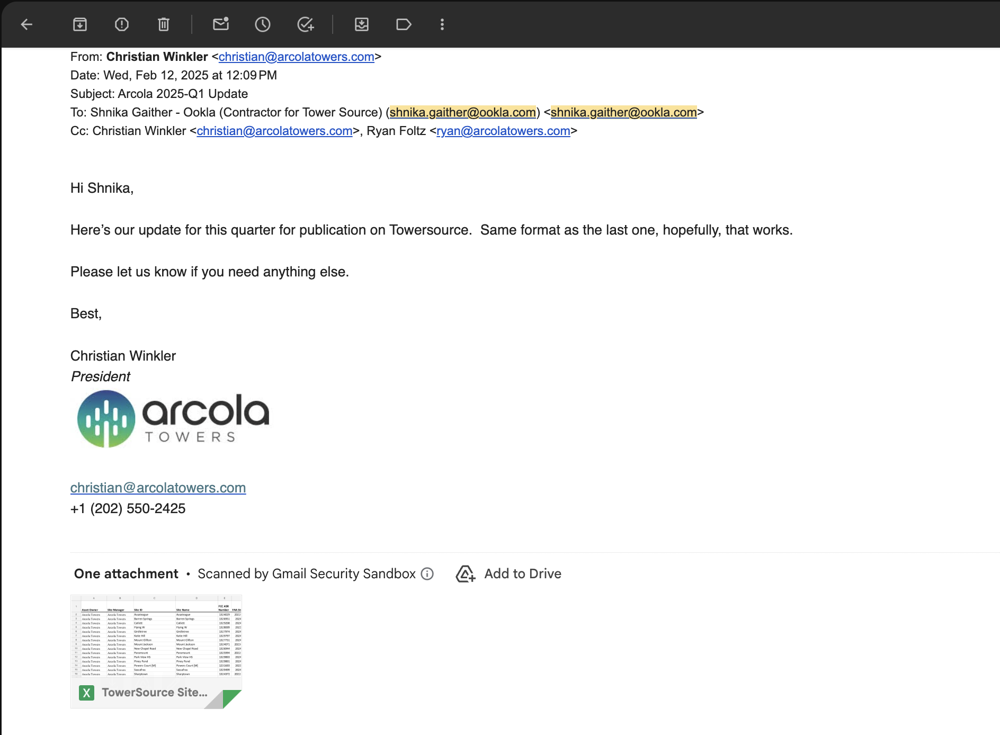
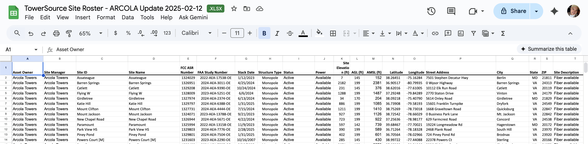
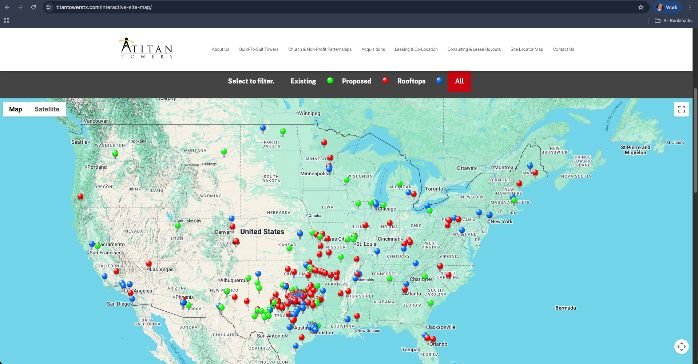
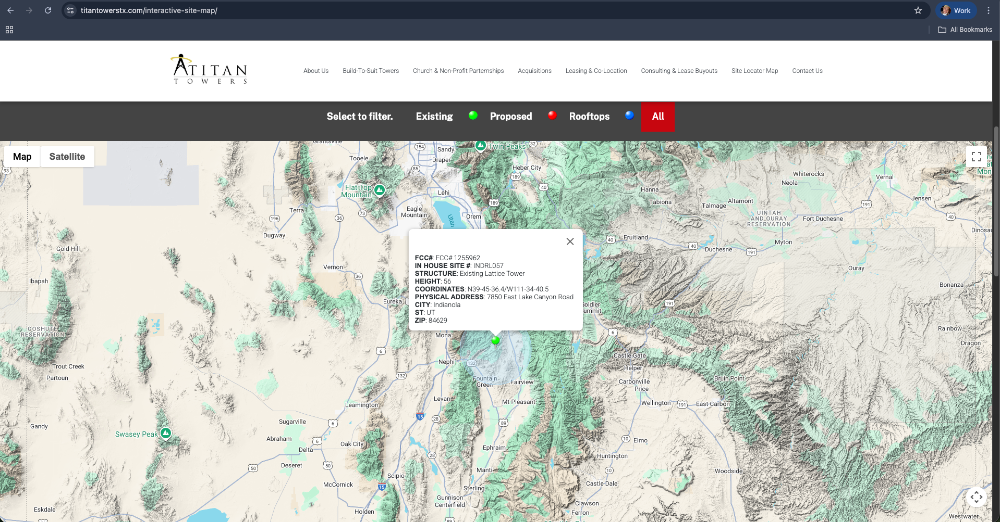
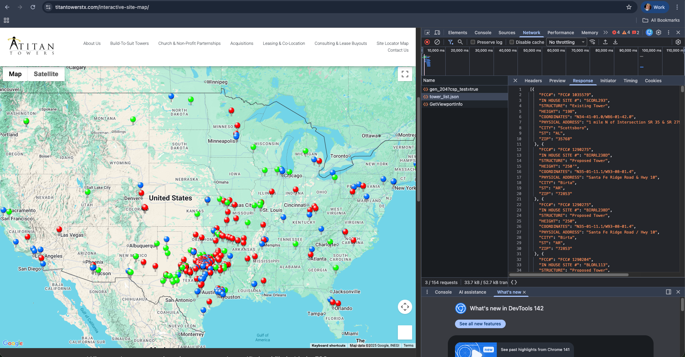
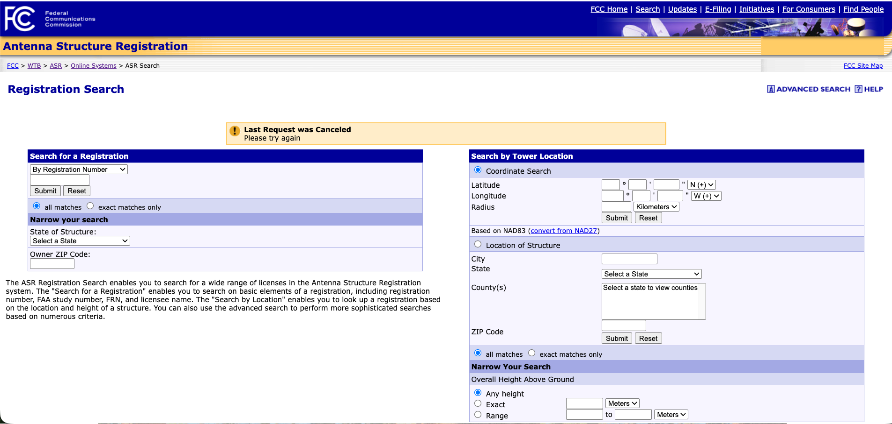
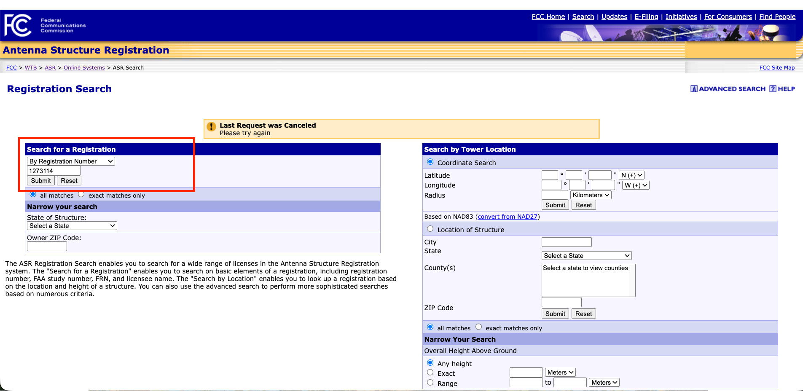
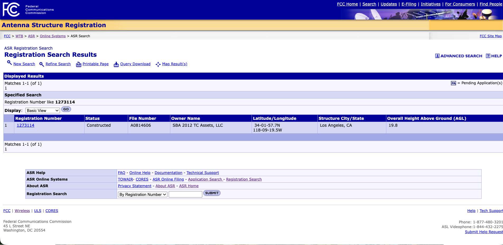
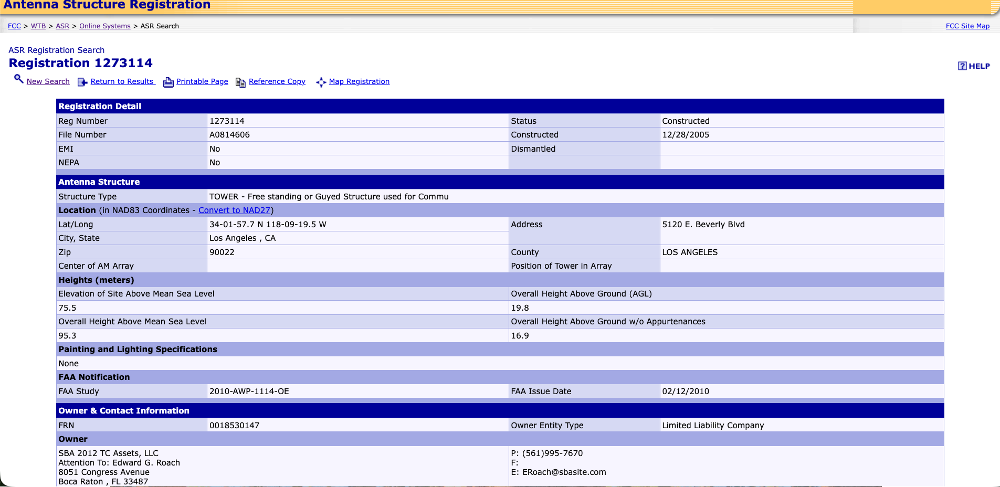
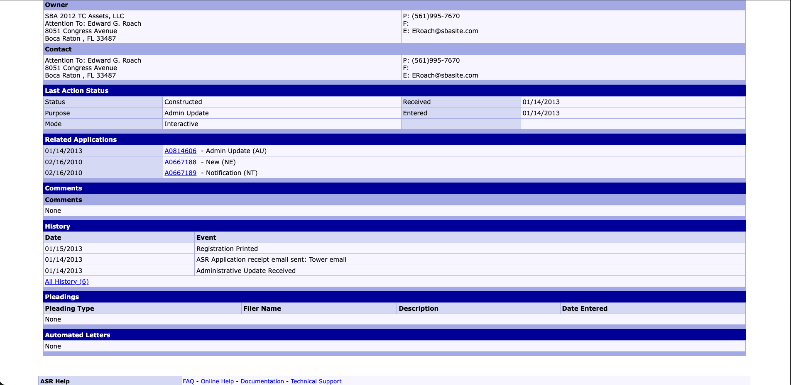

# Table of Contents

1. [Introduction](#1-introduction)
<!--- Here I'll explain what this document is all about, which is all about auto-merging, and how it will help the future analysts to focus more on prox audits that require more in depth research. I need to create the motivation on what to expect in this document and how we will be slowly curating some theoretical and technical aspects that the reader should know before he/she can understand the fundamentals of auto-merging process itself, like: We'll tackle the primary identifiers used to determine information about towers (FAA and FCC) and show what they signify and where we can get those information (maybe we can google search some of the definition of terms and crash courses about these), talk about the proximity audits in Sherlock's perspective, talk about the proximity audits in Skeletor's perspective, talk about the anatomy of a group or single prox audit, talk about how prox audits can be queried from the backend tables, talk about auto-merging and how it will help us in implementing automation jobs, --->
2. [TowerSource's Data Source Overview](#2-towersources-data-source-overview)
   1. [Company data](#i-company-data)
      <!---a.) Outreach (Show an example of email sent to the companies and the example raw tower sheet we received from them, also say that not all companies are reporting complete data), b.) Web Scraping (Show websites where they have site locators in a form of maps or something where web scraping can be performed)--->
      1. [Company Tower Sheet from the Tower Company](#a-company-tower-sheet-from-the-tower-company)
      2. [Company Tower Sheet by Outreach](#b-company-tower-sheet-by-outreach)
      3. [Web Scraping](#c-web-scraping)
   3. [FCC-ASR](#ii-fcc-asr)
      <!-- Show the website, link the website, describe what the website is all about, show an example of a complete tower information. --->
   4. FAA
      <!-- Show the website, link the website, describe what the website is all about, show an example of a complete tower information. --->
      
3. Sherlock's Proximity Audit Overview
   1. Overview
      <!-- From the previous section, we talked about the Tower Assets' sources. Now, the Data Analysts should now perform some auditing to reconcile records in the database coming from these sources regarding which pertains to the same tower and otherwise. Since we capture data from these different sources, it is probabilistic to think that a single tower site will show up to these three different sources, one way or another. In the world of Towersource, if a tower asset/record, say, coming from the company pertains to the same tower showing from FCC-ASR and/or FAA's website, then the analyst should "merge" the records and create a singular record that will capture all of the demographics and techinical details of that said tower as complete and accurate as possible. But if a set of records pertain to different towers, then the analyst should not merge any of these records and just to "Confirm Correct" that each records are independent and different from each other, and then "Continue" to the next set of records to audit. But what logic should be followed on how to structure these "set of records" that should be grouped together for the analyst to look and do his/her further research? Also, what platform will these audits show up? As of the moment, we have the "Sherlock" UI to see all audits that the analyst should research and resolve (Show Sherlock), but since we're building the newer platform now in Superblocks these audits will be migrated there. In the general world of TowerSource, these audits can be determined through the "proximity audit". Here, I should define Proximity audits and the basic overview logic behind it. I should make it a point that it is very important to have the geographical coordinates shown by a specific tower site coming from either the Company', FCC-ASR's or FAA's website to determine which of the records should be grouped together and be further analyzed by the analyst simultaneously. A single "grouped" records based on proximity audit's logic can be called as a single "audit" or "group/grouping". As we load newer tower information coming from these different sources,  But what are the parts of a single "audit" or "grouping"?---> 
   2. Anatomy of Proximity Audit
      1. Proximity Audit from Sherlock's view
         <!-- Just show an example proximity audit and point out which is the reference/focus record and which is/are the associated record/s. --->
      2. Proximity Audit from Skeletor's view
         <!-- What table should give you the information about which if the focus and which are the respective associated records? What table should be used to join this proximity audits table to determine a more in depth tower information for each. Show here and link the SQL I wrote to get these information. Put a disclaimer that we will not be using delving into the "dimensions" table (i.e., manager_table, operator_table, etc.). We will end this section by showing the whole SQL and the snippet of the output (without the AGL thingies yet). --->
         
4. Auto-Merging's Designed Process Overview
<!--- Here, I will just introduce again the auto-merging process and the goal of creating an automated process for the merging process so that the analyst will only focus more on "audits" or "groupings" where further human intervention is required (i.e., further research, further traversing of the maps, further inquiries, etc.). I will discuss here that we will be using as a 'primary identifier' the FCC-ASR and FAA study number to determine one tower from another. These two ingredients will help us determine which focus/reference record should be merged to their respective associated record, and which shouldn't be merged and just do nothing with the records in a grouping or audit. And then from these identifiers, we can create different combination scenarios for FCC-ASR or FAA on how these two ingredients would show up in a grouping or audit. We will call these combination of scenarios as "cases". For the first implementation of the auto-merging process, we devised the 5 major cases: blablablabla --->

5. Auto-Merging's High Level Logic
   <!--- Here, I should mention that this process can be divided in to three major chunks of logic: The Looking for Merging candidates, the meats-n-potatoes process of Case X, the maintenance logic. And then describe briefly what each chunks of logic represents and what to expect for each one of which. --->
   
6. Auto-Merging Process' Database Anatomy
   <!--- I think it is better if I'll enclose each table in a tabular information as presented for each sub items of chapter/section 6 --->
   1. Prox Audits Table
      <!---Here, I should introduce the table name and what should it consist. I need to say that this table is the input table for each Case. So for Case 1, the input table should be the prox_audits table ran by my query.--->
   2. Merging Candidates
      <!---Introduce the name of the tables produced by this chunk of logic and what kind of records should be housed by each table. I should say that "if we continue case 1's process, it should producs tables X and Y". --->
   3. Further Filter & Merging Process
      <!---Introduce the name of the tables produced by this chunk of logic and what kind of records should be housed by each table. I should say that "if we continue case 1's process, it should producs tables X and Y". --->
   4. Maintenance Process
    <!---Introduce the name of the tables produced by this chunk of logic and what kind of records should be housed by each table. I should say that "if we continue case 1's process, it should producs tables X and Y. And then at this point, Table Z will be the input table for Case 2 to kick off, and then the same process continues for each Cases". --->
   
7. Elaborated Auto-Merging Process (Algorithm)
   1. Table Metadata
      <!--- Information about each columns in prox_audits table. --->
   2. Python Packages
      <!--- Just enumerate all of the python packages I will be using and then define each of the packages but I will be putting the documentation Cited in the bibliography but hyperlinked in the word "Documentation" as part of this section's paragraphs --->
   3. Preliminary Part
      <!--- Here, I will present the loading of the data, agl difference, geodesic, future warnings, caching, scraping, merging, etc. Any logic or defined functions in my code that is not part of the three major chunks of auto-merging process. At the end of this part, tell the reader to look at the whole code to appreciate the placement of each defined functions in the code. --->
   4. Case 1 Logic
      <!--- I can mention that this case would most probably play its role more as we load more tower sheets from the companies. Nonetheless, mention the logic behind this case step-by-step and as clear as possible--->
      <!--- For each chunks, I should show the code.--->
      1. Merging Candidates
      2. Further Filter & Merging Process
      3. Maintencance Process
      4. Example
         <!--- Show an example grouping that made it through this case successfully --->
   5. Case 2 Logic
      <!--- I can mention that this case would most probably play its role more as we load more tower sheets from the companies. Nonetheless, mention the logic behind this case step-by-step and as clear as possible--->
      <!--- For each chunks, I should show the code--->
      1. Merging Candidates
      2. Further Filter & Merging Process
      3. Maintencance Process
      4. Example
         <!--- Show an example grouping that made it through this case successfully --->
   6. Case 3 Logic
      <!--- I can mention that this case would most probably play its role more as we load more tower sheets from the companies. Nonetheless, mention the logic behind this case step-by-step and as clear as possible--->
      <!--- For each chunks, I should show the code--->
      1. Merging Candidates
      2. Further Filter & Merging Process
      3. Maintencance Process
      4. Example
         <!--- Show an example grouping that made it through this case successfully --->
   7. Case 4 Logic
      <!--- For each chunks, I should show the code--->
      1. Merging Candidates
      2. Further Filter & Merging Process
      3. Maintencance Process
      4. Example
         <!--- Show an example grouping that made it through this case successfully --->
   8. Case 5 Logic
      <!--- For each chunks, I should show the code--->
      1. Merging Candidates
      2. Further Filter & Merging Process
      3. Maintencance Process
      4. Example
         <!--- Show an example grouping that made it through this case successfully --->
   9. Whole Code
       <!--- I don't need to paste the whole code here. What I can do is just link the file with the whole code here. I would say that the code provided is for the jupyter notebook environment to be ran. I will yet to put the code that can be ran from other IDEs like spyder or pycharm or the like. -->
      
8. Future Plans
   <!--- In the future, we are to expect that we will be seeing more opportunities to expand the functionality of the auto-merging process from the five major cases we focused on. As of now, we are studying the possibility of having Case 6 (and then just give an overview on how it looks like and an example). --->

9. [References](#9-references)
     <!---I can create a numbering style (like in RRL) for each parts in the main documentation and then cited in this chapter. --->
     <!---FCC-ASR Website, research papers where FCC-ASR has been released or reviewed, FAA's website, research papers where FAA has been released or reviewed, packages used in Python (each packages should be cited using their documentation (can be a URL) --->

---
# 1. Introduction

[Towersource](https://www.towersource.com/)[^1] by **Ookla** is a large online database of vertical assets, like cell towers. It acts as a centralized directory that connects tower owners with tenants (such as moibile carriers) who need to lease space. It's like the Zillow for cell towers. If you own a cell tower, you can list it for sale or rent. If you're a mobile phone company (like T-Mobile or Verizon) and need to put antennas somewhere, you use TowerSource to search for the perfect spot. It helps companies find locations, see what competitors are doing, and manage their properties, all using a single, up-to-date database run by Ookla. 

Ookla's DQA Team takes its role in the perspective of Towersource database management and auditing. As part of our team's initiatives, we are to migrate the legacy Towersource system, which is the  "Sherlock" User Interface and "Skeletor" database, into a much newer platform, in the name of [Superblocks](https://docs.superblocks.com/)[^2], in order to refurbish and improve the process itself with the goal of automating multiple facets from the legacy Towersource system.

One of the aspect that our team have deliberately focused into automating is what we call as the **Auto-Merging process**. This automated process is programmed to audit and perform automatically the **merging process** from the vertical assets needed to be analyzed and researched in our Towersource's database. This way, it will significantly diminish the volume of assets that need to be audited by the DQAs, which will also help into the reallocation of their efforts to focus more into auditing vertical assets that requires more in-depth research before committing such information into our database for the market's consumption.

For this techical documentation, it will solely be dedicated to rigorously discuss the Auto-Merging process which is implemented as part of the **TowerSource Automation Project** which is to be deployed in the Superblocks platform, as mentioned previously. To give more benefit for the readers of this documentation, we will not delve instantly into the Auto-Merging process. In order to build some intuition and knowledge in this process, we will be discussing first some basic prerequisite frameworks about Towersource in general. This way, the reader will be able to understand some jargons used in this document and will be able to connect the dots seamlessly. We will delve first into the data sources in building the Towersource database, which will be followed by an overview of the proximity audits and how it looks like in the legacy Towersource system. Next, we will simply discuss the anatomy of an "audit" to know its parts and the information that the user should expect to see for each vertical assets. After these prerequisites, we will then be slowly introducing the overview of the Auto-Merging process. As we go deeper into this, the reader is to expect learning the step-by-step procedure of the said process which is to be supplemented by some programming aspect for technical readers. At the end, we will be discussing some future plans to motivate some perspective on what should we expect on how the said process will venture more in the future.

The reader should expect to learn the prerequisites of Towersource process in Sections 2 and 3. After these, the reader should expect to gradually learn the Auto-Merging process itself in Sections 4, 5, 6, and 7. Lasly, Section 8 will be the foreword of this document which will tackle the future plans for the said automation process.

As a disclaimer, this document will not entail the discussion of the totality of each TowerSource modules implemented in Superblocks. Auto-Merging process is expected to kick off after all necessary process of Towersource ran and before the DQA's auditing will take place. To know more about the architecture and backend development of the TowerSource in Superblocks platform prior to the processing of Auto-Merging job, please refer to this (*just a placeholder here to add Ar Jay's Documentation*) documentation. This document is also not the main document to be used as reference by the readers to understand the business rules and logic behind TowerSource in depth. The theoretical framework discussed in this document are the prerequisite information that the readers should know before digging into the world of Auto-Merging process. Nonetheless, we hope that this document will shed light into the reader's perspective into understanding more of our initiatives for the betterment of Towersource.

---
# 2. Towersource's Data Source Overview

For this section, we will be discussing how we collect data into building the rich database of Towersource. Generally, the said system is collecting data from the tower company itself, from Federal Communications Commission's Antenna Structure Registration (FCC ASR), and Obstruction Evaluation/Airport Space Analysis (OE/AAA). Each data source's overview will be discussed in this section. 

## i. Company Data

One of Towersource's data source is the Company data or what we call as the "Company Tower sheets". Sometimes, tower companies will be reaching out to us to have their Tower Assets be reflected in the interface of Towersource. Otherwise, there are times too where the DQA team will be performing some "Outreach" activities where an analyst of the team will be reaching out various tower companies. If the Company Tower Sheets couldn't be collected by eitherways, there are times where the DQA team will perform some Web Scraping methodology if the Tower Company's tower assets are publicly available and listed in their official websites (*i.e., most of the time in a form of an interactive map, if not shown as tabular data in the company's official website*). In this section, we will be showing these briefly with some examples each to visualize what a company tower sheet looks like and how to perform each of the said methods.

### a. Company Tower Sheet from the Tower Company

Tower Companies show interests into wanting their tower sites be reflected into Ookla's Towersource web interface. This way, it will help these Tower Companies find locations, , see what competitors are doing, and manage their properties. For this to happen, there are Tower Companies who reaches out to our team to make their Tower Assets be reflected in Towersource which is mostly in the form of an email. Shown below is an example exhibiting this: 

> Here, Arcola Towers directly Reached out to our team wanting to reflect in Towersource's interface their current updated Tower Assets listing.

 
 

Now shown below is an example contents from the said tower sheet:

> Note that Tower Companies have their own styles and formatting of sending their tower listings to us. Some companies might report fields pertaining to elevations in meters or feet or whatnot. Some companies will report ASR and/or Study Number but some will not. Some companies will report the geographical coordinate locations of their towers in decimal degrees or in Degrees-Minutes-Seconds or in Degrees and Decimal Minutes, etc. In legacy Towersource, the DQA analysts make sure to preprocess these information manually to standardize the reported data coming from different companies before uploading these into the database for further staging. In Superblocks Towersource, this preprocessing stage will be automated.
 

### b. Company Tower Sheet by Outreach

If Tower Companies aren't reaching out to us whenever they have some updates with their Tower Assets listing, DQA team has the responsibility to do some "Outreach" methodology which is done every quarter of the year. Here, we are to reach out to various Tower Companies asking if they can provide us their current and most up-to-date Tower Assets listing. Mostly this is done through email form, as shown below: 

> Here, we provide our standardized format that the Tower Companies should follow whenever they will be providing us their most up-to-date Tower listing.

 

### c. Web Scraping

Sometimes Tower Companies would not be sending us their updated Tower listing and they would not be responding to our Outreach as well. If so, as a last resort, we can check the official web page for these Tower Companies to see if they have publicly available information about their Tower Assets. Most of the time, they showcase their Tower Assets through some interactive maps. Sometimes, they list their tower assets in a tabularized manner. If so, we can utilize these publicly available information but it would be laborious to do it manually especially if the tower company have hundreds or thousands of tower assets. This is when web scraping methodology will help into getting these information in an instant. Example shown below from **Titan Towers**:

Here, we can see that Titan Towers has an interactive map where each pinned points can be navigated to drill further the tower's demographics. To web scrape this example, we can check first, using developer's tool, the Network and Response for each items that would show up in the tool. This way, we are somewhat investigating the structure of the website itself for us to carry out the appropriate web scraping method we can use. For this case, since the information for each pinned points in the map are pulled through Direct API interception, we can just easily use the [requests](https://requests.readthedocs.io/en/latest/)[^3] python library package to scrape the desired information.

> Note that each website are built differently. That's why it is important to inspect the website's structure or use developer's tool to see the appropriate method of scraping the said website. Sometimnes you might use python library packages like [Selenium](https://selenium-python.readthedocs.io/)[^4] whenever the tower information are stored dynamically or whenever you want to perform browser automation, or one can use [BeautifulSoup](https://pypi.org/project/beautifulsoup4/)[^5] (in conjunction with requests or Selenium) to statically parse HTML/XML and extract specific information from it.

 
 

## ii. FCC-ASR

**Antenna Structure Registratrion (ASR)** is a program and an online database that requires the owners of certain tall antenna structures to register them with the **Federal Communications Commission (FCC).** For any structure that is registered, the database includes key information such as: Its exact location (Latitude and Longitude), Its total height above ground and sea level, Ownershiop & Contact Information, Specific instructions for its painting and lighting, history filings, etc. 

The single most important purpose of the ASR program is **aviation safety**. Its goal is to ensure that any antenna structure tall enough to be a potential hazard to aircraft is properly marked (painted) and lit, making it visible to pilots in all conditions. The FCC works with the **Federal Aviation Administration (FAA)** on this[^6]. In simple terms[^7]:

- If a proposed structure is over 200 feet tall or is close to an airport, the owner must first notify the FAA.
- The FAA studies the proposal and, if it's not a hazard, issues a "Determination of No Hazard" that specifies what painting and lighting are required.
- The owner must then take that FAA determination and file it with the FCC to receive an official ASR number, which must be posted at the site.

By the general rule: If you do not have to notify the FAA, you do not have to register with the FCC. Since FCC only has a jurisdiction to antenna structures (could be free standing, built specifically to support antennas, or act as an antenna, or it could be structure mounted on some other man-made object), then any structures (i.e., water towers, buildings, billboards, bridges, windmills, etc.) that do not have an antenna mounted on them are not antenna structures and should not be registered[^8]. 

In Towersource's aspect, we fetch data from the FCC-ASR website which is done at the backend as part of enriching its database. In DQA's perspective, we use the FCC-ASR's [Registraction Search](https://wireless2.fcc.gov/UlsApp/AsrSearch/asrRegistrationSearch.jsp)[^9] tool to search for current ASR registrations that could help in doing research for audit purposes (**"Auditing"** will be discussed further in Section 3 of this document). Shown below are some snippets on what should we expect seeing when one used the said tool: 

---
# 9. References

[^1]: Ookla's [Towersource](https://www.towersource.com/) User Interface
[^2]: Documentation for [Superblocks](https://docs.superblocks.com/)
[^3]: Python Library Package Documentation for [requests](https://requests.readthedocs.io/en/latest/)
[^4]: Python Library Package Documentation for [Selenium](https://selenium-python.readthedocs.io/)
[^5]: Python Library Package Documentation for [BeautifulSoup](https://pypi.org/project/beautifulsoup4/)
[^6]: Code of Federal Regulations, Title 47, Part 17.4 – "Antenna structure registration." [https://www.ecfr.gov/current/title-47/chapter-I/subchapter-A/part-17/subpart-A/section-17.4](https://www.ecfr.gov/current/title-47/chapter-I/subchapter-A/part-17/subpart-A/section-17.4)
[^7]: Code of Federal Regulations, Title 14, Part 77.9 – "Construction or alteration requiring notice." [https://www.ecfr.gov/current/title-14/chapter-I/subchapter-E/part-77/subpart-B/section-77.9](https://www.ecfr.gov/current/title-14/chapter-I/subchapter-E/part-77/subpart-B/section-77.9)
[^8]: FCC Antenna Structure Registration (ASR) - Overview. [https://www.fcc.gov/wireless/support/knowledge-base/antenna-structure-registration-asr-resources/antenna-structure](https://www.fcc.gov/wireless/support/knowledge-base/antenna-structure-registration-asr-resources/antenna-structure)
[^9]: FCC-ASR Registration Search tool. [https://wireless2.fcc.gov/UlsApp/AsrSearch/asrRegistrationSearch.jsp](https://wireless2.fcc.gov/UlsApp/AsrSearch/asrRegistrationSearch.jsp)
