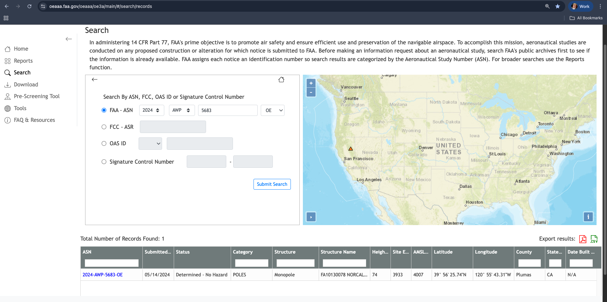
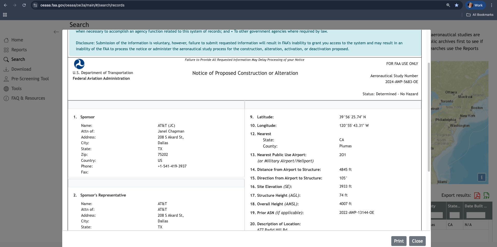
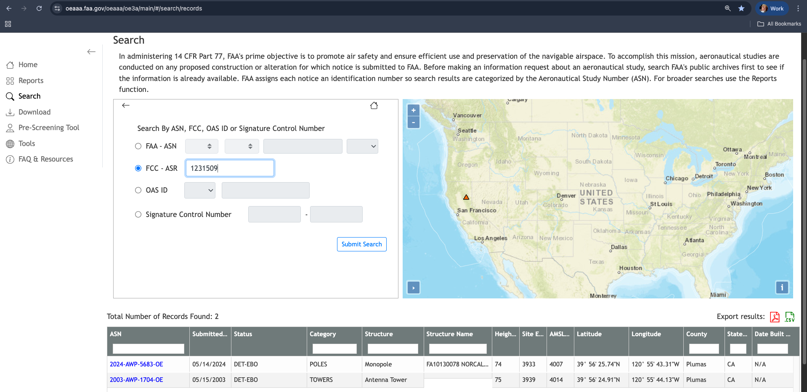
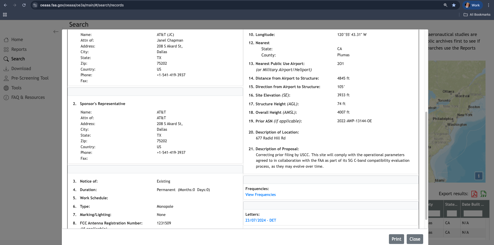
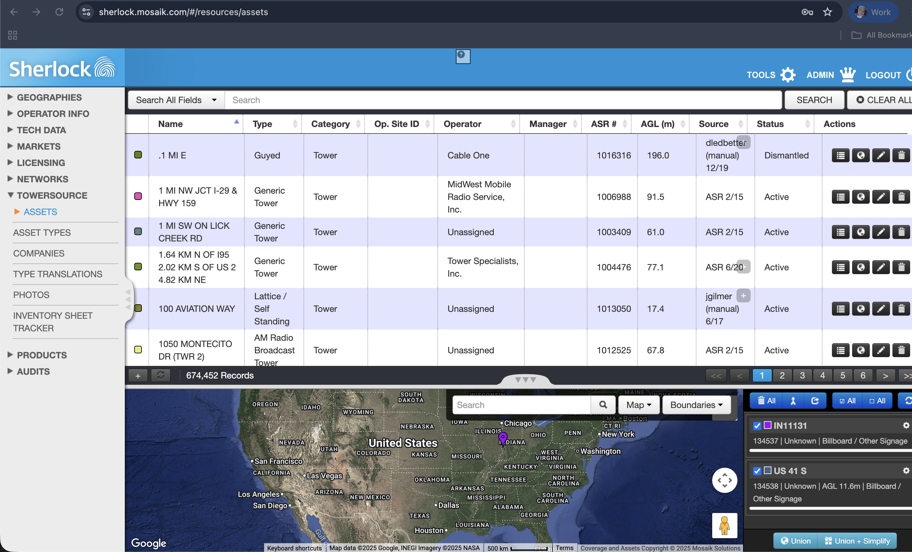
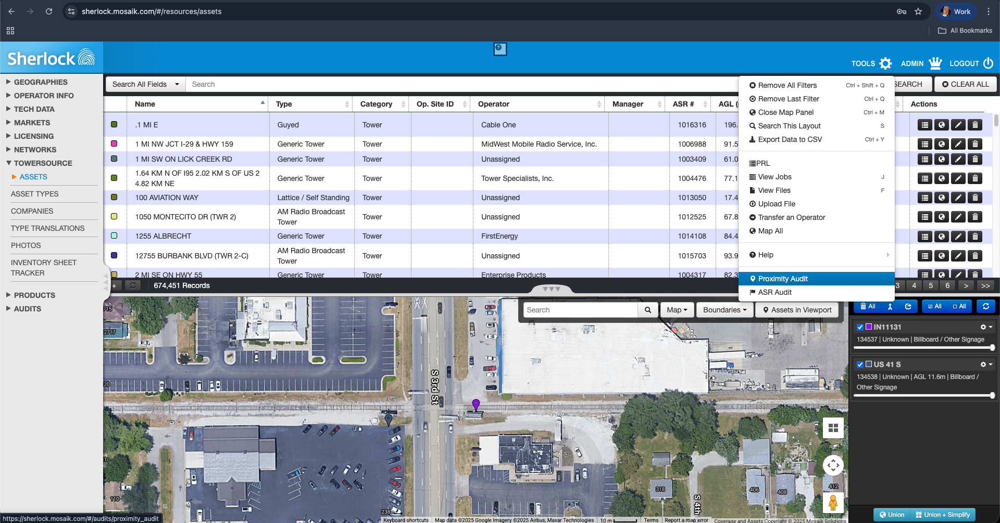
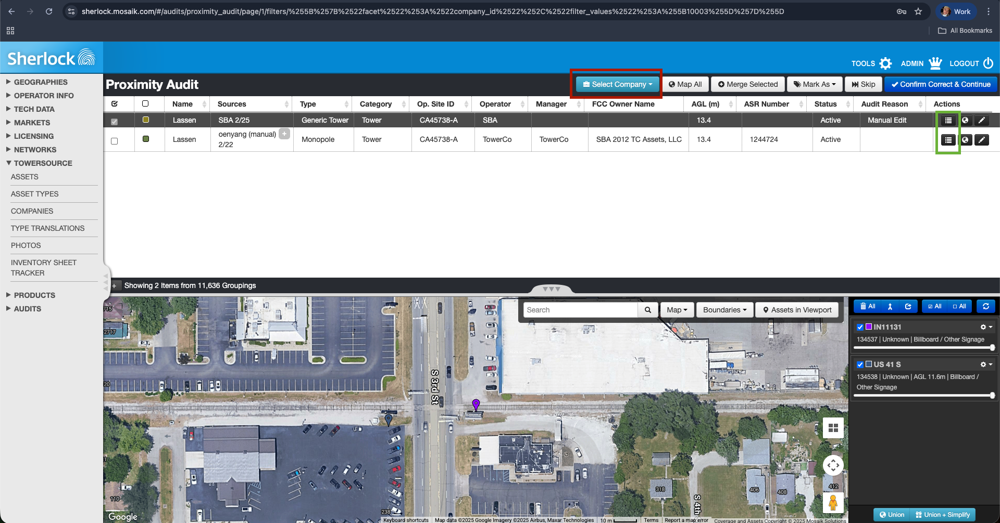
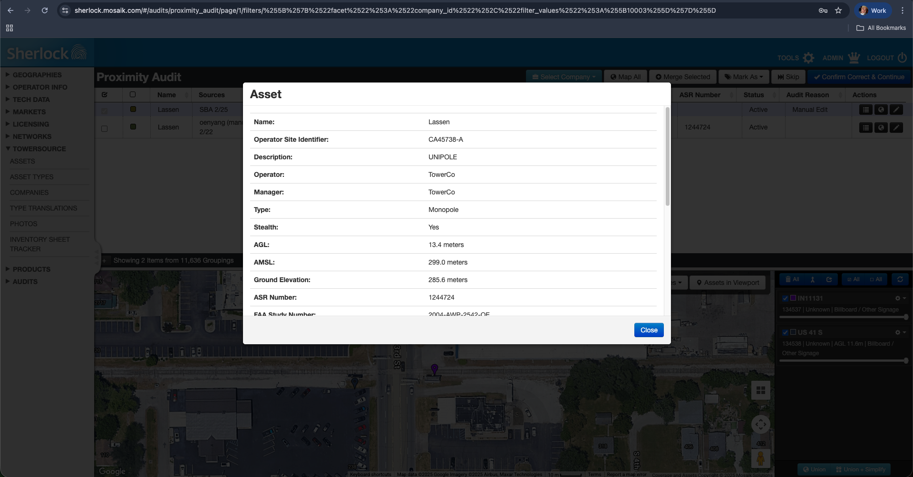

# Table of Contents


1. [Introduction](#1-introduction)
<!--- Here I'll explain what this document is all about, which is all about auto-merging, and how it will help the future analysts to focus more on prox audits that require more in depth research. I need to create the motivation on what to expect in this document and how we will be slowly curating some theoretical and technical aspects that the reader should know before he/she can understand the fundamentals of auto-merging process itself, like: We'll tackle the primary identifiers used to determine information about towers (FAA and FCC) and show what they signify and where we can get those information (maybe we can google search some of the definition of terms and crash courses about these), talk about the proximity audits in Sherlock's perspective, talk about the proximity audits in Skeletor's perspective, talk about the anatomy of a group or single prox audit, talk about how prox audits can be queried from the backend tables, talk about auto-merging and how it will help us in implementing automation jobs, --->
2. [TowerSource's Data Source Overview](#2-towersources-data-source-overview)
   1. [Company data](#i-company-data)
      <!---a.) Outreach (Show an example of email sent to the companies and the example raw tower sheet we received from them, also say that not all companies are reporting complete data), b.) Web Scraping (Show websites where they have site locators in a form of maps or something where web scraping can be performed)--->
      1. [Company Tower Sheet from the Tower Company](#a-company-tower-sheet-from-the-tower-company)
      2. [Company Tower Sheet by Outreach](#b-company-tower-sheet-by-outreach)
      3. [Web Scraping](#c-web-scraping)
   3. [FCC-ASR](#ii-fcc-asr)
      <!-- Show the website, link the website, describe what the website is all about, show an example of a complete tower information. --->
   4. [FAA](#iii-faa)
      <!-- Show the website, link the website, describe what the website is all about, show an example of a complete tower information. --->
      
3. [Towersource Proximity Audit Overview](#3-towersource-proximity-audit-overview)
   1. [Overview](#i-overview)
      <!-- From the previous section, we talked about the Tower Assets' sources. Now, the Data Analysts should now perform some auditing to reconcile records in the database coming from these sources regarding which pertains to the same tower and otherwise. Since we capture data from these different sources, it is probabilistic to think that a single tower site will show up to these three different sources, one way or another. In the world of Towersource, if a tower asset/record, say, coming from the company pertains to the same tower showing from FCC-ASR and/or FAA's website, then the analyst should "merge" the records and create a singular record that will capture all of the demographics and techinical details of that said tower as complete and accurate as possible. But if a set of records pertain to different towers, then the analyst should not merge any of these records and just to "Confirm Correct" that each records are independent and different from each other, and then "Continue" to the next set of records to audit. But what logic should be followed on how to structure these "set of records" that should be grouped together for the analyst to look and do his/her further research? Also, what platform will these audits show up? As of the moment, we have the "Sherlock" UI to see all audits that the analyst should research and resolve (Show Sherlock), but since we're building the newer platform now in Superblocks these audits will be migrated there. In the general world of TowerSource, these audits can be determined through the "proximity audit". Here, I should define Proximity audits and the basic overview logic behind it. I should make it a point that it is very important to have the geographical coordinates shown by a specific tower site coming from either the Company', FCC-ASR's or FAA's website to determine which of the records should be grouped together and be further analyzed by the analyst simultaneously. A single "grouped" records based on proximity audit's logic can be called as a single "audit" or "group/grouping". As we load newer tower information coming from these different sources,  But what are the parts of a single "audit" or "grouping"?---> 
   2. [Anatomy of Proximity Audit](#ii-anatomy-of-proximity-audit)
      1. [Proximity Audit from Sherlock's view](#a-proximity-audit-from-sherlocks-view)
         <!-- Just show an example proximity audit and point out which is the reference/focus record and which is/are the associated record/s. --->
      2. [Proximity Audit from Skeletor's view](#b-proximity-audit-from-skeletors-view)
         <!-- What table should give you the information about which if the focus and which are the respective associated records? What table should be used to join this proximity audits table to determine a more in depth tower information for each. Show here and link the SQL I wrote to get these information. Put a disclaimer that we will not be using delving into the "dimensions" table (i.e., manager_table, operator_table, etc.). We will end this section by showing the whole SQL and the snippet of the output (without the AGL thingies yet). --->
         
4. [Auto-Merging's Designed Process Overview](#4-auto-mergings-designed-process-overview)
<!--- Here, I will just introduce again the auto-merging process and the goal of creating an automated process for the merging process so that the analyst will only focus more on "audits" or "groupings" where further human intervention is required (i.e., further research, further traversing of the maps, further inquiries, etc.). I will discuss here that we will be using as a 'primary identifier' the FCC-ASR and FAA study number to determine one tower from another. These two ingredients will help us determine which focus/reference record should be merged to their respective associated record, and which shouldn't be merged and just do nothing with the records in a grouping or audit. And then from these identifiers, we can create different combination scenarios for FCC-ASR or FAA on how these two ingredients would show up in a grouping or audit. We will call these combination of scenarios as "cases". For the first implementation of the auto-merging process, we devised the 5 major cases: blablablabla --->

5. [Auto-Merging's High Level Logic](#5-auto-mergings-high-level-logic)
   <!--- Here, I should mention that this process can be divided in to three major chunks of logic: The Looking for Merging candidates, the meats-n-potatoes process of Case X, the maintenance logic. And then describe briefly what each chunks of logic represents and what to expect for each one of which. --->
   
6. [Auto-Merging Process Database Anatomy](#6-auto-merging-process-database-anatomy)
   <!--- I think it is better if I'll enclose each table in a tabular information as presented for each sub items of chapter/section 6 --->
   1. [Prox Audits Table](#i-prox-audits-table)
      <!---Here, I should introduce the table name and what should it consist. I need to say that this table is the input table for each Case. So for Case 1, the input table should be the prox_audits table ran by my query.--->
   2. [Merging Candidates](#ii-merging-candidates)
      <!---Introduce the name of the tables produced by this chunk of logic and what kind of records should be housed by each table. I should say that "if we continue case 1's process, it should producs tables X and Y". --->
   3. [Further Filter and Merging Process](#iii-further-filter-and-merging-process)
      <!---Introduce the name of the tables produced by this chunk of logic and what kind of records should be housed by each table. I should say that "if we continue case 1's process, it should producs tables X and Y". --->
   4. [Maintenance Process](#iv-maintenance-process)
    <!---Introduce the name of the tables produced by this chunk of logic and what kind of records should be housed by each table. I should say that "if we continue case 1's process, it should producs tables X and Y. And then at this point, Table Z will be the input table for Case 2 to kick off, and then the same process continues for each Cases". --->
   5. [Summary](#v-summary)
   
7. [Elaborated Auto-Merging Process](#7-elaborated-auto-merging-process)
   1. [Python Packages](#i-python-packages)
      <!--- Just enumerate all of the python packages I will be using and then define each of the packages but I will be putting the documentation Cited in the bibliography but hyperlinked in the word "Documentation" as part of this section's paragraphs --->
   2. [Preliminary Part](#ii-preliminary-part)
      <!--- Here, I will present the loading of the data, agl difference, geodesic, future warnings, caching, scraping, merging, etc. Any logic or defined functions in my code that is not part of the three major chunks of auto-merging process. At the end of this part, tell the reader to look at the whole code to appreciate the placement of each defined functions in the code. --->
   3. [Case 1 Logic](#iii-case-1-logic)
      <!--- I can mention that this case would most probably play its role more as we load more tower sheets from the companies. Nonetheless, mention the logic behind this case step-by-step and as clear as possible--->
      <!--- For each chunks, I should show the code.--->
      1. [Case 1 Merging Candidates](#a-case-1-merging-candidates)
      2. [Case 1 Further Filter and Merging Process](#b-case-1-further-filter-and-merging-process)
      3. [Case 1 Maintencance Process](#c-case-1-maintencance-process)
         
   4. [Case 2 Logic](#iv-case-2-logic)
      <!--- I can mention that this case would most probably play its role more as we load more tower sheets from the companies. Nonetheless, mention the logic behind this case step-by-step and as clear as possible--->
      <!--- For each chunks, I should show the code--->
      1. [Case 2 Merging Candidates](#a-case-2-merging-candidates)
      2. [Case 2 Further Filter and Merging Process](#b-case-2-further-filter-and-merging-process)
      3. [Case 2 Maintencance Process](#c-case-2-maintencance-process)

   5. [Case 3 Logic](#v-case-3-logic)
      <!--- I can mention that this case would most probably play its role more as we load more tower sheets from the companies. Nonetheless, mention the logic behind this case step-by-step and as clear as possible--->
      <!--- For each chunks, I should show the code--->
      1. [Case 3 Merging Candidates](#a-case-3-merging-candidates)
      2. [Case 3 Further Filter and Merging Process](#b-case-3-further-filter-and-merging-process)
      3. [Case 3 Maintencance Process](#c-case-3-maintencance-process)

   6. [Case 4 Logic](#vi-case-4-logic)
      <!--- For each chunks, I should show the code--->
      1. [Case 4 Merging Candidates](#a-case-4-merging-candidates)
      2. [Case 4 Further Filter and Merging Process](#b-case-4-further-filter-and-merging-process)
      3. [Case 4 Maintencance Process](#c-case-4-maintencance-process)

   7. [Case 5 Logic](#vii-case-5-logic)
      <!--- For each chunks, I should show the code--->
      1. [Case 5 Merging Candidates](#a-case-5-merging-candidates)
      2. [Case 5 Further Filter and Merging Process](#b-case-5-further-filter-and-merging-process)
      3. [Case 5 Maintencance Process](#c-case-5-maintencance-process)

   8. [Summary](#viii-summary)
       <!--- I don't need to paste the whole code here. What I can do is just link the file with the whole code here. I would say that the code provided is for the jupyter notebook environment to be ran. I will yet to put the code that can be ran from other IDEs like spyder or pycharm or the like. -->

8. [Connecting Auto-Merge Results to Towersource Database](#8-Connecting-Auto-Merge-Results-to-Towersource-Database)


9. [Future Plans](#9-future-plans)
   <!--- In the future, we are to expect that we will be seeing more opportunities to expand the functionality of the auto-merging process from the five major cases we focused on. As of now, we are studying the possibility of having Case 6 (and then just give an overview on how it looks like and an example). --->
   

10. [References](#10-references)
     <!---I can create a numbering style (like in RRL) for each parts in the main documentation and then cited in this chapter. --->
     <!---FCC-ASR Website, research papers where FCC-ASR has been released or reviewed, FAA's website, research papers where FAA has been released or reviewed, packages used in Python (each packages should be cited using their documentation (can be a URL) --->

---
# 1. Introduction

[Towersource](https://www.towersource.com/)[^1] by **Ookla** is a large online database of vertical assets, like cell towers. It acts as a centralized directory that connects tower owners with tenants (such as moibile carriers) who need to lease space. It's like the Zillow for cell towers. If you own a cell tower, you can list it for sale or rent. If you're a mobile phone company (like T-Mobile or Verizon) and need to put antennas somewhere, you use TowerSource to search for the perfect spot. It helps companies find locations, see what competitors are doing, and manage their properties, all using a single, up-to-date database run by Ookla. 

Ookla's DQA Team takes its role in the perspective of Towersource database management and auditing. As part of our team's initiatives, we are to migrate the legacy Towersource system, which is the  "Sherlock" User Interface and "Skeletor" database, into a much newer platform, in the name of [Superblocks](https://docs.superblocks.com/)[^2], in order to refurbish and improve the process itself with the goal of automating multiple facets from the legacy Towersource system.

One of the aspect that our team have deliberately focused into automating is what we call as the **Auto-Merging process**. This automated process is programmed to audit and perform automatically the **merging process** from the vertical assets needed to be analyzed and researched in our Towersource's database. This way, it will significantly diminish the volume of assets that need to be audited by the DQAs, which will also help into the reallocation of their efforts to focus more into auditing vertical assets that requires more in-depth research before committing such information into our database for the market's consumption.

For this techical documentation, it will solely be dedicated to rigorously discuss the Auto-Merging process which is implemented as part of the **TowerSource Automation Project** which is to be deployed in the Superblocks platform, as mentioned previously. To give more benefit for the readers of this documentation, we will not delve instantly into the Auto-Merging process. In order to build some intuition and knowledge in this process, we will be discussing first some basic prerequisite frameworks about Towersource in general. This way, the reader will be able to understand some jargons used in this document and will be able to connect the dots seamlessly. We will delve first into the data sources in building the Towersource database, which will be followed by an overview of the proximity audits and how it looks like in the legacy Towersource system. Next, we will simply discuss the anatomy of an "audit" to know its parts and the information that the user should expect to see for each vertical assets. After these prerequisites, we will then be slowly introducing the overview of the Auto-Merging process. As we go deeper into this, the reader is to expect learning the step-by-step procedure of the said process which is to be supplemented by some programming aspect for technical readers. At the end, we will be discussing some future plans to motivate some perspective on what should we expect on how the said process will venture more in the future.

The reader should expect to learn the prerequisites of Towersource process in Sections 2 and 3. After these, the reader should expect to gradually learn the Auto-Merging process itself in Sections 4, 5, 6, and 7. Lasly, Section 8 will be the foreword of this document which will tackle the future plans for the said automation process.

As a disclaimer, this document will not entail the discussion of the totality of each TowerSource modules implemented in Superblocks. Auto-Merging process is expected to kick off after all necessary process of Towersource ran and before the DQA's auditing will take place. To know more about the architecture and backend development of the TowerSource in Superblocks platform prior to the processing of Auto-Merging job, please refer to this (*just a placeholder here to add Ar Jay's Documentation*) documentation. This document is also not the main document to be used as reference by the readers to understand the business rules and logic behind TowerSource in depth. The theoretical framework discussed in this document are the prerequisite information that the readers should know before digging into the world of Auto-Merging process. Nonetheless, we hope that this document will shed light into the reader's perspective into understanding more of our initiatives for the betterment of Towersource.

---
# 2. Towersource's Data Source Overview

For this section, we will be discussing how we collect data into building the rich database of Towersource. Generally, the said system is collecting data from the tower company itself, from Federal Communications Commission's Antenna Structure Registration (FCC ASR), and Obstruction Evaluation/Airport Space Analysis (OE/AAA). Each data source's overview will be discussed in this section. 

## i. Company Data

One of Towersource's data source is the Company data or what we call as the "Company Tower sheets". Sometimes, tower companies will be reaching out to us to have their Tower Assets be reflected in the interface of Towersource. Otherwise, there are times too where the DQA team will be performing some "Outreach" activities where an analyst of the team will be reaching out various tower companies. If the Company Tower Sheets couldn't be collected by eitherways, there are times where the DQA team will perform some Web Scraping methodology if the Tower Company's tower assets are publicly available and listed in their official websites (*i.e., most of the time in a form of an interactive map, if not shown as tabular data in the company's official website*). In this section, we will be showing these briefly with some examples each to visualize what a company tower sheet looks like and how to perform each of the said methods.

### a. Company Tower Sheet from the Tower Company

Tower Companies show interests into wanting their tower sites be reflected into Ookla's Towersource web interface. This way, it will help these Tower Companies find locations, , see what competitors are doing, and manage their properties. For this to happen, there are Tower Companies who reaches out to our team to make their Tower Assets be reflected in Towersource which is mostly in the form of an email. Shown below is an example exhibiting this: 


> Here, Arcola Towers directly Reached out to our team wanting to reflect in Towersource's interface their current updated Tower Assets listing.

<br>
<br>

Now shown below is an example contents from the said tower sheet:


> Note that Tower Companies have their own styles and formatting of sending their tower listings to us. Some companies might report fields pertaining to elevations in meters or feet or whatnot. Some companies will report ASR and/or Study Number but some will not. Some companies will report the geographical coordinate locations of their towers in decimal degrees or in Degrees-Minutes-Seconds or in Degrees and Decimal Minutes, etc. In legacy Towersource, the DQA analysts make sure to preprocess these information manually to standardize the reported data coming from different companies before uploading these into the database for further staging. In Superblocks Towersource, this preprocessing stage will be automated.
<br>

### b. Company Tower Sheet by Outreach

If Tower Companies aren't reaching out to us whenever they have some updates with their Tower Assets listing, DQA team has the responsibility to do some "Outreach" methodology which is done every quarter of the year. Here, we are to reach out to various Tower Companies asking if they can provide us their current and most up-to-date Tower Assets listing. Mostly this is done through email form, as shown below: 


> Here, we provide our standardized format that the Tower Companies should follow whenever they will be providing us their most up-to-date Tower listing.

<br>


### c. Web Scraping

Sometimes Tower Companies would not be sending us their updated Tower listing and they would not be responding to our Outreach as well. If so, as a last resort, we can check the official web page for these Tower Companies to see if they have publicly available information about their Tower Assets. Most of the time, they showcase their Tower Assets through some interactive maps. Sometimes, they list their tower assets in a tabularized manner. If so, we can utilize these publicly available information but it would be laborious to do it manually especially if the tower company have hundreds or thousands of tower assets. This is when web scraping methodology will help into getting these information in an instant. Example shown below from **Titan Towers**:


Here, we can see that Titan Towers has an interactive map where each pinned points can be navigated to drill further the tower's demographics. To web scrape this example, we can check first, using developer's tool, the Network and Response for each items that would show up in the tool. This way, we are somewhat investigating the structure of the website itself for us to carry out the appropriate web scraping method we can use. For this case, since the information for each pinned points in the map are pulled through Direct API interception, we can just easily use the [requests](https://requests.readthedocs.io/en/latest/)[^3] python library package to scrape the desired information.


> Note that each website are built differently. That's why it is important to inspect the website's structure or use developer's tool to see the appropriate method of scraping the said website. Sometimnes you might use python library packages like [Selenium](https://selenium-python.readthedocs.io/)[^4] whenever the tower information are stored dynamically or whenever you want to perform browser automation, or one can use [BeautifulSoup](https://pypi.org/project/beautifulsoup4/)[^5] (in conjunction with requests or Selenium) to statically parse HTML/XML and extract specific information from it.

<br>
<br>

## ii. FCC-ASR

**Antenna Structure Registratrion (ASR)** is a program and an online database that requires the owners of certain tall antenna structures to register them with the **Federal Communications Commission (FCC).** For any structure that is registered, the database includes key information such as: Its exact location (Latitude and Longitude), Its total height above ground and sea level, Ownershiop & Contact Information, Specific instructions for its painting and lighting, history filings, etc. 

The single most important purpose of the ASR program is **aviation safety**. Its goal is to ensure that any antenna structure tall enough to be a potential hazard to aircraft is properly marked (painted) and lit, making it visible to pilots in all conditions. The FCC works with the **Federal Aviation Administration (FAA)** on this[^6]. In simple terms[^7]:

- If a proposed structure is over 200 feet tall or is close to an airport, the owner must first notify the FAA.
- The FAA studies the proposal and, if it's not a hazard, issues a "Determination of No Hazard" that specifies what painting and lighting are required.
- The owner must then take that FAA determination and file it with the FCC to receive an official ASR number, which must be posted at the site.

By the general rule: If you do not have to notify the FAA, you do not have to register with the FCC. Since FCC only has a jurisdiction to antenna structures (could be free standing, built specifically to support antennas, or act as an antenna, or it could be structure mounted on some other man-made object), then any structures (i.e., water towers, buildings, billboards, bridges, windmills, etc.) that do not have an antenna mounted on them are not antenna structures and should not be registered[^8]. 

In Towersource's aspect, we fetch data from the FCC-ASR website which is done at the backend as part of enriching its database. In DQA's perspective, we use the FCC-ASR's [Registraction Search](https://wireless2.fcc.gov/UlsApp/AsrSearch/asrRegistrationSearch.jsp)[^9] tool to search for current ASR registrations that could help in doing research for audit purposes (**"Auditing"** will be discussed further in Section 3 of this document). Shown below are some snippets on what should we expect seeing when one used the said tool: 


<br>
<br>

## iii. FAA

**FAA Study Number** (also called as Aeronautical Study Number or ASN) is a unique tracking identifier assigned by the Federal Aviation Administration (FAA). Its purpose is to track a specific "Obstruction Evaluation" (OE) case. This process begins when someone (like a developer, tower owner, or crane operator) files a notice (Form 7460-1[^10]) for a proposed structure that is either: Over 200 feet tall, or Close to an airport. 

The FAA then conducts a study using this number to determine if the proposed structure would be a hazard to air navigation. The study concludes with a "Determination" (e.g., "No Hazard," "No Hazard with Lighting," or "Hazard").

A typical study number looks like this: **2025-ASO-12345-OE**. This is a formatted identifier that tells you key information about the case:

- **2025 (Year):** This is the calendar year in which the case was filed.
- **ASO (Service Area / Office):** Three-letter code that identifies the specific FAA regional office or service center that is handling the study. Each region has its own code:

| Code | FAA Service Area / Region   |
|------|-----------------------------|
| AAL  | Alaskan                     |
| ACE  | Central                     |
| AGL  | Great Lakes                 |
| ANE  | New England                 |
| ANM  | Northwest Mountain          |
| ASO  | Southern                    |
| ASW  | Southwest                   |
| AWP  | Western-Pacific             |
| WTW  | Western Terminal Operations |

- **12345 (Sequence Number):** This is a unique sequential number assigned by that specific office for that year.
- **OE (Case Type):** This suffix indicates the type of case. Commonly it is *OE* which stands form *Obstruction Evaluation*.

| Acronym | Case Type              | Definition                                                                                                                                                                                 |
|---------|------------------------|--------------------------------------------------------------------------------------------------------------------------------------------------------------------------------------------|
| OE      | Obstruction Evaluation | This is the most common type. It is a study of a physical structure to see if it  obstructs navigable airspace or interferes with signals.                                                 |
| NRA     | Non-Rulemaking Airport | This study is for proposals on a public-use airport or that affect the airport's layout. Example: A proposal to build a new hangar on an airport's property, or a plan to extend a runway. |
| NR      | Non-Rulemaking         | This is a broader "non-rulemaking" category for aeronautical studies that are  not physical obstructions and not airport layout changes.                                                   |


<br>


Like FCC-ASR, FAA also has an official [Public Search Portal](https://oeaaa.faa.gov/oeaaa/oe3a/main/#/search/records)[^11] for the Obstruction Evaluation / Airport Airspace Analysis (OEAAA) database. The FAA Study Number is the primary key you use on that website to look up the official public record for any given study.

By entering a valid study number into that search page, you can find the structure's details (location, height) and the FAA's final determination, which is the document needed for other permitting, like the FCC ASR. Shown below is an illustration of keying ASN/FAA Study number to pull the filing desired: 




<br>
<br>

You can also key in by FCC-ASR number to see a historical view of its study numbers as shown below: 






> an FCC-ASR number can have multiple Study Number associated with it over its lifetime because every time a tower is modified, corrected, or re-evaluated, the FAA treats it as a new "case" and assigns it a new number.


---
# 3. Towersource Proximity Audit Overview

## i. Overview

From the previous section, we talked about Towersource's Data Sources. Now, DQA should perform the "auditing" part to reconcile records in the database coming from these sources regarding which pertains to the same tower and otherwise. Since we capture data from these different sources, it is probabilistic that the same single tower site will show up to these three different sources, one way or the other. 

In the world of Towersource, if a tower asset/record, say, coming from the company pertains to the very same tower showing up from FCC-ASR and/or FAA's website, then the analyst should **"merge"** the records coming from these data sources and create a **singular record** that will capture all of the demographics and technical details of that said tower as complete and accurate as possible. This way, we will not be be overstating the volume of towers we will be committing in our final Towersource database.

But if a **"set of records"** pertain to different towers, then the analyst should not merge any of these records and just to **"Confirm Correct"** that each tower assets/records in the given set are independent and different from each other, and then **"Continue"** to the next set of records to audit. We should not merge any records from a given set of records if these are truly different mounted towers. This way, we will not be understating the volume of towers we will be committing in our final Towersource database.

But what logic should be followed on how to structure these said **"set of records"** that should be grouped together for the analyst to look and do his/her further research? Also, what platform will these audits show up? 

As of the moment, we have the "Sherlock" UI to see all audits that the analyst should research and resolve. Shown below is [Sherlock's UI](https://sherlock.mosaik.com/#/resources/assets)[^12] for Towersource's aspect:





> The image shown above is a glimpse of what Sherlock UI looks like. This interface is used by the DQA team to retrieve tower assets information and some common translations (i.e., How raw data is being mapped into the standardized and transformed information followed by the legacy Towersource system) from Towersource's database (i.e., Skeletor) without explicity writing SQL code. Additionally, the image shown above is the "Assets" menu of the Towersource aspect of the said UI. Here we can retrieve the demographics and technical information for each tower assets stored in Skeletor. Conjunctionally, we can also select the desired assets here and lay these out in the interactive map shown in the image to visualize the location and whatnot. 

<br>

> But since we're now building the newer platform in Superblocks, with the goal of replacing both Sherlock and Skeletor, these audits will be fully migrated there.

<br>
<br>

In the general world of TowerSource, these audits can be determined through the **"proximity audit"** which is determined under the **"matching"** module of the Towersource system. In the **matching** module, the newly uploaded data, which are coming from the different data sources discussed in the previous section, will be checked against the data that are already committed in the Towersource database. There are various fields used in the matching, like:

- operator_id
- manager_id
- address_id
- type_id
- fcc_asr_number
- faa_study_number
- agl
- amsl
- ground_elevation
- etc.

So say we are trying to load new data in Towersouce. So if the said module will find a perfect match, which means that the new data being loaded finds a perfect match from the data that has already been previously committed in the database, then the older data already committed in the database will be replaced by the newer data being loaded. Some administrative fields like created_at and updated_at will be changed by the timestamp of when the matching have had happened. But if the newer data being loaded will find an ambiguous match with the data that has already been previously committed in the database, which means that some fields are matching but some aren't, then the data that has already been previously committed in the database will not be replaced by the newer data and that the said newer data being loaded will be appended in that same database. Otherwise, if the new data being loaded will not find any matches, then that new data will be considered as a new asset that is not yet known by the Towersource database. 

After all of these matchings ran, then the formation of **"audits"** will now be formed. For simplicity, this formation of audits is a function that will run after the said matchings which will form the **"groups/groupings"** or what we can call as the **"audits"**. This is synonymous to the **"set of records"** that was previously mentioned in this section. These audits follow a certain **"proximity"** or distance in meters of radius within which to limit the extent of assets to look at within the said scope. This proximity is limited to 50m. That's why the geographical data of the tower assets, which are the latitude and longitude, are a must have. So say that if the newly loaded data is a new asset, then his newly loaded data will be the center and it will look around the 50m radius all of the assets that will be within the said scope. For all assets that will be included in the said scope, these assets will now be considered as the **"associated assets"** to the said newly loaded asset. Thus, this newly loaded asset will be then called as the **"focus/reference asset"**. Well, generally, all newly loaded data will be the focus/reference asset of a certain audit or grouping since we need to audit these newly loaded data against the data we already committed in the Towersource database to make sure that we will be reconciling/merging records in the grouping, if needed. Otherwise, no merging is required. It is important to also explicitly mention that an audit or grouping should contain one Focus/Reference record only and at least one Associated record. 

Also since there are instances in the matching where there are ambiguous matches, then those records should be included in the audits and should be looked more by the analyst. These are instances where the newly loaded data appears to have some differences on how it has been loaded previously (e.g., alterations in tower height, changes in coordinates, changes in address, change of ownership, etc.). 

There are more specifics into the formation of the proximity audits. But the ones mentioned in this document are just high level of it. To know more about the formation of audits for Towersource, the reader can visit this [script](https://github.com/teamookla/towersource-data/blob/master/scripts/match.rb) in Towersource GitHub repository[^13]. Note that the scripts there were written using the Ruby programming language. This is one of the key factors on why we will be rebuilding a newer Towersource system; to migrate the legacy Towersource system to a newer platform using Python programming language as its core since this is widely used for general purpose development nowadays and is still robust and smooth for maintenance and improvements down the line.

Now that we know about what a single **audit** or **group/grouping** looks like. We now need to visualize how it looks like by showing some examples. 

<br>
<br>

## ii. Anatomy of Proximity Audit

For this section, we will be visualizing how a single audit or grouping looks like. We will be looking into how it looks like from Sherlock's view. Also, we will be delving into how to pull these audits from the Skeletor database by showing the SQL code for that which will pull all of the important fields used for matching module to have a complete view of each records. 


### a. Proximity Audit from Sherlock's view

Previously, we have introduced a glimpse of Sherlock's UI. To navigate inside the proximity audits that need to be reviewed, one should click the option as shown below: 




<br>

After clicking the Proximity Audit option, it will show you the audits the analyst should research and take further action from that. From the first screenshot shown below, the user can opt to choose what company to look at which is boxed in red. From the first screenshot below, **SBA** company was chosen and these two records showed up. The top row is the focus or reference record/asset. Here, we can see that the focus record was loaded last February 2025 and that the source is the tower company named as SBA. The record below it is the associated record/asset. We can see that the associated record has a user action being committed last February of 2022. This two records forms an audit or grouping. Based on the map, we can see that the two assets are somewhat close with each other, and it should follow the proximity radial distance of 50m from the focus record. We can see also that this grouping showed up in the proximity audit because even though the focus and associated records matched at Tower name, operator site identifier, site status, category, and agl, these records still differ at the operator, manager, and tower type perspective. Also, the focus record don't have an ASR number making the fcc owner name to be blank, while the associated record has an ASR present which enables to lookup for the corresponding fcc owner name. The user can further look into the records one at a time to unpack more information other than what's showing in the screenshot below by clicking the details icon boxed in green (or, the user can right click anywhere in the row and click "Details"). If the user does this, say for the associated record, the second and third screenshot will show up.






<br>

### b. Proximity Audit from Skeletor's view

Evidently, the proximity audits shown by the Sherlock's view is connected from what's available in the Skeletor database. Basically, we can consider the table `towersource.assets` as our fact table while the `towersource.proximity_audit_assets` is one of the dimension tables of Towersource. The `towersource.proximity_audit_assets` designates the grouping, thus it dictates which is the focus asset and which is/are the associated asset/s. This table contains all of the assets that are yet to be audited. Once a grouping or an audit was resolved, that audit or grouping will not show up anymore in this table. To get the important demographics and technical information for both focus and associated records, it is housed by the `towersource.assets`. This table houses all of the assets that have been loaded & audited before, and assets that are yet to be audited. Then there are some of the dimension tables to get the information like asset types, operator name, manager name, tower site address & nation/country, and tower status. 

The complete SQL code to get all of the proximity audits is shown below: 

```sql
WITH x AS
(
SELECT B.focus_asset_id, B.associated_asset_id, A.updated_by AS Source, A.created_at, A.updated_at, ST_Y(A.wkb_geometry) AS Latitude, 
       ST_X(A.wkb_geometry) AS Longitude, A.name AS Name, A.operator_site_identifier AS operator_site_id, C.description AS Type, A.description,
       D.entity_name AS operator_name, A.manager_id, A.agl, A.amsl, A.ground_elevation, A.haat, A.shelter, A.power, A.stories, A.fcc_asr_number, A.faa_study_number,
       A.cdbs_facility_id, A.region, CONCAT(TRIM(E.street1), ' ', TRIM(E.street2), ', ', TRIM(E.city), ', ', TRIM(E.state), ' ', TRIM(E.postal_code), ', ', 
       CASE WHEN TRIM(F.iso_2_abrv) = 'US' THEN 'UNITED STATES' ELSE TRIM(F.iso_2_abrv) END) AS Address, A.construction_date,
       CASE WHEN A.stealth IS NULL THEN 'No' WHEN A.stealth IS FALSE THEN 'No' ELSE 'Yes' END AS stealth, G.name AS asset_status, B.audit_reason
FROM towersource.assets AS A
LEFT JOIN towersource.proximity_audit_assets AS B 
          ON B.associated_asset_id = A.id
LEFT JOIN towersource.asset_types AS C
          ON A.type_id = C.id
LEFT JOIN towersource.operators AS D
          ON A.operator_id = D.id
LEFT JOIN towersource.addresses AS E
          ON A.address_id = E.id
LEFT JOIN towersource.nations AS F 
	      ON E.nation_id = F.id
LEFT JOIN towersource.asset_statuses AS G
          ON A.status_id = G.id
UNION ALL               
SELECT A.id, NULL AS associated_asset_id, A.updated_by AS Source, A.created_at, A.updated_at, ST_Y(A.wkb_geometry) AS Latitude, 
       ST_X(A.wkb_geometry) AS Longitude, A.name AS Name, A.operator_site_identifier AS operator_site_id, C.description AS Type, A.description, 
       D.entity_name AS operator_name, A.manager_id, A.agl, A.amsl, A.ground_elevation, A.haat, A.shelter, A.power, A.stories,  A.fcc_asr_number,
       A.faa_study_number, A.cdbs_facility_id, A.region, CONCAT(TRIM(E.street1), ' ', TRIM(E.street2), ', ', TRIM(E.city), ', ', TRIM(E.state), ' ', TRIM(E.postal_code), ', ', 
       CASE WHEN TRIM(F.iso_2_abrv) = 'US' THEN 'UNITED STATES' ELSE TRIM(F.iso_2_abrv) END) AS Address, A.construction_date,
       CASE WHEN A.stealth IS NULL THEN 'No' WHEN A.stealth IS FALSE THEN 'No' ELSE 'Yes' END AS stealth, G.name AS asset_status, 'Focus Asset' AS audit_reason
FROM towersource.assets AS A
LEFT JOIN towersource.proximity_audit_assets AS B 
          ON B.associated_asset_id = A.id
LEFT JOIN towersource.asset_types AS C
          ON A.type_id = C.id
LEFT JOIN towersource.operators AS D
          ON A.operator_id = D.id
LEFT JOIN towersource.addresses AS E
          ON A.address_id = E.id
LEFT JOIN towersource.nations AS F 
	      ON E.nation_id = F.id
LEFT JOIN towersource.asset_statuses AS G
          ON A.status_id = G.id
WHERE A.id IN (SELECT DISTINCT focus_asset_id FROM towersource.proximity_audit_assets)
), 
y AS 
(
SELECT x.focus_asset_id, z.updated_by AS focus_asset, x.associated_asset_id, x.source, x.created_at, x.updated_at, x.latitude, x.longitude, x.name, 
       x.operator_site_id, x.type, x.description, x.operator_name, j.entity_name AS manager_name, i.entity_name AS fcc_owner_name, x.agl, x.amsl, x.ground_elevation,
       x.haat, x.shelter, x.power, x.stories, x.fcc_asr_number, x.faa_study_number, x.cdbs_facility_id, x.region, x.address, x.construction_date, x.stealth,
       x.asset_status, x.audit_reason
FROM x 
LEFT JOIN towersource.assets AS z
		  ON x.focus_asset_id = z.id
LEFT JOIN towersource.operators AS j
          ON x.manager_id = j.id
LEFT JOIN towersource.asr_company_map_bak AS i
          ON x.fcc_asr_number =  i.fcc_asr_number
)
SELECT DISTINCT y.focus_asset_id, y.focus_asset, y.associated_asset_id, y.source, y.created_at, y.updated_at, y.latitude, y.longitude, y.name, 
       y.operator_site_id, y.type, y.description, y.operator_name, y.manager_name, y.fcc_owner_name, y.agl, y.amsl, y.ground_elevation, y.haat, 
       y.shelter, y.power, y.stories, y.fcc_asr_number, y.faa_study_number, y.cdbs_facility_id, y.region, y.address, y.construction_date, 
       y.stealth, y.asset_status, y.audit_reason
FROM y
WHERE y.focus_asset_id IS NOT NULL          
ORDER BY y.focus_asset_id, y.associated_asset_id NULLS FIRST;
```

<br>

Shown below is one example of an audit or grouping. In the said query output, if the records have the same  `focus_asset_id`, then those records corresponds to an audit or grouping. In an audit/grouping, the record with `NULL` `associated_asset_id` is the focus record, while the records with `NOT NULL` `associated_asset_id` are the associated records: 


| focus_asset_id | focus_asset                     | associated_asset_id | source                          | created_at          | updated_at          | latitude | longitude  | name             | operator_site_id | type                    | description | operator_name                   | manager_name | fcc_owner_name                     | agl  | amsl  | ground_elevation | haat | shelter | power | stories | fcc_asr_number | faa_study_number | cdbs_facility_id | region | address                                                  | construction_date | stealth | asset_status | audit_reason          |
| -------------- | ------------------------------- | ------------------- | ------------------------------- | ------------------- | ------------------- | -------- | ---------- | ---------------- | ---------------- | ----------------------- | ----------- | ------------------------------- | ------------ | ---------------------------------- | ---- | ----- | ---------------- | ---- | ------- | ----- | ------- | -------------- | ---------------- | ---------------- | ------ | -------------------------------------------------------- | ----------------- | ------- | ------------ | --------------------- |
| 1147142        | Everest Infrastructure Partners |                     | Everest Infrastructure Partners | 2025-02-18 16:27:16 | 2025-02-18 16:27:16 | 46.68272 | \-67.99925 | 333 State St     | US645557         | Lattice / Self Standing |             | Everest Infrastructure Partners |              | Spectrum Northeast, LLC            | 6.4  | 209.1 | 202.7            |      |         |       |         | 1304467        | 2017-ANE-3794-OE |                  |        | 333 State St , Presque Isle, ME 04769, UNITED STATES     |                   | No      | Dismantled   | Focus Asset           |
| 1147142        | Everest Infrastructure Partners | 820988              | sgaither                        | 2015-04-21 18:15:04 | 2023-01-09 16:50:37 | 46.68269 | \-67.99869 | Presque Isle     |                  | Lattice / Self Standing | LTOWER      | Charter Communications          | KGI Wireless | Spectrum Northeast, LLC            | 9.1  | 215.5 | 206.4            |      |         |       |         | 1304467        | 2017-ANE-3794-OE |                  |        | 329 State St , Presque Isle, ME 04769, UNITED STATES     | 1981-06-01        | No      | Dismantled   | Proximity Audit (42m) |
| 1147142        | Everest Infrastructure Partners | 963158              | ASR                             | 2019-10-16 10:34:55 | 2019-10-16 10:34:55 | 46.68269 | \-67.99925 | 331 State Street |                  | Monopole                | MTOWER      | AT&T                            |              | Northeast Wireless Networks, LLC   | 30.5 | 234   | 203.5            |      |         |       |         | 1295433        | 2019-ANE-2510-OE |                  |        | 331 State Street , Pesque Isle, ME 04769, UNITED STATES  | 2015-04-10        | No      | Active       | Proximity Audit (3m)  |
| 1147142        | Everest Infrastructure Partners | 1048858             | sgaither                        | 2015-02-03 23:55:20 | 2023-01-06 22:58:37 | 46.68268 | \-67.9992  | Presque Isle Dt  | 444389           | Monopole                | POLE        | USCellular                      |              | UNITED STATES CELLULAR CORPORATION | 30.4 | 234.6 | 204.2            |      |         |       |         | 1240747        | 2023-ANE-3329-OE |                  |        | 280 State Street , Presque Isle, ME 04769, UNITED STATES | 2015-03-24        | No      | Active       | Proximity Audit (5m)  |

<br>

The output of this query will be fed to the auto-merging process. For the next sections, we will now be delving into the said designed process from a surface level down to the most granular level. 
<br>

---
# 4. Auto-Merging's Designed Process Overview

From the previous sections, we have motivated and defined important aspects of Towersource that should serve as an overview or refresher of the things that the reader should know and be familiarized before delving into the auto-merging process itself. We're at this point in the document to introduce the meats-and-potatoes of what should be expected for the **auto-merging process**. 

As we load more company tower sheets into the Towersource database, it will also directly affect the volume of audits that will be formed. This will create a lot of weight, specifically to the analyst's standpoint, because this will also require a lot of research and auditing that needs to be done before we finally commit these newly loaded data into the assets' database. But it is a given fact also that not all of these audits or groupings require in depth approach in terms of doing research and whatnot. Some of the groupings exhibit an evident behaviour wherein a reconciliation or merging of the focus and associated assets can be done without doing a lot of footwork and investigations.

This is where the motivation to create an automated process comes into play. This part of the project has the goal to perform an automated merging based on the specific sets of criteria that should be met. These specific sets of criteria were carefully designed from the rigorous reviews that the team have performed specifically though the commonalities that can be seen in production where merging should take place. The main challenge into the curation of this process is "how are we going to create an automated process that can distinguish if the records from a given audit or grouping pertains to the same tower?". The common answer for this is to use parameters that can innately identify one tower from another. The main proponents considered in this process to make the automation accurately distinguish which records pertain to the same tower are the tower identifiers discussed in the previous sections -- **FCC-ASR Number** and the **FAA Study Number**. From these two parameters, we have created a starting point on how we will be designing the sets of criteria. This point is where we have created five commonly seen cases where auto merging could happen. These cases are highly dependent on the presence and combination of FCC-ASR and FAA Study Number: 


### **Case 1**
Both the Focus/Reference record and the Associated Record/s have the same NON NULL FCC-ASR Number and FAA Study Number.
<br>

### **Case 2** 
Both the Focus/Reference record and the Associated Record/s have the same NON NULL FCC-ASR Number but have different NON NULL FAA Study Number.
<br>

### **Case 3**
Both the Focus/Reference record and the Associated Record/s have the same NON NULL FCC-ASR Number but either the Focus/Reference record or the Associated Record/s have NULL FAA Study Number.
<br>

### **Case 4**
The Focus/Reference record have NULL FCC-ASR Number and FAA Study Number while the Associated Record/s have NON NULL FCC-ASR Number and FAA Study Number.
<br>

### **Case 5**
Both Focus/Reference record and Associated Record/s have NULL FCC-ASR Number and FAA Study Number.
<br>
<br>

Based from each of these Five Cases, the merging candidates were pulled from the database. And then from these merging candidates for each cases, the sets of criteria were carefully designed so that auto merging of records that shouldn't be merged would be prevented. 

These Cases will run Chronologically - Case 1 will run first and then Case 5 will run the last - and the result of the previous case will be fed to the next case. To further visualize this - Treat these cases as "Sieve" that are vertically stacked, where Case 1 is at the top while Case 5 is at the bottom. As we go down the level of Sieve, the mesh size gets smaller. This means that the level of restriction and complexity in terms of the conditions will be higher as we go down each sieve. Thus, say, all particles that will be successfully strained by Case 1's Sieve will be the fed particles for Case 2's Sieve, and so on. Thus, all particles that will not be strained by each Case's Sieve will be the ones that should be auto-merged.

For the next section, we will be delving into the surface level logic that should be followed by each of the five cases. For brevity, these surface level logic is patterned such that each of the cases are uniformly designed to be the same. But, the sub logics for each of the cases will be somewhat unique from each other since each cases have different combination of the said primary identifiers. One should expect that as we go higher in terms of Case number that the sub logics will be more restrictive to prevent inaccurate auto merging to happen.

---
# 5. Auto-Merging's High Level Logic

In the previous section, it was mentioned that the surface level logic for each of the five cases are patterned such that all will be uniformly designed to be the same. In this section, we will be exploring these surface level logic and what high level logic should run for each. 

For the auto-merging process, we have three main chunks of logic that are followed for each of the five cases. In chronological order, these chunks are:

### **i. Merging Candidates Conditions** 

This is the first chunk of logic that will kick-off for the auto-merging process. The goal of this logic is to iterate for each of the grouping to find instances where the certain-defined fields from the focus/reference record are matching with the associated record/s. If the grouping's focus/reference record won't find any associated record that will match at these certain-defined fields, then the whole grouping won't have any successful auto merging. Otherwise, these matching records will be considered as candidates for auto-merging and will proceed with the next consecutive chunks of logic.

As one can notice, we can say that Case 1 has the most confidence level in terms of matching an associated record to its corresponding focus/reference record in a given grouping that gives the assurance that these pertains to the same tower asset. Reason behind is that both focus/reference and associated record share the same primary identifiers for a tower asset (i.e., FCC-ASR Number and FAA Study Number). Thus, the level of restriction in terms of matching and whatnot is not that restrictive for this case. Thus, one can also notice at this point that as we go down each cases, the level of restriction will go higher since the confidence level in terms of matching gets lower due to some differences or missing element/s from our primary identifiers between the focus/reference record and the corresponding associated record/s. This will create more complexity in the logic as we go down each cases. 

In section 7, we will be exploring the algorithm for Merging Candidates rigorously and how the sub logic is changing for each cases. In the code for Auto-Merging process, this chunk of logic has the function name of `split_case_X_audits`, where `X` pertains to case number (example: `split_case_1_audits` is the merging candidates conditions function for Case 1).
<br>
<br>

### **ii. Further Filter & Merging Conditions**

After the Merging Candidates Conditions ran, the Further Filter Conditions will kick-off. Not all of the records that were found to be merging candidates in a given grouping can be auto-merged immediately even though they matched at certain-defined fields. From the commonalities review done prior to the design of auto-merging process, we saw cases wherein multiple towers are present in a certain proximity that shares the same, say, study number and/or operator site identifier and/or site name and/or operator, etc. This is why the Further Filter was created; to add an extra-added layer of safeguard to make sure that the records that we will be auto-merging are truly pertaining to the same tower. Thus, Further Filter Conditions can be considered as a helper function for us to make sure that the records we will be auto merging are accurate and to remove records that should not be included in the auto-merging process. Same as with Merging Candidates Conditions, the Further Filter Conditions will be more complex as we move along each of the cases.

After the Further Filter Conditions, then the Merging Conditions will now kick-off. Since we already filtered the merging candidates to get which should be auto-merged, now is the time to merge these successful records from a given grouping. For the Merging Conditions, Cases 1 through 5 should just be the same. 

In Section 7, we will be exploring the algorithm for both Further Filter and Merging Conditions rigorously and how the sub logic is changing for each cases. In the code for Auto-Merging process, this chunk of logic has the function name of `apply_case_X_full_processing`, where `X` pertains to case number (example: `apply_case_1_full_processing` is the Further Filter & Merging Conditions function for Case 1).
<br>
<br>

### **iii. Maintenance Conditions**

After the Further Filter & Merging Conditions ran, the Maintenance Conditions will kick-off. Basically, this chunk will just perform some cleanups and preparations for the total and finalized output of each case. This way, the said process is preparing the updated list of groupings that needs to be further investigated by the next consecutive cases. 

Again in Section 7, we will be exploring the algorithm for the Maintenance Conditions. In the code for Auto-Merging process, this chunk of logic has the function name of `apply_case_X_maintenance_logic`, where `X` pertains to case number (example: `apply_case_1_maintenance_logic` is the Maintenance Conditions function for Case 1).

---
# 6. Auto-Merging Process Database Anatomy

Before we'll discuss the step-by-step algorithm for each of the "chunks" of logic for each cases, we must first introduce the table names that will be produced and used by each of the Cases. Also, we will define what each tables should contain, what tables should be fed for a given chunk of logic, and from what chunk of logic the certain tables will be produced.

## i. Prox Audits Table

| Table Name            | Description                                                                                                                                                                                                                                                                                                                                                                                 |
| --------------------- | ------------------------------------------------------------------------------------------------------------------------------------------------------------------------------------------------------------------------------------------------------------------------------------------------------------------------------------------------------------------------------------------- |
| `prox_audits_table` | This table will house all of the proximity audits/groupings prior to the commencement of the Auto-Merging process. Note that the Auto-Merging process will run after the proximity audits will ran. The contents of this table come from the data pulled by the SQL code shown in Section 3b. This table will be the input table for Case 1's Merging Candidates Conditions logic. |

<br>

## ii. Merging Candidates

The following tables will be produced by this chunk of logic: 

| Table Name                                          | Description                                                                                                                                                                                                                                                                                 |
| --------------------------------------------------- | ------------------------------------------------------------------------------------------------------------------------------------------------------------------------------------------------------------------------------------------------------------------------------------------- |
| `caseX_auto_merge_candidates`                     | Here, `X` pertains to case number. This table will house all of the focus/reference record and their corresponding matching associated record/s from a given grouping. Thus, the records that will reside in this table are the records that will have the possibility to be auto-merged. |
| `initial_caseX_prox_audits_post_auto_merge_table` | Here, `X` pertains to case number. This table will house all records that don't satisfy the matching conditions imposed for each case.                                                                                                                                                    |
<br>

## iii. Further Filter and Merging Process

The following tables will be produced by this chunk of logic:

| Table Name                                          | Description                                                                                                                                                                                                                                                                                                                                                          |
| --------------------------------------------------- | -------------------------------------------------------------------------------------------------------------------------------------------------------------------------------------------------------------------------------------------------------------------------------------------------------------------------------------------------------------------- |
| `caseX_auto_merge_further_filter`                 | Here, `X` pertains to case number. This table will house all of the focus/reference record and their corresponding associated record/s from a given grouping that satisfies the given set of further filter conditions imposed for each case. Thus, the records that will reside in this table are the records that will be auto-merged.                           |
| `updated_caseX_prox_audits_post_auto_merge_table` | Here, `X` pertains to case number. This table will house all records that don't satisfy the matching conditions and further filter conditions imposed for each case, and also the resulting merged singular record (note that this table won't show the original focus/reference record and corresponding associated record/s that went through the auto-merging). |
| `caseX_post_auto_merge_table`                     | Here, `X` pertains to case number. This table will only house all of the resulting merged singular record.                                                                                                                                                                                                                                                         |
| `caseX_raw_post_auto_merge_table`                 | Here, `X` pertains to case number. This table will show the resulting merged singular record, and the original focus/reference record & the corresponding associated/records that were used to produce the said merged singular record.                                                                                                                            |

<br>

## iv. Maintenance Process

The following tables will be produced by this chunk of logic:

| Table Name                                        | Description                                                                                                                                                                                                                                                                                                                                                                                                                                                                                                                                                                              |
| ------------------------------------------------- | ---------------------------------------------------------------------------------------------------------------------------------------------------------------------------------------------------------------------------------------------------------------------------------------------------------------------------------------------------------------------------------------------------------------------------------------------------------------------------------------------------------------------------------------------------------------------------------------- |
| `caseX_aggregated_final_asset_table`            | Here, `X` pertains to case number. After the Further Filter & Merging Conditions ran, there will have some instances where a given audit/grouping will only have one record remaining (i.e., all records in a given grouping were used to produce a merged singular record or all of the corresponding associated records in a given grouping were already used by the previous groupings that have produced a merged singular record). Thus, we can consider this grouping with only one record remaining as already "resolved". Thus, this record will go to this final asset table. |
| `final_caseX_prox_audits_post_auto_merge_table` | Here, `X` pertains to case number. This table is the cleaned up and sorted resulting proximity audits table. Thus, this table will house all groupings that still has a focus/reference record and at least one associated record that are still subject for auditing. Ultimately, this is the updated list of proximity audits after the auto-merging done by, say, Case 1 happened.                                                                                                                                                                                                  |


<br>

## v. Summary

The table shown below shows the input and output table's for the given function for each cases: 

**Case 1**

| Input Table                                                                                                                                            | Function                         | Output Table                                                                                                                                                         |
| ------------------------------------------------------------------------------------------------------------------------------------------------------ | -------------------------------- | -------------------------------------------------------------------------------------------------------------------------------------------------------------------- |
| `prox_audits_table`                                                                                                                                  | `split_case_1_audits`          | `case1_auto_merge_candidates`<br>`initial_case1_prox_audits_post_auto_merge_table`                                                                               |
| `case1_auto_merge_candidates`<br>`initial_case1_prox_audits_post_auto_merge_table`                                                                 | `apply_case_1_full_processing` | `case1_auto_merge_further_filter`<br>`updated_case1_prox_audits_post_auto_merge_table`<br>`case1_post_auto_merge_table`<br>`case1_raw_post_auto_merge_table` |
| `prox_audits_table`<br>`updated_case1_prox_audits_post_auto_merge_table`<br>`case1_post_auto_merge_table`<br>`case1_raw_post_auto_merge_table` | `apply_case_1_maintenance_logic`   | `case1_aggregated_final_asset_table`<br>`final_case1_prox_audits_post_auto_merge_table`                                                                          |

<br>

**Case 2**

| Input Table                                                                                                                                            | Function                         | Output Table                                                                                                                                                         |
| ------------------------------------------------------------------------------------------------------------------------------------------------------ | -------------------------------- | -------------------------------------------------------------------------------------------------------------------------------------------------------------------- |
| `final_case1_prox_audits_post_auto_merge_table`                                                                                                      | `split_case_2_audits`          | `case2_auto_merge_candidates`<br>`initial_case2_prox_audits_post_auto_merge_table`                                                                               |
| `case2_auto_merge_candidates`<br>`initial_case2_prox_audits_post_auto_merge_table`                                                                 | `apply_case_2_full_processing` | `case2_auto_merge_further_filter`<br>`updated_case2_prox_audits_post_auto_merge_table`<br>`case2_post_auto_merge_table`<br>`case2_raw_post_auto_merge_table` |
| `prox_audits_table`<br>`updated_case2_prox_audits_post_auto_merge_table`<br>`case2_post_auto_merge_table`<br>`case2_raw_post_auto_merge_table` | `apply_case_2_maintenance_logic`   | `case2_aggregated_final_asset_table`<br>`final_case2_prox_audits_post_auto_merge_table`                                                                          |

<br>

**Case 3**

| Input Table                                                                                                                                            | Function                         | Output Table                                                                                                                                                         |
| ------------------------------------------------------------------------------------------------------------------------------------------------------ | -------------------------------- | -------------------------------------------------------------------------------------------------------------------------------------------------------------------- |
| `final_case2_prox_audits_post_auto_merge_table`                                                                                                      | `split_case_3_audits`          | `case3_auto_merge_candidates`<br>`initial_case3_prox_audits_post_auto_merge_table`                                                                               |
| `case3_auto_merge_candidates`<br>`initial_case3_prox_audits_post_auto_merge_table`                                                                 | `apply_case_3_full_processing` | `case3_auto_merge_further_filter`<br>`updated_case3_prox_audits_post_auto_merge_table`<br>`case3_post_auto_merge_table`<br>`case3_raw_post_auto_merge_table` |
| `prox_audits_table`<br>`updated_case3_prox_audits_post_auto_merge_table`<br>`case3_post_auto_merge_table`<br>`case3_raw_post_auto_merge_table` | `apply_case_3_maintenance_logic`   | `case3_aggregated_final_asset_table`<br>`final_case3_prox_audits_post_auto_merge_table`                                                                          |

<br>

**Case 4**

| Input Table                                                                                                                                            | Function                         | Output Table                                                                                                                                                         |
| ------------------------------------------------------------------------------------------------------------------------------------------------------ | -------------------------------- | -------------------------------------------------------------------------------------------------------------------------------------------------------------------- |
| `final_case3_prox_audits_post_auto_merge_table`                                                                                                      | `split_case_4_audits`          | `case4_auto_merge_candidates`<br>`initial_case4_prox_audits_post_auto_merge_table`                                                                               |
| `case4_auto_merge_candidates`<br>`initial_case4_prox_audits_post_auto_merge_table`                                                                 | `apply_case_4_full_processing` | `case4_auto_merge_further_filter`<br>`updated_case4_prox_audits_post_auto_merge_table`<br>`case4_post_auto_merge_table`<br>`case4_raw_post_auto_merge_table` |
| `prox_audits_table`<br>`updated_case4_prox_audits_post_auto_merge_table`<br>`case4_post_auto_merge_table`<br>`case4_raw_post_auto_merge_table` | `apply_case_4_maintenance_logic`   | `case4_aggregated_final_asset_table`<br>`final_case4_prox_audits_post_auto_merge_table`                                                                          |

<br>

**Case 5**

| Input Table                                                                                                                                            | Function                         | Output Table                                                                                                                                                         |
| ------------------------------------------------------------------------------------------------------------------------------------------------------ | -------------------------------- | -------------------------------------------------------------------------------------------------------------------------------------------------------------------- |
| `final_case4_prox_audits_post_auto_merge_table`                                                                                                      | `split_case_5_audits`          | `case5_auto_merge_candidates`<br>`initial_case5_prox_audits_post_auto_merge_table`                                                                               |
| `case5_auto_merge_candidates`<br>`initial_case5_prox_audits_post_auto_merge_table`                                                                 | `apply_case_5_full_processing` | `case5_auto_merge_further_filter`<br>`updated_case5_prox_audits_post_auto_merge_table`<br>`case5_post_auto_merge_table`<br>`case5_raw_post_auto_merge_table` |
| `prox_audits_table`<br>`updated_case5_prox_audits_post_auto_merge_table`<br>`case5_post_auto_merge_table`<br>`case5_raw_post_auto_merge_table` | `apply_case_5_maintenance_logic`   | `case5_aggregated_final_asset_table`<br>`final_case5_prox_audits_post_auto_merge_table`                                                                          |


---
# 7. Elaborated Auto-Merging Process

In this section, we will be discussing in details the chronological steps followed by each of the five cases. But before we will be doing that, we will try to enumerate first the python packages used by the auto-merging process, and then we'll go next into discussing some defined functions that will be used by the three main chunks discussed in the previous section. 

## i. Python Packages

Shown below are the specific Python Packages used in the code for the Auto-Merging process. Here, we defined the purpose of these packages in the said code, and what functions were used for each package. 

| Package                  | Purpose in the Code                                                                                                                                                                                      | Key Functionality                                 |
| ------------------------ | -------------------------------------------------------------------------------------------------------------------------------------------------------------------------------------------------------- | ------------------------------------------------- |
| pandas[^14]                   | The core data manipulation engine. Used for everything involving tables (DataFrames), grouping records by `focus_asset_id`, complex sequential filtering, merging data, and preparing final output files.  | `pd.DataFrame`, `df.groupby()`, `pd.concat()`, `df.loc[]` |
| typing[^15]                   | Used for type hinting in function definitions (e.g., `-> Tuple[pd.DataFrame, pd.DataFrame]`). This improves code readability and allows for static analysis.                                               | `Tuple`, `List`                                       |
| datetime[^16]                 | Used for handling temporal data. Crucial for stamping the merged records with the precise `updated_at` time and performing date-based comparisons for filtering.                                           | `datetime.now()`, `datetime.strptime()`               |
| numpy[^17]                    | Used for numerical operations, handling multi-dimensional arrays, and representing special values like `NaN` (Not a Number) for initializing columns and handling invalid data.                            | `np.nan`, `np.inf`                                    |
| requests[^3]                 | The base library for making HTTP calls. Although largely encapsulated by the `requests.Session` object, it's the fundamental tool for web communication.                                                   | `requests.post()`                                   |
| json[^18]                     | Used for handling data interchange with the external FAA API, serializing Python dictionaries into JSON format for the API request payload.                                                              | `json.dumps()`, `response.json()`                     |
| re[^19]                       | The regular expression module. Used specifically within the `parse_asn()` function to validate and break down the structure of the FAA Study Number (ASN).                                                 | `re.match()`                                        |
| time[^20]                     | Used for measuring execution time (logging runtime). Essential for assessing the effectiveness of our performance optimizations.                                                                         | `time.time()`                                       |
| warnings[^21]                 | Used for code stability. Added to safely suppress `FutureWarning` messages from pandas, keeping the notebook UI clean without breaking logic.                                                              | `warnings.simplefilter()`                           |
| geopy.distance[^22]           | Used for geospatial calculations. Specifically calculates the geodesic distance (shortest distance over the earth’s surface) in meters between assets, which populates the `distance_to_reference` column. | `geodesic()`                                        |
| tqdm[^23]                     | Used to display progress bars. Provides visual feedback during long-running tasks, especially the pre-caching stage.                                                                                     | `tqdm()`                                            |
| concurrent.futures[^24]       | Used for implementing multi-threading. This allows the `pre_populate_api_caches()` function to safely execute multiple web scraping requests simultaneously.                                               | `ThreadPoolExecutor`                                |
| requests.adapters.Retry[^3]  | A submodule used to configure the `requests.Session` object with an automatic retry policy. This handles transient network failures by trying a request multiple times with increasing delays (backoff).   | `Retry` (used in `create_robust_session`)             |
| urllib3.util.retry.Retry[^25] | The underlying library component utilized by `requests` to define the specific logic for retry strategy and exponential backoff, ensuring resilience against server throttling.                            | `Retry` (used in `create_robust_session`)             |


<br>
<br>

## ii. Preliminary Part

Before we will be delving into the main chunks of the Auto-Merge process, we need to discuss first how we imported the packages used for this process, the preprocessing steps we did in order to build the `prox_audits_table`, and the important defined functions that will be used in the main chunks itself.

First, shown below are the imported packages together with the single-line comments for readability: 

```python
import pandas as pd
from geopy.distance import geodesic
import numpy as np
from typing import Tuple, List
from datetime import datetime
import numpy as np
import requests
import json
import re
import time 
import warnings
from requests.adapters import HTTPAdapter
from urllib3.util.retry import Retry
from concurrent.futures import ThreadPoolExecutor
from tqdm import tqdm # Used to show progress during long-running tasks (like pre-caching)
```

<br>
Next, we need to load the proximity audits table which was pulled in the Skeletor's Database through SQL (just for the purpose of initially designing this and for testing. But in the future, we will be including in Superblocks an SQL component in the auto-merging process to perform the SQL in pulling the proximity audits. Afterwhich, it will be loaded in the python code for Auto-Merging as a pandas dataframne). 

Consequently, I performed a casting of DataTypes for each of the fields in the said proximity audits. This way, we will be aligning each of the fields with their corresponding DataType.

```python
# loading the complete list of proximity audits and loading it in a pandas DataFrame
df = pd.read_csv('Result 2025-09-23 05-01-51.csv')


# Casting the data types
df['focus_asset_id'] = df['focus_asset_id'].astype('Int64')
df['focus_asset'] = df['focus_asset'].astype('string')
df['associated_asset_id'] = df['associated_asset_id'].astype('Int64')
df['source'] = df['source'].astype('string')
df['name'] = df['name'].astype('string')
df['operator_site_id'] = df['operator_site_id'].astype('string')
df['type'] = df['type'].astype('string')
df['description'] = df['description'].astype('string')
df['operator_name'] = df['operator_name'].astype('string')
df['manager_name'] = df['manager_name'].astype('string')
df['fcc_owner_name'] = df['fcc_owner_name'].astype('string')
df['shelter'] = df['shelter'].astype('string')
df['power'] = df['power'].astype('string')
df['fcc_asr_number'] = df['fcc_asr_number'].astype('string')
df['faa_study_number'] = df['faa_study_number'].astype('string')
df['cdbs_facility_id'] = df['cdbs_facility_id'].astype('string')
df['region'] = df['region'].astype('string')
df['address'] = df['address'].astype('string')
df['stealth'] = df['stealth'].astype('string')
df['asset_status'] = df['asset_status'].astype('string')
df['audit_reason'] = df['audit_reason'].astype('string')
```

<br>

Next, we will define a function `calculate_distance_to_reference(df)` that will calculate the `distance_to_reference` field. This field will show the geodesic distance between the associated record to its corresponding focus/reference record in a group:

```python
def calculate_distances_to_reference(df):
    """
    Calculates the geodesic distance (in meters) from the reference record 
    to every associated record within the same focus_asset_id group.
    
    This function populates the 'distance_to_reference' column, which is essential
    for subsequent filtering logic in the main auto-merge pipeline (e.g., AGL difference check).
    """
    df_copy = df.copy()
    # Initialize the new column with NaN. Only associated records will be populated.
    df_copy['distance_to_reference'] = np.nan 

    # Step 1: Iterate through each distinct grouping in the DataFrame
    for group_name, group_df in df_copy.groupby('focus_asset_id'):
        # Step 2: Identify the single reference record (where associated_asset_id is NULL)
        reference_record = group_df[group_df['associated_asset_id'].isna()]

        if not reference_record.empty:
            # Step 3: Extract the coordinates for the reference record
            ref_lat = reference_record['latitude'].iloc[0]
            ref_lon = reference_record['longitude'].iloc[0]
            reference_coords = (ref_lat, ref_lon)

            # Step 4: Iterate through all records in the group (looking for associated records)
            for index, row in group_df.iterrows():
                # Check if the current row is an associated record
                if pd.notna(row['associated_asset_id']):
                    record_coords = (row['latitude'], row['longitude'])
                    
                    # Step 5: Calculate the geodesic distance in meters
                    distance = geodesic(reference_coords, record_coords).meters
                    
                    # Step 6: Update the distance_to_reference field for the associated record
                    df_copy.loc[index, 'distance_to_reference'] = distance
    
    # Returns the DataFrame with the new 'distance_to_reference' column populated
    return df_copy
```

<br>

After that, we will define a function `calculate_agldiff_to_reference(df)` that will calculate the `agldiff_to_reference` field. This field will calculate the difference in AGL between the focus/reference record and each of the associated record in a group:

```python
def calculate_agldiff_to_reference(df):
    """
    Calculates the difference in Height Above Ground Level (AGL) between the
    reference record and every associated record (Ref AGL - Assoc AGL).
    
    This function populates the 'agldiff_to_reference' column.
    """
    df_copy = df.copy() 
    # Initialize the new column with NaN
    df_copy['agldiff_to_reference'] = np.nan 

    # Step 1: Iterate through each distinct grouping
    for group_name, group_df in df_copy.groupby('focus_asset_id'):
        # Step 2: Identify the reference record
        reference_record = group_df[group_df['associated_asset_id'].isna()]

        if not reference_record.empty:
            # Step 3: Extract the AGL for the reference record
            ref_agl = reference_record['agl'].iloc[0]

            # Step 4: Iterate through all associated records in the group
            for index, row in group_df.iterrows():
                # Check if the current row is an associated record
                if pd.notna(row['associated_asset_id']):
                    record_agl = row['agl']
                    
                    # Step 5: Calculate the AGL difference (Ref AGL minus Assoc AGL)
                    distance = ref_agl - record_agl
                    
                    # Step 6: Update the agldiff_to_reference field
                    df_copy.loc[index, 'agldiff_to_reference'] = distance
                    
    return df_copy
```

<br>

Shown below is the execution for these two functions and the creation of the `prox_audits_table`:

```python
# Calculating the distance of the associated record from the corresponding focus/reference record in a group.
df_with_distances = calculate_distances_to_reference(df)

# Calculating the AGL difference of the associated record from the corresponding focus/reference record in a group.
df_with_differences = calculate_agldiff_to_reference(df_with_distances)

# redefining the variable to create the prox_audits_table DataFrame.
prox_audits_table = df_with_differences
```

<br>

Now, we also added a function to suppress the warnings that would show so that it won't overwhelm the user interface itself causing for it to crash, if ever. This is done by the below:

```python
# Suppress all FutureWarning messages
# This ensures a clean terminal output by hiding warnings related to DataFrame operations.
warnings.simplefilter(action='ignore', category=FutureWarning)
```

<br>

For the auto-merging process, there are some Case numbers where we will be utilizing some web scraping functionalities through API utilities in order to reconcile the FCC-ASR Number and FAA Study Number from the database with the ones from the FAA's website (we'll discuss this more in the logic for the main chunks). But before we define the web scraping functionalities (Core API utilities), let's define first the parameters it'll need. First, we need to define the exact URL to use when scraping the FAA Study Number (ASN) and the FCC-ASR Number. Shown below is that line of code for this: 

```python
# API Configuration
api_endpoint_asn = "https://oeaaa.faa.gov/oeaaa/tools-api/namedOperation.do"
api_endpoint_asr = "https://oeaaa.faa.gov/oeaaa/oe3a/external/portal-api/caseFiling/dynamicCaseDataByAsn.do"
```

<br>

Next, we will be utilizing the Payload parameter (which you can check from the developer's tool when you try to search for an ASN and FCC-ASR Number) to get the JSON form data as we search these primary identifiers. Shown below is the template which is directly sourced from FAA's website. Also, shown below is the header and response keys that will help us connect seamlessly and to get the desired information for each API call we will be doing:

```python
# Payload templates, headers, and response keys
api_payload_template_asn = {
    "areaType": "id", "timeSpan": "120", "formLat": "", "formLon": "",
    "radiusNM": 25, "structureType": "ANY", "allStatusSelected": True,
    "criteria": {}, "fcc": "", "opName": "GET_CASE_BY_FCC",
    "placement": "OFF_AIRPORT", "status": {}, "structureTypes": ["ANY"]
}
api_payload_template_asr = {
    "areaType": "id", "timeSpan": "120", "formLat": "", "formLon": "",
    "radiusNM": 25, "structureType": "ANY", "allStatusSelected": True,
    "criteria": {}, "asnRegion": "", "asnYear": 0, "asnSequence": "",
    "asnCaseType": "", "placement": "OFF_AIRPORT", "status": {},
    "structureTypes": ["ANY"]
}
headers = {
    "Content-Type": "application/json",
    "User-Agent": "Mozilla/5.0 (Windows NT 10.0; Win64; x64) AppleWebKit/537.36 (KHTML, like Gecko) Chrome/126.0.0.0 Safari/537.36"
}
asn_key_in_response = "ASN"
date_key_in_response_asn = "SUBMITTED_DATE"
fcc_asr_key_in_response = "fccAsr"
```

<br>

After that, we need to create also a function that will help us to have a robust connection to these APIs. Since not all iterations of web scraping are consistent in terms of how fast we can create or connect a session from its API or how often we will be timed-out, we need to define certain parameters entailing the global requests to create a session, number of retries whenever a connection seems absent or timed-out, waiting time to create a session in seconds, etc. We will be naming this function as `create_robust_session()`:

```python
# Robust Request Session (Retries, Timeout)
def create_robust_session():
    """Initializes a global requests.Session object configured for resilience."""
    session = requests.Session()
    session.headers.update(headers)
    
    retry_strategy = Retry(
        total=5, 
        backoff_factor=1, 
        status_forcelist=[429, 500, 502, 503, 504],
    )
    
    adapter = HTTPAdapter(max_retries=retry_strategy)
    session.mount("http://", adapter)
    session.mount("https://", adapter)
    session.timeout = 60 # Set a 60-second timeout
    
    return session

api_session = create_robust_session()
```

<br>


Now that we have these prerequisites to have a robust web scraping, we can now discuss the code for Core API utilities. But generally, we will certainly face a bottleneck in our auto-merge pipeline with regards to web scraping: the slow sequential access to the external FAA web API. This is fundamentally a big problem, especially since we will be iterating each of the groups in our proximity audits one at a time, thus this process is expected to create API calls, at most, thousands of times due to the volume of expected proximity audits we have. To solve the largest performance and reliability bottleneck, we designed the core idea of *Pre-caching*. The idea is that we will be optimizing our code such that we will be defining global caches, and then we will be executing all required unique API calls in parallel before the main chunks will run. This way, the API calls will not be running on top of the complex logic for each iterations of our main pipeline process for Cases 1 through 5. We will be defining `max_workers=3` that will work in parallel to create this unique API calls to optimize the runtime.

The following codes of logic entails the Core API utilities and the Caching logic. First, let's define the said global caches for ASN and FCC-ASR number:

```python
# Global Caches for API Calls
asn_cache = {} # Cache for ASR -> ASN lookups
asr_cache = {} # Cache for ASN -> ASR lookups
```

<br>

Next, we need to Parse the FAA study number to its parts (which was discussed in Subsection iii. of Section 2) and to make sure that the correct format was followed. This is done by the function `parse_asn(asn_string)`:

```python
def parse_asn(asn_string):
    """Parses a FAA Study Number (ASN) string into its constituent parts."""
    match = re.match(r"(\d{4})-([A-Z]{3})-([\d\w]+)-([A-Z]{2})", str(asn_string))
    if match:
        year, region, sequence, casetype = match.groups()
        return {
            "asnYear": int(year), "asnRegion": region, "asnSequence": sequence,
            "asnCaseType": casetype
        }
    return None
```

<br>

Also, just to make sure that the ASR number will not be treated as a number (having a suffix of .0), we have defined a function to clean this up, for safety purposes: 

```python
def clean_asr_in_dataframe(df: pd.DataFrame) -> pd.DataFrame:
    """
    Standardizes the 'fcc_asr_number' column by removing the '.0' suffix from clean integer values.
    """
    if 'fcc_asr_number' in df.columns:
        original_strings = df['fcc_asr_number'].copy()
        numeric_fcc = pd.to_numeric(df['fcc_asr_number'], errors='coerce')
        
        def to_clean_str(x, original_val):
            if pd.notnull(x) and x == int(x): return str(int(x))
            if pd.notnull(original_val): return str(original_val)
            return np.nan
        
        df['fcc_asr_number'] = [to_clean_str(num, orig) for num, orig in zip(numeric_fcc, original_strings)]
    return df
```

<br>

With these, we can now define the functions we need to scrape the ASN and its corresponding FCC-ASR from FAA's website itself. These will be done by the `get_asn_via_api(asr_number)` and `get_asr_via_api(asn_number)`: 

```python
def get_asn_via_api(asr_number):
    """Fetches FAA Study Number (ASN) based on FCC ASR Number, utilizing cache."""
    asr_number_str = str(asr_number)
    if asr_number_str in asn_cache: return asn_cache[asr_number_str]

    payload = api_payload_template_asn.copy()
    payload["fcc"] = asr_number_str
    
    try:
        response = api_session.post(api_endpoint_asn, data=json.dumps(payload))
        if response.status_code == 200:
            data = response.json()
            if data and isinstance(data, list) and len(data) > 0:
                def parse_date(record):
                    date_str = record.get(date_key_in_response_asn)
                    if date_str and date_str != "N/A":
                        try: return datetime.strptime(date_str, "%m/%d/%Y")
                        except ValueError: return datetime.min
                    return datetime.min
                latest_record = max(data, key=parse_date)
                
                if asn_key_in_response in latest_record:
                    result = latest_record[asn_key_in_response]
                    asn_cache[asr_number_str] = result 
                    return result
    except Exception: pass
    asn_cache[asr_number_str] = None
    return None


def get_asr_via_api(asn_number):
    """Fetches FCC ASR Number based on FAA Study Number (ASN), utilizing cache."""
    asn_number_str = str(asn_number)
    if asn_number_str in asr_cache: return asr_cache[asn_number_str]

    asn_parts = parse_asn(asn_number_str)
    if not asn_parts:
        asr_cache[asn_number_str] = None
        return None

    payload = api_payload_template_asr.copy()
    payload.update(asn_parts)

    try:
        response = api_session.post(api_endpoint_asr, data=json.dumps(payload))
        if response.status_code == 200:
            data = response.json()
            result = None
            if isinstance(data, dict) and fcc_asr_key_in_response in data:
                result = str(data[fcc_asr_key_in_response])
            elif isinstance(data, list) and len(data) > 0 and fcc_asr_key_in_response in data[0]:
                result = str(data[0][fcc_asr_key_in_response])
            if result:
                asr_cache[asn_number_str] = result 
                return result
    except Exception: pass
    asr_cache[asn_number_str] = None
    return None
```

<br>

Since we already got the scraped ASN and ASR, we need to reconcile those with what's showing in the proximity audits (Again, we will be discussing this further in the main pipeline/chunks of each cases). We have two functions for this - `get_case_1_final_faa(ref_fcc, ref_faa, assoc_faa)` for Case 1, and `determine_faa_study_number(ref_fcc, ref_faa, assoc_faa)` for Cases 2, 3, and 4.

```python
def determine_faa_study_number(ref_fcc, ref_faa, assoc_faa):
    """
    Complex logic for Cases 2, 3, 4: Attempts to scrape the optimal FAA Study Number (ASN).
    1. ASR -> ASN lookup (primary). 2. If null, cross-validate existing Ref/Assoc ASN.
    """
    # 1. Primary Check: ASR -> ASN
    new_faa = get_asn_via_api(ref_fcc)
    if pd.notnull(new_faa) and new_faa != 'N/A': return str(new_faa) 

    # 2. Secondary Check: Cross-Validation (ASN -> ASR)
    faa_ids_to_check = set()
    if pd.notnull(ref_faa) and parse_asn(str(ref_faa)): faa_ids_to_check.add(str(ref_faa))
    if pd.notnull(assoc_faa) and parse_asn(str(assoc_faa)): faa_ids_to_check.add(str(assoc_faa))
    
    for faa_id in faa_ids_to_check:
        found_asr = get_asr_via_api(faa_id)
        if pd.notnull(found_asr) and str(found_asr) == str(ref_fcc):
            return faa_id 

    return None


def get_case_1_final_faa(ref_fcc, ref_faa, assoc_faa):
    """
    Simple logic for Case 1: Attempts ASR -> ASN lookup. 
    If scrape fails, it falls back to the existing Reference FAA Study Number.
    """
    new_faa = get_asn_via_api(ref_fcc)
    
    if pd.notnull(new_faa) and new_faa != 'N/A': return str(new_faa)
    else: return ref_faa
```

These codes are for the Core API Utilities. For the Caching logic, we defined the function `pre_populate_api_caches(prox_audits_table: pd.DataFrame, max_workers: int = 3)` to perform the said optimal performance together with its helper functions (`_cache_asn(asr)` and `_cache_asr(asn)`):

```python
# Worker functions for pre-caching
def _cache_asn(asr): get_asn_via_api(asr)
def _cache_asr(asn): get_asr_via_api(asn)

def pre_populate_api_caches(prox_audits_table: pd.DataFrame, max_workers: int = 3):
    """
    CRITICAL OPTIMIZATION STEP. Populates the global caches by executing all required
    unique API calls safely in parallel BEFORE the main processing loop starts.
    """
    start_time = time.time()
    print(f"Starting API pre-caching with max_workers={max_workers}...")
    
    unique_asrs = prox_audits_table['fcc_asr_number'].dropna().unique()
    unique_asns_raw = prox_audits_table['faa_study_number'].dropna().unique()
    unique_asns = [asn for asn in unique_asns_raw if parse_asn(asn)]
    
    # Execute ASR Caching in Parallel Threads
    print(f"Caching {len(unique_asrs)} unique ASR numbers...")
    with ThreadPoolExecutor(max_workers=max_workers) as executor:
        list(tqdm(executor.map(_cache_asn, unique_asrs), total=len(unique_asrs), desc="Caching ASRs"))
            
    # Execute ASN Caching in Parallel Threads
    print(f"Caching {len(unique_asns)} unique ASN numbers...")
    with ThreadPoolExecutor(max_workers=max_workers) as executor:
        list(tqdm(executor.map(_cache_asr, unique_asns), total=len(unique_asns), desc="Caching ASNs"))

    end_time = time.time()
    duration_minutes = (end_time - start_time) / 60
    print(f"--- API Pre-caching completed in: {duration_minutes:.2f} minutes ---")
    print(f"Total items cached: {len(asn_cache) + len(asr_cache)}")
```

<br>

Lastly, part of this preliminary part of the code is the definition of the functionality pertaining the merging of records. In the code, this is defined as `merge_records(reference_record, associated_record, merge_timestamp, faa_study_number=None)` (the logic for merging will be discussed further in the main pipeline/chunk for each cases): 

```python
def merge_records(reference_record, associated_record, merge_timestamp, faa_study_number=None):
    """
    Core merging logic: combines two records, applies field coalescing, operator priority, 
    status update, and metadata updates.
    """
    merged_record = reference_record.copy()

    # Operator Name Logic: Use associated name if ref is 'Unassigned'/'Unkown' and assoc is valid
    ref_op = reference_record['operator_name']
    assoc_op = associated_record['operator_name']
    
    if pd.notnull(ref_op) and ref_op in ["Unassigned", "Unkown"] and \
       pd.notnull(assoc_op) and assoc_op not in ["Unassigned", "Unkown"]:
        merged_record['operator_name'] = assoc_op
    
    # Update Source with 'Auto-Merged MM/YYYY'
    merged_record['source'] = f"Auto-Merged {merge_timestamp.strftime('%m/%Y')}"
    # Update Timestamp (updated_at = now)
    merged_record['created_at'] = reference_record['created_at']
    merged_record['updated_at'] = merge_timestamp.strftime('%Y-%m-%d %H:%M:%S')

    # Coalesce fields: if reference field is null, fill from associated record
    fields_to_check = [
        "latitude", "longitude", "name", "operator_site_id", "type", "description", 
        "manager_name", "fcc_owner_name", "agl", "amsl", "ground_elevation", "haat", 
        "shelter", "power", "stories", "fcc_asr_number", "cdbs_facility_id", "region", 
        "address", "construction_date", "stealth", "asset_status"
    ]
    for field in fields_to_check:
        if pd.isnull(merged_record[field]) and pd.notnull(associated_record[field]):
            merged_record[field] = associated_record[field]

    # Update FAA Study Number with the newly scraped/validated value
    if faa_study_number is not None: merged_record['faa_study_number'] = faa_study_number
        
    # Final ASR Cleaning for merged record
    if pd.notnull(merged_record['fcc_asr_number']):
        try:
            numeric_val = pd.to_numeric(merged_record['fcc_asr_number'], errors='coerce')
            if pd.notnull(numeric_val) and numeric_val == int(numeric_val):
                merged_record['fcc_asr_number'] = str(int(numeric_val))
            else:
                merged_record['fcc_asr_number'] = str(merged_record['fcc_asr_number'])
        except Exception: pass
            
    # Final check: If construction_date is valid, set asset_status to 'Active'
    if pd.notnull(merged_record['construction_date']):
        try:
            pd.to_datetime(merged_record['construction_date'])
            merged_record['asset_status'] = "Active"
        except: pass
            
    return merged_record
```

<br>

These defined preliminary codes will be used inside the main pipeline/chunks of Cases 1 though 5. In the next subsections, we will be diving into each one of those. 

<br>

## iii. Case 1 Logic

The following main chunks/pipeline will run in chronological order:

### a. Case 1 Merging Candidates 

For this first chunk, the following steps will run in chronological order (`split_case_1_audits()`):

- The input table we will be using is the `prox_audits_table`.

- Iterate for each grouping in the `prox_audits_table` and apply a matching condition: Get the records for each group/audit where the `fcc_asr_number` and `faa_study_number` are the same between the focus/reference record and the associated records. Note that both `fcc_asr_number` and `faa_study_number` should be `NON NULL`.

- For the matching records, put these in `case_1_auto_merge_candidates` table. Thus, the matching candidates should have one focus/reference record and at least one associated record.

- For records in a group that won't be satisfying the said matching condition, put these in `case1_prox_audits_post_auto_merge_table`. 


Shown below is the defined function to perform these tasks: 

```python
# CASE 1: Looking for Merging Candidates
def split_case_1_audits(prox_audits_table: pd.DataFrame) -> Tuple[pd.DataFrame, pd.DataFrame]:
    """CASE 1: Candidates require matching, non-null FCC ASR AND FAA ASN."""
    working_table = prox_audits_table.copy(); working_table = clean_asr_in_dataframe(working_table)
    candidates_indices = set(); grouped = working_table.groupby('focus_asset_id')
    
    for focus_asset_id, group in grouped:
        reference_record_df = group[group['associated_asset_id'].isnull()]
        associated_records_df = group[group['associated_asset_id'].notnull()]
        ref_index = reference_record_df.index[0] if len(reference_record_df) == 1 else None

        if len(reference_record_df) == 1 and ref_index is not None:
            reference_record = reference_record_df.iloc[0]
            ref_fcc = reference_record['fcc_asr_number']; ref_faa = reference_record['faa_study_number']
            
            if pd.notnull(ref_fcc) and pd.notnull(ref_faa):
                matching_mask = (associated_records_df['fcc_asr_number'] == ref_fcc) & \
                                (associated_records_df['faa_study_number'] == ref_faa)
                matching_associated_records = associated_records_df[matching_mask]
                
                if not matching_associated_records.empty:
                    candidates_indices.add(ref_index); candidates_indices.update(matching_associated_records.index)

    case1_auto_merge_candidates = working_table.loc[list(candidates_indices)].copy()
    all_original_indices = set(working_table.index)
    final_post_merge_indices = all_original_indices.difference(candidates_indices)
    case1_prox_audits_post_auto_merge_table = working_table.loc[list(final_post_merge_indices)].copy()

    cols = working_table.columns
    if case1_auto_merge_candidates.empty: case1_auto_merge_candidates = pd.DataFrame(columns=cols)
    if case1_prox_audits_post_auto_merge_table.empty: case1_prox_audits_post_auto_merge_table = pd.DataFrame(columns=cols)
    return case1_auto_merge_candidates, case1_prox_audits_post_auto_merge_table
```

<br>

## b. Case 1 Further Filter and Merging Process

For this second chunk, the following steps will run in chronological order (`apply_case_1_full_processing()`):

- The input tables we will be using are `case1_auto_merge_candidates` and `initial_case1_prox_audits_post_auto_merge_table`.

- From `case1_auto_merge_candidates`, we will be iterating for each groupings in this table such that:

  	- If the associated record’s `associated_asset_id` can already be found in the `case1_raw_post_auto_merge_table`'s `focus_asset_id` field, then we will not be including this anymore in the auto merging for the current iterating group. Put that record in the `case1_prox_audits_post_auto_merge_table` if so.
  	- If the associated record’s `NON NULL` `associated_asset_id` can already be found in the `case1_raw_post_auto_merge_table’`s `associated_asset_id`, then we will not be including this anymore in the auto merging for the current iterating group. Put that record in the `case1_prox_audits_post_auto_merge_table` if so.
  	- Check if the reference record's `source` field and `created_date`'s year and month are the same with the associated record. If so, then that associated record will not be included in the auto merging process. Put that associated record in `case1_prox_audits_post_auto_merge_table`.
  	- At this point, we need to check the number of remaining records. If only one record remains from it, which for sure is the reference record, put that record as well in `case1_prox_audits_post_auto_merge_table` and then proceed to the next iterating grouping. But if more than one record remains, then put these records in `case1_auto_merge_further_filter` and then we will run the **Merging Logic** for that current iterating grouping.

- At this point, the **Merging Logic** will run. Here, we will be merging the focus/reference record and the remaining associated record into a singular record. In order to do this, the code needs to perform the following:

  	- If the `operator_name` of the reference record is either `Unassigned` or `Unkown` while the `operator_name` of the associated record is neither `Unassigned` nor `Unkown`, use the `operator_name` from the associated record. Otherwise, use the `operator_name` from the reference record.
  	- `focus_asset_id` and `focus_asset` should still be the same as the reference record.
  	- `associated_asset_id` of the merged singular record should come from the reference record.
  	- The `source` should now show as `Auto-Merged MM/YYYY` where `MM` is the month and `YYYY` is the year when merging job ran.
  	- `created_at` should be the same as the reference record while `updated_at` should be the timestamp when the merging job ran.
  	- The `latitude`, `longitude`,  `name` , `operator_site_id`, `type`, `description`, `manager_name`, `fcc_owner_name`, `agl`, `amsl`, `ground_elevation`, `haat`, `shelter`, `power`, `stories`, `fcc_asr_number`, `cdbs_facility_id`, `region`, `address`, `construction_date`, `stealth`, `asset_status` should come from the reference record if data for each fields are `NON NULL`. If a field has `NULL` value, use the one from associated record.
  	- `audit_reason`, `distance_to_reference`, and `agldiff_to_reference` should come only from the reference record.
  	- If the `construction_date` is populated with a valid date, then the `asset_status` should be always populated with `Active`.
  	- At this point, we will be performing the API call (web scraping) to populate the `faa_study_number`.
  	  	- We will be using the `fcc_asr_number` as an input parameter of the API call. If the scraped ASN is `NON NULL`, then use that value to populate `faa_study_number` in the merged singular record.
  	  	- If the web scraper got a `NULL` value, we will be using the `faa_study_number` of the focus record (which is just the same as the associated record's) to get the FCC-ASR Number from the same website. If we get the same FCC-ASR number from the website as the `fcc_asr_number` of the current iterating grouping, then use that `faa_study_number` as the value of the merged singular record.
  	  	- If it still fails, we will stop the auto merging process for the current iterating grouping and put both records in `case1_prox_audits_post_auto_merge_table`.
  	  
- For the merged singular record, put it in the `case1_prox_audits_post_auto_merge_table`, `case1_post_auto_merge_table`, and `case1_raw_post_auto_merge_table`.

- For the original reference record and the associated records used in the merging, put those also in `case1_raw_post_auto_merge_table`.

- The `case1_prox_audits_post_auto_merge_table` returned by `apply_case_1_full_processing()` should contain the `case1_prox_audits_post_auto_merge_table` produced by `split_case_1_audits()` plus the finalized set of records from the candidate pool that could not be fully merged plus the newly created merged records.


Shown below is the defined function to perform these tasks: 

```python
# CASE 1: Further Filter & Merging Process
def apply_case_1_full_processing(
    candidates_table: pd.DataFrame, initial_prox_audits_table: pd.DataFrame
) -> Tuple[pd.DataFrame, pd.DataFrame, pd.DataFrame, pd.DataFrame]:
    """Executes Case 1 merging logic. Applies sequential filters and simple FAA scraping."""
    start_time = time.time(); print("Starting Case 1 processing...")
    merging_timestamp = datetime.now(); cols = candidates_table.columns
    
    case1_auto_merge_further_filter_list = []; case1_raw_post_auto_merge_list = []
    case1_post_auto_merge_list = []; new_prox_audit_records_list = [] 
    failed_prox_audit_records_list = []; case1_prox_audits_post_auto_merge_table = initial_prox_audits_table.copy()
    processed_focus_ids = set(); processed_assoc_ids = set()
    
    if not pd.api.types.is_datetime64_any_dtype(candidates_table['created_at']):
        candidates_table['created_at'] = pd.to_datetime(candidates_table['created_at'], errors='coerce')
    candidates_table['created_at_month'] = candidates_table['created_at'].dt.to_period('M')
    grouped = candidates_table.groupby('focus_asset_id')
    
    for focus_asset_id, group in tqdm(grouped, desc="Processing Case 1"):
        reference_record_df = group[group['associated_asset_id'].isnull()]
        associated_records_df = group[group['associated_asset_id'].notnull()].copy()
        
        if len(reference_record_df) != 1: continue
            
        reference_record = reference_record_df.iloc[0]
        ref_fcc = reference_record['fcc_asr_number']; ref_faa = reference_record['faa_study_number']
        ref_source = reference_record['source']; ref_year_month = reference_record['created_at_month']
        
        remaining_associated_records_df = associated_records_df.copy(); indices_to_remove = set()
        
        if processed_focus_ids:
            focus_id_match_mask = remaining_associated_records_df['associated_asset_id'].isin(processed_focus_ids)
            indices_to_remove.update(remaining_associated_records_df[focus_id_match_mask].index)
        if processed_assoc_ids:
            assoc_id_match_mask = remaining_associated_records_df['associated_asset_id'].isin(processed_assoc_ids)
            indices_to_remove.update(remaining_associated_records_df[assoc_id_match_mask].index)

        remaining_associated_records_df['created_at_month'] = remaining_associated_records_df['created_at'].dt.to_period('M')
        date_source_match_mask = (remaining_associated_records_df['source'] == ref_source) & \
                                 (remaining_associated_records_df['created_at_month'] == ref_year_month)
        indices_to_remove.update(remaining_associated_records_df[date_source_match_mask].index)
        
        removed_associated_records_df = remaining_associated_records_df.loc[list(indices_to_remove)].copy()
        remaining_associated_records_df = remaining_associated_records_df.loc[~remaining_associated_records_df.index.isin(indices_to_remove)]
        
        if 'created_at_month' in removed_associated_records_df.columns: removed_associated_records_df.drop(columns=['created_at_month'], inplace=True)
        if 'created_at_month' in remaining_associated_records_df.columns: remaining_associated_records_df.drop(columns=['created_at_month'], inplace=True)
        ref_record_cleaned = reference_record_df.copy()
        if 'created_at_month' in ref_record_cleaned.columns: ref_record_cleaned.drop(columns=['created_at_month'], inplace=True)
        
        if not removed_associated_records_df.empty: failed_prox_audit_records_list.append(removed_associated_records_df)
            
        if len(remaining_associated_records_df) > 0:
            current_group_to_merge = pd.concat([ref_record_cleaned, remaining_associated_records_df], ignore_index=False)
            case1_auto_merge_further_filter_list.append(current_group_to_merge)

            for index, assoc_record in remaining_associated_records_df.iterrows():
                final_faa = get_case_1_final_faa(ref_fcc, ref_faa, assoc_record['faa_study_number'])

                merged_record_series = merge_records(reference_record, assoc_record, merging_timestamp, faa_study_number=final_faa)
                merged_record_df = pd.DataFrame([merged_record_series], columns=cols)
                
                new_prox_audit_records_list.append(merged_record_df); case1_post_auto_merge_list.append(merged_record_df)
                case1_raw_post_auto_merge_list.append(merged_record_df)
                assoc_record_df = pd.DataFrame([assoc_record], columns=cols); case1_raw_post_auto_merge_list.append(assoc_record_df)
                ref_record_df_cleaned_raw = ref_record_cleaned.copy(); case1_raw_post_auto_merge_list.append(ref_record_df_cleaned_raw)
                
                if pd.notnull(merged_record_series['focus_asset_id']): processed_focus_ids.add(merged_record_series['focus_asset_id'])
                if pd.notnull(assoc_record['associated_asset_id']): processed_assoc_ids.add(assoc_record['associated_asset_id'])
                
        else:
            failed_prox_audit_records_list.append(ref_record_cleaned)
            
    # Concatenate all results from lists ONCE at the end
    if new_prox_audit_records_list:
        new_records_df = pd.concat(new_prox_audit_records_list, ignore_index=True)
        case1_prox_audits_post_auto_merge_table = pd.concat([case1_prox_audits_post_auto_merge_table, new_records_df], ignore_index=True)
    if failed_prox_audit_records_list:
        failed_records_df = pd.concat(failed_prox_audit_records_list, ignore_index=True)
        case1_prox_audits_post_auto_merge_table = pd.concat([case1_prox_audits_post_auto_merge_table, failed_records_df], ignore_index=True)
    
    if case1_auto_merge_further_filter_list: case1_auto_merge_further_filter = pd.concat(case1_auto_merge_further_filter_list, ignore_index=False)
    else: case1_auto_merge_further_filter = pd.DataFrame(columns=cols)
    if case1_post_auto_merge_list: case1_post_auto_merge_table = pd.concat(case1_post_auto_merge_list, ignore_index=True)
    else: case1_post_auto_merge_table = pd.DataFrame(columns=cols)
    if case1_raw_post_auto_merge_list: case1_raw_post_auto_merge_table = pd.concat(case1_raw_post_auto_merge_list, ignore_index=True)
    else: case1_raw_post_auto_merge_table = pd.DataFrame(columns=cols)

    end_time = time.time()
    duration_minutes = (end_time - start_time) / 60
    print(f"--- Case 1 Processing completed in: {duration_minutes:.2f} minutes ---")
    
    return (
        case1_auto_merge_further_filter, 
        case1_prox_audits_post_auto_merge_table.drop_duplicates(ignore_index=True),
        case1_post_auto_merge_table.drop_duplicates(ignore_index=True), 
        case1_raw_post_auto_merge_table.drop_duplicates(ignore_index=True)
    )
```

<br>

## c. Case 1 Maintencance Process 

For this third chunk, the following steps will run in chronological order (`apply_case_1_maintenance_logic()`):

- The input tables we will be using are `prox_audits_table`, `updated_case1_prox_audits_post_auto_merge_table`, `case1_post_auto_merge_table`, and `case1_raw_post_auto_merge_table`.
  
- If the `associated_asset_id` of the associated records from `case1_prox_audits_post_auto_merge_table` is already showing up in the `focus_asset_id` field from `case1_post_auto_merge_table`, then they are a match. If we found a match, then replace the values for all the fields of the said associated records from `case1_prox_audits_post_auto_merge_table` with the values of the matching record from `case1_post_auto_merge_table` except the `audit_reason`, `distance_to_reference`, `associated_asset_id`, and `agldiff_to_reference`.

- If the `NON NULL` `associated_asset_id` of the associated records from `case1_prox_audits_post_auto_merge` table is already showing up in the `associated_asset_id` from `case1_raw_post_auto_merge_table`, then they are a match. If you found a match, remove the matching associated record from `case1_prox_audits_post_auto_merge table`.

- Check each groupings in `case1_prox_audits_post_auto_merge_table` and see if there will be a grouping that will only have 1 record. If so, put that record in `case1_aggregated_final_asset_table`.

- And then sort the records from `case1_prox_audits_post_auto_merge_table` by ascending `focus_asset_id`, and by `NULLS FIRST` `associated_asset_id`. The sorted result should be put in `final_case1_prox_audits_post_auto_merge_table`.

Shown below is the defined function to perform these tasks: 

```python
# CASE 1: Maintenance Conditions for cleanup and preparation of remaining proximity audits, which will be fed for Case 2.
def apply_case_1_maintenance_logic(
    prox_audits_table: pd.DataFrame, post_auto_merge_table: pd.DataFrame, 
    post_merge_table: pd.DataFrame, raw_post_merge_table: pd.DataFrame
) -> Tuple[pd.DataFrame, pd.DataFrame]:
    """Performs final cleanup, updates associated records, and sorts the output for Case 2."""
    if post_auto_merge_table.empty:
        empty_df = pd.DataFrame(columns=prox_audits_table.columns)
        return empty_df, empty_df
    
    working_post_merge = post_auto_merge_table.reset_index(drop=True)
    final_asset_table_list = []
    associated_records_mask = working_post_merge['associated_asset_id'].notnull()
    
    # Filter A: Update associated records based on matching focus_asset_id in post_merge_table
    if not post_merge_table.empty:
        post_merge_lookup = post_merge_table.set_index('focus_asset_id')
        all_cols = working_post_merge.columns.tolist()
        cols_to_exclude = ["audit_reason", "distance_to_reference", "agldiff_to_reference", "associated_asset_id", "index"]
        cols_to_update = [col for col in all_cols if col not in cols_to_exclude]
        for idx, assoc_record in working_post_merge[associated_records_mask].iterrows():
            assoc_asset_id = assoc_record['associated_asset_id']
            if assoc_asset_id in post_merge_lookup.index:
                matching_merged_record = post_merge_lookup.loc[assoc_asset_id]
                if isinstance(matching_merged_record, pd.DataFrame): matching_merged_record = matching_merged_record.iloc[0]
                for col in cols_to_update:
                    if col in matching_merged_record.index:
                        if col in working_post_merge.columns:
                            working_post_merge.loc[idx, col] = matching_merged_record[col]

    # Filter B: Remove associated records whose associated_asset_id is in the raw_post_merge_table (fully processed)
    if not raw_post_merge_table.empty:
        raw_assoc_ids = set(raw_post_merge_table['associated_asset_id'].dropna())
        removal_mask = (working_post_merge['associated_asset_id'].notnull()) & \
                       (working_post_merge['associated_asset_id'].isin(raw_assoc_ids))
        working_post_merge = working_post_merge[~removal_mask]

    # Step C: Identify groups with only 1 record (finalized) and move them to final_asset_table
    valid_groups = working_post_merge['focus_asset_id'].dropna()
    if not valid_groups.empty:
        group_sizes = working_post_merge.groupby('focus_asset_id').size()
        single_record_groups = group_sizes[group_sizes == 1].index
        final_asset_table_df = working_post_merge[
            working_post_merge['focus_asset_id'].isin(single_record_groups)
        ].copy()
        final_asset_table_list.append(final_asset_table_df)
        working_post_merge = working_post_merge[
            ~working_post_merge['focus_asset_id'].isin(single_record_groups)
        ]

    # Step D: Sort the remaining records by focus_asset_id and associated_asset_id (NULLs first)
    sorted_post_merge_table = working_post_merge.sort_values(
        by=['focus_asset_id', 'associated_asset_id'], 
        ascending=[True, True],
        na_position='first'
    ).reset_index(drop=True)

    final_asset_table = pd.concat(final_asset_table_list, ignore_index=True)
    if final_asset_table.empty: final_asset_table = pd.DataFrame(columns=prox_audits_table.columns) 

    return final_asset_table, sorted_post_merge_table
```

<br>

# iv. Case 2 Logic

The following main chunks/pipeline will run in chronological order:

### a. Case 2 Merging Candidates 

For this first chunk, the following steps will run in chronological order (`split_case_2_audits()`):

- The input table we will be using is the `final_case1_prox_audits_post_auto_merge_table`.

- Iterate for each grouping in the `final_case1_prox_audits_post_auto_merge_table` and apply a matching condition: Get the records for each group/audit where the `fcc_asr_number` is the same between the focus/reference record and the associated records, but the `faa_study_number` are different between the focus/reference record and the associated records. Note that both `fcc_asr_number` and `faa_study_number` should be `NON NULL`.

- For the matching records, put these in `case_2_auto_merge_candidates` table. Thus, the matching candidates should have one focus/reference record and at least one associated record.

- For records in a group that won't be satisfying the said matching condition, put these in `case2_prox_audits_post_auto_merge_table`. 


Shown below is the defined function to perform these tasks: 

```python
# CASE 2: Looking for Merging Candidates
def split_case_2_audits(case1_sorted_post_merge_table: pd.DataFrame) -> Tuple[pd.DataFrame, pd.DataFrame]:
    """CASE 2: Candidates require matching, non-null FCC ASR, but DIFFERENT, non-null FAA ASN values."""
    working_table = case1_sorted_post_merge_table.copy(); working_table = clean_asr_in_dataframe(working_table) 
    candidates_indices = set(); grouped = working_table.groupby('focus_asset_id')

    for focus_asset_id, group in grouped:
        reference_record_df = group[group['associated_asset_id'].isnull()]
        associated_records_df = group[group['associated_asset_id'].notnull()]
        ref_index = reference_record_df.index[0] if len(reference_record_df) == 1 else None

        if len(reference_record_df) == 1 and ref_index is not None:
            reference_record = reference_record_df.iloc[0]
            ref_fcc = reference_record['fcc_asr_number']; ref_faa = reference_record['faa_study_number']

            if pd.notnull(ref_fcc) and pd.notnull(ref_faa):
                matching_mask = (associated_records_df['fcc_asr_number'] == ref_fcc) & \
                                (associated_records_df['faa_study_number'] != ref_faa) & \
                                (associated_records_df['fcc_asr_number'].notnull()) & \
                                (associated_records_df['faa_study_number'].notnull())
                matching_associated_records = associated_records_df[matching_mask]
                
                if not matching_associated_records.empty:
                    candidates_indices.add(ref_index); candidates_indices.update(matching_associated_records.index)

    case2_auto_merge_candidates = working_table.loc[list(candidates_indices)].copy()
    all_original_indices = set(working_table.index) 
    final_post_merge_indices = all_original_indices.difference(candidates_indices)
    case2_prox_audits_post_auto_merge_table = working_table.loc[list(final_post_merge_indices)].copy()
    
    cols = working_table.columns
    if case2_auto_merge_candidates.empty: case2_auto_merge_candidates = pd.DataFrame(columns=cols)
    if case2_prox_audits_post_auto_merge_table.empty: case2_prox_audits_post_auto_merge_table = pd.DataFrame(columns=cols)

    return case2_auto_merge_candidates, case2_prox_audits_post_auto_merge_table
```

<br>

## b. Case 2 Further Filter and Merging Process

For this second chunk, the following steps will run in chronological order (`apply_case_2_full_processing()`):

- The input tables we will be using are `case2_auto_merge_candidates` and `initial_case2_prox_audits_post_auto_merge_table`.

- From `case2_auto_merge_candidates`, we will be iterating for each groupings in this table such that:

  	- If the associated record’s `associated_asset_id` can already be found in the `case2_raw_post_auto_merge_table`'s `focus_asset_id` field, then we will not be including this anymore in the auto merging for the current iterating group. Put that record in the `case2_prox_audits_post_auto_merge_table` if so.
  	- If the associated record’s `NON NULL` `associated_asset_id` can already be found in the `case2_raw_post_auto_merge_table’`s `associated_asset_id`, then we will not be including this anymore in the auto merging for the current iterating group. Put that record in the `case2_prox_audits_post_auto_merge_table` if so.
  	- Check if the associated record has a source of `Auto-Merge MM/YYYY` where `MM` and `YYYY` is the month and year of when the auto merge process ran. If the `MM/YYYY` of the associated record is the same as when the current auto merge process ran, then don’t include this in the auto merging process and put that associated record in `case2_prox_audits_post_auto_merge_table`.
  	- Check if the source of the focus record is `Auto-Merge MM/YYYY` where `MM` and `YYYY` is the month and year of when the auto merge process ran. If the `MM/YYYY` of the focus record is the same as when the current auto merge process ran, then don’t include the whole grouping in the merging process and put the whole current iterating grouping in `case2_prox_audits_post_auto_merge_table`. 
  	- Check if the reference record's `source` field and `created_date`'s year and month are the same with the associated record. If so, then that associated record will not be included in the auto merging process. Put that associated record in `case2_prox_audits_post_auto_merge_table`.
  	- At this point, we need to check the number of remaining records. If only one record remains from it, which for sure is the reference record, put that record as well in `case2_prox_audits_post_auto_merge_table` and then proceed to the next iterating grouping. But if more than one record remains, then put these records in `case2_auto_merge_further_filter` and then we will run the **Merging Logic** for that current iterating grouping.

- At this point, the **Merging Logic** will run. Here, we will be merging the focus/reference record and the remaining associated record into a singular record. In order to do this, the code needs to perform the following:

  	- If the `operator_name` of the reference record is either `Unassigned` or `Unkown` while the `operator_name` of the associated record is neither `Unassigned` nor `Unkown`, use the `operator_name` from the associated record. Otherwise, use the `operator_name` from the reference record.
  	- `focus_asset_id` and `focus_asset` should still be the same as the reference record.
  	- `associated_asset_id` of the merged singular record should come from the reference record.
  	- The `source` should now show as `Auto-Merged MM/YYYY` where `MM` is the month and `YYYY` is the year when merging job ran.
  	- `created_at` should be the same as the reference record while `updated_at` should be the timestamp when the merging job ran.
  	- The `latitude`, `longitude`,  `name` , `operator_site_id`, `type`, `description`, `manager_name`, `fcc_owner_name`, `agl`, `amsl`, `ground_elevation`, `haat`, `shelter`, `power`, `stories`, `fcc_asr_number`, `cdbs_facility_id`, `region`, `address`, `construction_date`, `stealth`, `asset_status` should come from the reference record if data for each fields are `NON NULL`. If a field has `NULL` value, use the one from associated record.
  	- `audit_reason`, `distance_to_reference`, and `agldiff_to_reference` should come only from the reference record.
  	- If the `construction_date` is populated with a valid date, then the `asset_status` should be always populated with `Active`.
  	- At this point, we will be performing the API call (web scraping) to populate the `faa_study_number`.
  	  	- We will be using the `fcc_asr_number` as an input parameter of the API call. If the scraped ASN is `NON NULL`, then use that value to populate `faa_study_number` in the merged singular record.
  	  	- If the web scraper got a `NULL` value, we will be using the `faa_study_number` of the focus record (which is just the same as the associated record's) to get the FCC-ASR Number from the same website. If we get the same FCC-ASR number from the website as the `fcc_asr_number` of the current iterating grouping, then use that `faa_study_number` as the value of the merged singular record.
  	  	- If it still fails, we will stop the auto merging process for the current iterating grouping and put both records in `case2_prox_audits_post_auto_merge_table`.
  	  
- For the merged singular record, put it in the `case2_prox_audits_post_auto_merge_table`, `case2_post_auto_merge_table`, and `case2_raw_post_auto_merge_table`.

- For the original reference record and the associated records used in the merging, put those also in `case2_raw_post_auto_merge_table`.

- The `case2_prox_audits_post_auto_merge_table` returned by `apply_case_2_full_processing()` should contain the `case2_prox_audits_post_auto_merge_table` produced by `split_case_2_audits()` plus the finalized set of records from the candidate pool that could not be fully merged plus the newly created merged records.


Shown below is the defined function to perform these tasks: 

```python
# CASE 2: Further Filter & Merging Process
def apply_case_2_full_processing(
    candidates_table: pd.DataFrame,
    initial_prox_audits_table: pd.DataFrame
) -> Tuple[pd.DataFrame, pd.DataFrame, pd.DataFrame, pd.DataFrame]:
    """Executes Case 2 merging logic. Applies expanded filters and complex FAA scraping."""
    start_time = time.time(); print("Starting Case 2 processing...")
    merging_timestamp = datetime.now(); cols = candidates_table.columns
    merge_source_check = f"Auto-Merged {merging_timestamp.strftime('%m/%Y')}"
    
    # Initialize lists and sets
    case2_auto_merge_further_filter_list = []; case2_raw_post_auto_merge_list = []
    case2_post_auto_merge_list = []; new_prox_audit_records_list = []
    failed_prox_audit_records_list = []; case2_prox_audits_post_auto_merge_table = initial_prox_audits_table.copy()
    processed_focus_ids = set(); processed_assoc_ids = set() 
    
    if not pd.api.types.is_datetime64_any_dtype(candidates_table['created_at']):
        candidates_table['created_at'] = pd.to_datetime(candidates_table['created_at'], errors='coerce')
    candidates_table['created_at_month'] = candidates_table['created_at'].dt.to_period('M')
    grouped = candidates_table.groupby('focus_asset_id')
    
    for focus_asset_id, group in tqdm(grouped, desc="Processing Case 2"):
        reference_record_df = group[group['associated_asset_id'].isnull()]
        associated_records_df = group[group['associated_asset_id'].notnull()].copy()
        
        if len(reference_record_df) != 1: continue
            
        reference_record = reference_record_df.iloc[0]
        ref_fcc = reference_record['fcc_asr_number']; ref_faa = reference_record['faa_study_number']
        ref_source = reference_record['source']; ref_year_month = reference_record['created_at_month']
        
        remaining_associated_records_df = associated_records_df.copy(); indices_to_remove = set()
        
        if processed_focus_ids:
            focus_id_match_mask = remaining_associated_records_df['associated_asset_id'].isin(processed_focus_ids)
            indices_to_remove.update(remaining_associated_records_df[focus_id_match_mask].index)
        if processed_assoc_ids:
            assoc_id_match_mask = remaining_associated_records_df['associated_asset_id'].isin(processed_assoc_ids)
            indices_to_remove.update(remaining_associated_records_df[assoc_id_match_mask].index)

        source_match_mask = (remaining_associated_records_df['source'] == merge_source_check)
        indices_to_remove.update(remaining_associated_records_df[source_match_mask].index)
        
        ref_source_match = reference_record['source'] == merge_source_check
        
        ref_record_cleaned = reference_record_df.copy()
        if 'created_at_month' in ref_record_cleaned.columns: ref_record_cleaned.drop(columns=['created_at_month'], inplace=True)
        
        if ref_source_match:
            group_associated_cleaned = associated_records_df.copy()
            if 'created_at_month' in group_associated_cleaned.columns: group_associated_cleaned.drop(columns=['created_at_month'], inplace=True)
            failed_prox_audit_records_list.append(ref_record_cleaned); failed_prox_audit_records_list.append(group_associated_cleaned)
            continue 

        remaining_associated_records_df['created_at_month'] = remaining_associated_records_df['created_at'].dt.to_period('M')
        date_source_match_mask = (remaining_associated_records_df['source'] == ref_source) & \
                                 (remaining_associated_records_df['created_at_month'] == ref_year_month)
        indices_to_remove.update(remaining_associated_records_df[date_source_match_mask].index)

        removed_associated_records_df = remaining_associated_records_df.loc[list(indices_to_remove)].copy()
        remaining_associated_records_df = remaining_associated_records_df.loc[~remaining_associated_records_df.index.isin(indices_to_remove)]
        if 'created_at_month' in removed_associated_records_df.columns: removed_associated_records_df.drop(columns=['created_at_month'], inplace=True)
        if 'created_at_month' in remaining_associated_records_df.columns: remaining_associated_records_df.drop(columns=['created_at_month'], inplace=True)

        if not removed_associated_records_df.empty: failed_prox_audit_records_list.append(removed_associated_records_df)

        if len(remaining_associated_records_df) > 0:
            current_group_to_merge = pd.concat([ref_record_cleaned, remaining_associated_records_df], ignore_index=False)
            case2_auto_merge_further_filter_list.append(current_group_to_merge)

            for index, assoc_record in remaining_associated_records_df.iterrows():
                final_faa = determine_faa_study_number(ref_fcc, ref_faa, assoc_record['faa_study_number'])

                if pd.notnull(final_faa):
                    merged_record_series = merge_records(reference_record, assoc_record, merging_timestamp, faa_study_number=final_faa)
                    merged_record_df = pd.DataFrame([merged_record_series], columns=cols)

                    new_prox_audit_records_list.append(merged_record_df); case2_post_auto_merge_list.append(merged_record_df)
                    case2_raw_post_auto_merge_list.append(merged_record_df)
                    assoc_record_df = pd.DataFrame([assoc_record], columns=cols); case2_raw_post_auto_merge_list.append(assoc_record_df)
                    ref_record_df_cleaned_raw = ref_record_cleaned.copy(); case2_raw_post_auto_merge_list.append(ref_record_df_cleaned_raw)
                    
                    if pd.notnull(merged_record_series['focus_asset_id']): processed_focus_ids.add(merged_record_series['focus_asset_id'])
                    if pd.notnull(assoc_record['associated_asset_id']): processed_assoc_ids.add(assoc_record['associated_asset_id'])

                else:
                    assoc_record_df = pd.DataFrame([assoc_record], columns=cols)
                    failed_prox_audit_records_list.append(ref_record_cleaned); failed_prox_audit_records_list.append(assoc_record_df)
                    
        else:
            failed_prox_audit_records_list.append(ref_record_cleaned)
            
    # Concatenate all results from lists ONCE at the end
    if new_prox_audit_records_list:
        new_records_df = pd.concat(new_prox_audit_records_list, ignore_index=True)
        case2_prox_audits_post_auto_merge_table = pd.concat([case2_prox_audits_post_auto_merge_table, new_records_df], ignore_index=True)
    if failed_prox_audit_records_list:
        failed_records_df = pd.concat(failed_prox_audit_records_list, ignore_index=True)
        case2_prox_audits_post_auto_merge_table = pd.concat([case2_prox_audits_post_auto_merge_table, failed_records_df], ignore_index=True)
    
    if case2_auto_merge_further_filter_list: case2_auto_merge_further_filter = pd.concat(case2_auto_merge_further_filter_list, ignore_index=False)
    else: case2_auto_merge_further_filter = pd.DataFrame(columns=cols)
    if case2_post_auto_merge_list: case2_post_auto_merge_table = pd.concat(case2_post_auto_merge_list, ignore_index=True)
    else: case2_post_auto_merge_table = pd.DataFrame(columns=cols)
    if case2_raw_post_auto_merge_list: case2_raw_post_auto_merge_table = pd.concat(case2_raw_post_auto_merge_list, ignore_index=True)
    else: case2_raw_post_auto_merge_table = pd.DataFrame(columns=cols)

    end_time = time.time()
    duration_minutes = (end_time - start_time) / 60
    print(f"--- Case 2 Processing completed in: {duration_minutes:.2f} minutes ---")
    
    return (
        case2_auto_merge_further_filter, 
        case2_prox_audits_post_auto_merge_table.drop_duplicates(ignore_index=True),
        case2_post_auto_merge_table.drop_duplicates(ignore_index=True), 
        case2_raw_post_auto_merge_table.drop_duplicates(ignore_index=True)
    )
```

<br>

## c. Case 2 Maintencance Process 

For this third chunk, the following steps will run in chronological order (`apply_case_2_maintenance_logic()`):

- The input tables we will be using are `prox_audits_table`, `updated_case2_prox_audits_post_auto_merge_table`, `case2_post_auto_merge_table`, and `case2_raw_post_auto_merge_table`.
  
- If the `associated_asset_id` of the associated records from `case2_prox_audits_post_auto_merge_table` is already showing up in the `focus_asset_id` field from `case2_post_auto_merge_table`, then they are a match. If we found a match, then replace the values for all the fields of the said associated records from `case2_prox_audits_post_auto_merge_table` with the values of the matching record from `case2_post_auto_merge_table` except the `audit_reason`, `distance_to_reference`, `associated_asset_id`, and `agldiff_to_reference`.

- If the `NON NULL` `associated_asset_id` of the associated records from `case2_prox_audits_post_auto_merge` table is already showing up in the `associated_asset_id` from `case2_raw_post_auto_merge_table`, then they are a match. If you found a match, remove the matching associated record from `case2_prox_audits_post_auto_merge table`.

- Check each groupings in `case2_prox_audits_post_auto_merge_table` and see if there will be a grouping that will only have 1 record. If so, put that record in `case2_aggregated_final_asset_table`.

- And then sort the records from `case2_prox_audits_post_auto_merge_table` by ascending `focus_asset_id`, and by `NULLS FIRST` `associated_asset_id`. The sorted result should be put in `final_case2_prox_audits_post_auto_merge_table`.

- The `case2_aggregated_final_asset_table` should containt the contents of `case1_aggregated_final_asset_table` and the one produced by Case 2 itself. 

Shown below is the defined function to perform these tasks: 

```python
# CASE 2: Maintenance Conditions for cleanup and preparation of remaining proximity audits, which will be fed for Case 3.
def apply_case_2_maintenance_logic(
    prox_audits_table: pd.DataFrame, post_auto_merge_table: pd.DataFrame, 
    post_merge_table: pd.DataFrame, raw_post_merge_table: pd.DataFrame,
    running_final_asset_table: pd.DataFrame
) -> Tuple[pd.DataFrame, pd.DataFrame]:
    """Performs final cleanup for Case 2. Updates associated records, and aggregates output for Case 3."""
    if post_auto_merge_table.empty:
        empty_df = pd.DataFrame(columns=prox_audits_table.columns)
        return running_final_asset_table, empty_df
    
    working_post_merge = post_auto_merge_table.reset_index(drop=True)
    final_asset_table_list = []
    associated_records_mask = working_post_merge['associated_asset_id'].notnull()
    
    if not post_merge_table.empty:
        post_merge_lookup = post_merge_table.set_index('focus_asset_id')
        all_cols = working_post_merge.columns.tolist()
        cols_to_exclude = ["audit_reason", "distance_to_reference", "agldiff_to_reference", "associated_asset_id", "index"]
        cols_to_update = [col for col in all_cols if col not in cols_to_exclude]
        for idx, assoc_record in working_post_merge[associated_records_mask].iterrows():
            assoc_asset_id = assoc_record['associated_asset_id']
            if assoc_asset_id in post_merge_lookup.index:
                matching_merged_record = post_merge_lookup.loc[assoc_asset_id]
                if isinstance(matching_merged_record, pd.DataFrame): matching_merged_record = matching_merged_record.iloc[0]
                for col in cols_to_update:
                    if col in matching_merged_record.index:
                        if col in working_post_merge.columns:
                            working_post_merge.loc[idx, col] = matching_merged_record[col]

    if not raw_post_merge_table.empty:
        raw_assoc_ids = set(raw_post_merge_table['associated_asset_id'].dropna())
        removal_mask = (working_post_merge['associated_asset_id'].notnull()) & \
                       (working_post_merge['associated_asset_id'].isin(raw_assoc_ids))
        working_post_merge = working_post_merge[~removal_mask]

    valid_groups = working_post_merge['focus_asset_id'].dropna()
    if not valid_groups.empty:
        group_sizes = working_post_merge.groupby('focus_asset_id').size()
        single_record_groups = group_sizes[group_sizes == 1].index
        final_asset_table_df = working_post_merge[
            working_post_merge['focus_asset_id'].isin(single_record_groups)
        ].copy()
        final_asset_table_list.append(final_asset_table_df)
        working_post_merge = working_post_merge[
            ~working_post_merge['focus_asset_id'].isin(single_record_groups)
        ]

    sorted_post_merge_table = working_post_merge.sort_values(
        by=['focus_asset_id', 'associated_asset_id'], 
        ascending=[True, True],
        na_position='first'
    ).reset_index(drop=True)

    case2_final_assets = pd.concat(final_asset_table_list, ignore_index=True)
    if case2_final_assets.empty: case2_final_assets = pd.DataFrame(columns=prox_audits_table.columns) 
        
    aggregated_final_asset_table = pd.concat([running_final_asset_table, case2_final_assets], ignore_index=True)

    return aggregated_final_asset_table, sorted_post_merge_table
```

<br>

# v. Case 3 Logic

The following main chunks/pipeline will run in chronological order:

### a. Case 3 Merging Candidates 

For this first chunk, the following steps will run in chronological order (`split_case_3_audits()`):

- The input table we will be using is the `final_case2_prox_audits_post_auto_merge_table`.

- Iterate for each grouping in the `final_case2_prox_audits_post_auto_merge_table` and apply a matching condition: Get the records for each group/audit where the `fcc_asr_number` is the same between the focus/reference record and the associated records, but the `faa_study_number` of the focus/reference record is NULL while it is `NON NULL` for the associated records. Note that `fcc_asr_number` should be `NON NULL`.

- For the matching records, put these in `case_3_auto_merge_candidates` table. Thus, the matching candidates should have one focus/reference record and at least one associated record.

- For records in a group that won't be satisfying the said matching condition, put these in `case3_prox_audits_post_auto_merge_table`. 


Shown below is the defined function to perform these tasks: 

```python
# CASE 3: Looking for Merging Candidates
def split_case_3_audits(case2_sorted_post_merge_table: pd.DataFrame) -> Tuple[pd.DataFrame, pd.DataFrame]:
    """CASE 3: Candidates require matching, non-null FCC ASR, but Ref NULL XOR Assoc NULL FAA ASN."""
    working_table = case2_sorted_post_merge_table.copy(); working_table = clean_asr_in_dataframe(working_table) 
    candidates_indices = set(); grouped = working_table.groupby('focus_asset_id')

    for focus_asset_id, group in grouped:
        reference_record_df = group[group['associated_asset_id'].isnull()]
        associated_records_df = group[group['associated_asset_id'].notnull()]
        ref_index = reference_record_df.index[0] if len(reference_record_df) == 1 else None

        if len(reference_record_df) == 1 and ref_index is not None:
            reference_record = reference_record_df.iloc[0]
            ref_fcc = reference_record['fcc_asr_number']; ref_faa = reference_record['faa_study_number']

            if pd.notnull(ref_fcc):
                mask_ref_null = pd.isnull(ref_faa); mask_assoc_not_null = associated_records_df['faa_study_number'].notnull()
                mask_ref_not_null = pd.notnull(ref_faa); mask_assoc_null = associated_records_df['faa_study_number'].isnull()
                
                matching_mask = (associated_records_df['fcc_asr_number'] == ref_fcc) & \
                                (associated_records_df['fcc_asr_number'].notnull()) & \
                                (
                                    (mask_ref_null & mask_assoc_not_null) | 
                                    (mask_ref_not_null & mask_assoc_null)
                                )
                
                matching_associated_records = associated_records_df[matching_mask]
                
                if not matching_associated_records.empty:
                    candidates_indices.add(ref_index); candidates_indices.update(matching_associated_records.index)

    case3_auto_merge_candidates = working_table.loc[list(candidates_indices)].copy()
    all_original_indices = set(working_table.index) 
    final_post_merge_indices = all_original_indices.difference(candidates_indices)
    case3_prox_audits_post_auto_merge_table = working_table.loc[list(final_post_merge_indices)].copy()
    
    cols = working_table.columns
    if case3_auto_merge_candidates.empty: case3_auto_merge_candidates = pd.DataFrame(columns=cols)
    if case3_prox_audits_post_auto_merge_table.empty: case3_prox_audits_post_auto_merge_table = pd.DataFrame(columns=cols)

    return case3_auto_merge_candidates, case3_prox_audits_post_auto_merge_table
```

<br>

## b. Case 3 Further Filter and Merging Process

For this second chunk, the following steps will run in chronological order (`apply_case_3_full_processing()`) and should just have the very same structure as with Case 2's Further Filter and Merging Process.

Shown below is the defined function to perform these tasks: 

```python
# CASE 3: Further Filter & Merging Process
def apply_case_3_full_processing(
    candidates_table: pd.DataFrame,
    initial_prox_audits_table: pd.DataFrame
) -> Tuple[pd.DataFrame, pd.DataFrame, pd.DataFrame, pd.DataFrame]:
    """Executes Case 3 merging logic. Identical to Case 2: applies expanded filters and complex FAA scraping."""
    start_time = time.time(); print("Starting Case 3 processing...")
    merging_timestamp = datetime.now(); cols = candidates_table.columns
    merge_source_check = f"Auto-Merged {merging_timestamp.strftime('%m/%Y')}"
    
    # Initialize lists and sets
    case3_auto_merge_further_filter_list = []; case3_raw_post_auto_merge_list = []
    case3_post_auto_merge_list = []; new_prox_audit_records_list = []
    failed_prox_audit_records_list = []; case3_prox_audits_post_auto_merge_table = initial_prox_audits_table.copy()
    processed_focus_ids = set(); processed_assoc_ids = set() 
    
    if not pd.api.types.is_datetime64_any_dtype(candidates_table['created_at']):
        candidates_table['created_at'] = pd.to_datetime(candidates_table['created_at'], errors='coerce')
    candidates_table['created_at_month'] = candidates_table['created_at'].dt.to_period('M')
    grouped = candidates_table.groupby('focus_asset_id')
    
    for focus_asset_id, group in tqdm(grouped, desc="Processing Case 3"):
        reference_record_df = group[group['associated_asset_id'].isnull()]
        associated_records_df = group[group['associated_asset_id'].notnull()].copy()
        
        if len(reference_record_df) != 1: continue
            
        reference_record = reference_record_df.iloc[0]
        ref_fcc = reference_record['fcc_asr_number']; ref_faa = reference_record['faa_study_number']
        ref_source = reference_record['source']; ref_year_month = reference_record['created_at_month']
        
        remaining_associated_records_df = associated_records_df.copy(); indices_to_remove = set()
        
        if processed_focus_ids:
            focus_id_match_mask = remaining_associated_records_df['associated_asset_id'].isin(processed_focus_ids)
            indices_to_remove.update(remaining_associated_records_df[focus_id_match_mask].index)
        if processed_assoc_ids:
            assoc_id_match_mask = remaining_associated_records_df['associated_asset_id'].isin(processed_assoc_ids)
            indices_to_remove.update(remaining_associated_records_df[assoc_id_match_mask].index)

        source_match_mask = (remaining_associated_records_df['source'] == merge_source_check)
        indices_to_remove.update(remaining_associated_records_df[source_match_mask].index)
        
        ref_source_match = reference_record['source'] == merge_source_check
        
        ref_record_cleaned = reference_record_df.copy()
        if 'created_at_month' in ref_record_cleaned.columns: ref_record_cleaned.drop(columns=['created_at_month'], inplace=True)
        
        if ref_source_match:
            group_associated_cleaned = associated_records_df.copy()
            if 'created_at_month' in group_associated_cleaned.columns: group_associated_cleaned.drop(columns=['created_at_month'], inplace=True)
            failed_prox_audit_records_list.append(ref_record_cleaned); failed_prox_audit_records_list.append(group_associated_cleaned)
            continue 

        remaining_associated_records_df['created_at_month'] = remaining_associated_records_df['created_at'].dt.to_period('M')
        date_source_match_mask = (remaining_associated_records_df['source'] == ref_source) & \
                                 (remaining_associated_records_df['created_at_month'] == ref_year_month)
        indices_to_remove.update(remaining_associated_records_df[date_source_match_mask].index)

        removed_associated_records_df = remaining_associated_records_df.loc[list(indices_to_remove)].copy()
        remaining_associated_records_df = remaining_associated_records_df.loc[~remaining_associated_records_df.index.isin(indices_to_remove)]
        if 'created_at_month' in removed_associated_records_df.columns: removed_associated_records_df.drop(columns=['created_at_month'], inplace=True)
        if 'created_at_month' in remaining_associated_records_df.columns: remaining_associated_records_df.drop(columns=['created_at_month'], inplace=True)

        if not removed_associated_records_df.empty: failed_prox_audit_records_list.append(removed_associated_records_df)

        
        if len(remaining_associated_records_df) > 0:
            current_group_to_merge = pd.concat([ref_record_cleaned, remaining_associated_records_df], ignore_index=False)
            case3_auto_merge_further_filter_list.append(current_group_to_merge)

            for index, assoc_record in remaining_associated_records_df.iterrows():
                final_faa = determine_faa_study_number(ref_fcc, ref_faa, assoc_record['faa_study_number'])

                if pd.notnull(final_faa):
                    merged_record_series = merge_records(reference_record, assoc_record, merging_timestamp, faa_study_number=final_faa)
                    merged_record_df = pd.DataFrame([merged_record_series], columns=cols)

                    new_prox_audit_records_list.append(merged_record_df); case3_post_auto_merge_list.append(merged_record_df)
                    case3_raw_post_auto_merge_list.append(merged_record_df)
                    assoc_record_df = pd.DataFrame([assoc_record], columns=cols); case3_raw_post_auto_merge_list.append(assoc_record_df)
                    ref_record_df_cleaned_raw = ref_record_cleaned.copy(); case3_raw_post_auto_merge_list.append(ref_record_df_cleaned_raw)
                    
                    if pd.notnull(merged_record_series['focus_asset_id']): processed_focus_ids.add(merged_record_series['focus_asset_id'])
                    if pd.notnull(assoc_record['associated_asset_id']): processed_assoc_ids.add(assoc_record['associated_asset_id'])

                else:
                    assoc_record_df = pd.DataFrame([assoc_record], columns=cols)
                    failed_prox_audit_records_list.append(ref_record_cleaned); failed_prox_audit_records_list.append(assoc_record_df)
                    
        else:
            failed_prox_audit_records_list.append(ref_record_cleaned)
            
    # Concatenate all results from lists ONCE at the end
    if new_prox_audit_records_list:
        new_records_df = pd.concat(new_prox_audit_records_list, ignore_index=True)
        case3_prox_audits_post_auto_merge_table = pd.concat([case3_prox_audits_post_auto_merge_table, new_records_df], ignore_index=True)
    if failed_prox_audit_records_list:
        failed_records_df = pd.concat(failed_prox_audit_records_list, ignore_index=True)
        case3_prox_audits_post_auto_merge_table = pd.concat([case3_prox_audits_post_auto_merge_table, failed_records_df], ignore_index=True)
    
    if case3_auto_merge_further_filter_list: case3_auto_merge_further_filter = pd.concat(case3_auto_merge_further_filter_list, ignore_index=False)
    else: case3_auto_merge_further_filter = pd.DataFrame(columns=cols)
    if case3_post_auto_merge_list: case3_post_auto_merge_table = pd.concat(case3_post_auto_merge_list, ignore_index=True)
    else: case3_post_auto_merge_table = pd.DataFrame(columns=cols)
    if case3_raw_post_auto_merge_list: case3_raw_post_auto_merge_table = pd.concat(case3_raw_post_auto_merge_list, ignore_index=True)
    else: case3_raw_post_auto_merge_table = pd.DataFrame(columns=cols)

    end_time = time.time()
    duration_minutes = (end_time - start_time) / 60
    print(f"--- Case 3 Processing completed in: {duration_minutes:.2f} minutes ---")
    
    return (
        case3_auto_merge_further_filter, 
        case3_prox_audits_post_auto_merge_table.drop_duplicates(ignore_index=True),
        case3_post_auto_merge_table.drop_duplicates(ignore_index=True), 
        case3_raw_post_auto_merge_table.drop_duplicates(ignore_index=True)
    )
```

<br>

## c. Case 3 Maintencance Process 

For this third chunk, the following steps will run in chronological order (`apply_case_3_maintenance_logic()`) and should just have the very same structure as with Case 2's Maintenance Process.

Shown below is the defined function to perform these tasks: 

```python
# CASE 3: Maintenance Conditions for cleanup and preparation of remaining proximity audits, which will be fed for Case 4.
def apply_case_3_maintenance_logic(
    prox_audits_table: pd.DataFrame, post_auto_merge_table: pd.DataFrame, 
    post_merge_table: pd.DataFrame, raw_post_merge_table: pd.DataFrame,
    running_final_asset_table: pd.DataFrame
) -> Tuple[pd.DataFrame, pd.DataFrame]:
    """Performs final cleanup for Case 3. Updates associated records, and aggregates output for Case 4."""
    if post_auto_merge_table.empty:
        empty_df = pd.DataFrame(columns=prox_audits_table.columns)
        return running_final_asset_table, empty_df
    
    working_post_merge = post_auto_merge_table.reset_index(drop=True)
    final_asset_table_list = []
    associated_records_mask = working_post_merge['associated_asset_id'].notnull()
    
    if not post_merge_table.empty:
        post_merge_lookup = post_merge_table.set_index('focus_asset_id')
        all_cols = working_post_merge.columns.tolist()
        cols_to_exclude = ["audit_reason", "distance_to_reference", "agldiff_to_reference", "associated_asset_id", "index"]
        cols_to_update = [col for col in all_cols if col not in cols_to_exclude]
        for idx, assoc_record in working_post_merge[associated_records_mask].iterrows():
            assoc_asset_id = assoc_record['associated_asset_id']
            if assoc_asset_id in post_merge_lookup.index:
                matching_merged_record = post_merge_lookup.loc[assoc_asset_id]
                if isinstance(matching_merged_record, pd.DataFrame): matching_merged_record = matching_merged_record.iloc[0]
                for col in cols_to_update:
                    if col in matching_merged_record.index:
                        if col in working_post_merge.columns:
                            working_post_merge.loc[idx, col] = matching_merged_record[col]

    if not raw_post_merge_table.empty:
        raw_assoc_ids = set(raw_post_merge_table['associated_asset_id'].dropna())
        removal_mask = (working_post_merge['associated_asset_id'].notnull()) & \
                       (working_post_merge['associated_asset_id'].isin(raw_assoc_ids))
        working_post_merge = working_post_merge[~removal_mask]

    valid_groups = working_post_merge['focus_asset_id'].dropna()
    if not valid_groups.empty:
        group_sizes = working_post_merge.groupby('focus_asset_id').size()
        single_record_groups = group_sizes[group_sizes == 1].index
        final_asset_table_df = working_post_merge[
            working_post_merge['focus_asset_id'].isin(single_record_groups)
        ].copy()
        final_asset_table_list.append(final_asset_table_df)
        working_post_merge = working_post_merge[
            ~working_post_merge['focus_asset_id'].isin(single_record_groups)
        ]

    sorted_post_merge_table = working_post_merge.sort_values(
        by=['focus_asset_id', 'associated_asset_id'], 
        ascending=[True, True],
        na_position='first'
    ).reset_index(drop=True)

    case3_final_assets = pd.concat(final_asset_table_list, ignore_index=True)
    if case3_final_assets.empty: case3_final_assets = pd.DataFrame(columns=prox_audits_table.columns) 
        
    aggregated_final_asset_table = pd.concat([running_final_asset_table, case3_final_assets], ignore_index=True)

    return aggregated_final_asset_table, sorted_post_merge_table
```

<br>

# vi. Case 4 Logic

The following main chunks/pipeline will run in chronological order:

### a. Case 4 Merging Candidates 

For this first chunk, the following steps will run in chronological order (`split_case_4_audits()`):

- The input table we will be using is the `final_case3_prox_audits_post_auto_merge_table`.

- Iterate for each grouping in the `final_case3_prox_audits_post_auto_merge_table` and apply a matching condition: Get the records for each group/audit where both `fcc_asr_number` and `faa_study_number` of the focus/reference record are `NULL` while the associated records have `NON NULL` values for both fields. Also, the focus/reference record and the associated record/s should have the same values at these fields: `operator_name`, `operator_site_id`, `asset_status`, `type`, and `name`.

- For the matching records, put these in `case_4_auto_merge_candidates` table. Thus, the matching candidates should have one focus/reference record and at least one associated record.

- For records in a group that won't be satisfying the said matching condition, put these in `case4_prox_audits_post_auto_merge_table`. 


Shown below is the defined function to perform these tasks: 

```python
# CASE 4: Looking for Merging Candidates
def split_case_4_audits(case3_sorted_post_merge_table: pd.DataFrame) -> Tuple[pd.DataFrame, pd.DataFrame]:
    """CASE 4: Candidates require Ref FCC/FAA NULL, Assoc FCC/FAA NOT NULL, AND a 5-way operational match."""
    working_table = case3_sorted_post_merge_table.copy(); working_table = clean_asr_in_dataframe(working_table) 
    candidates_indices = set(); grouped = working_table.groupby('focus_asset_id')

    for focus_asset_id, group in grouped:
        reference_record_df = group[group['associated_asset_id'].isnull()]
        associated_records_df = group[group['associated_asset_id'].notnull()]
        ref_index = reference_record_df.index[0] if len(reference_record_df) == 1 else None

        if len(reference_record_df) == 1 and ref_index is not None:
            reference_record = reference_record_df.iloc[0]
            
            if pd.isnull(reference_record['fcc_asr_number']) and pd.isnull(reference_record['faa_study_number']):
                
                ref_op_name = reference_record['operator_name']; ref_op_site_id = reference_record['operator_site_id']
                ref_asset_status = reference_record['asset_status']; ref_type = reference_record['type']
                ref_name = reference_record['name']

                mask_assoc_not_null = (associated_records_df['fcc_asr_number'].notnull()) & \
                                      (associated_records_df['faa_study_number'].notnull())
                
                mask_field_match = (associated_records_df['operator_name'] == ref_op_name) & \
                                   (associated_records_df['operator_site_id'] == ref_op_site_id) & \
                                   (associated_records_df['asset_status'] == ref_asset_status) & \
                                   (associated_records_df['type'] == ref_type) & \
                                   (associated_records_df['name'] == ref_name)
                
                final_matching_mask = mask_assoc_not_null & mask_field_match
                matching_associated_records = associated_records_df[final_matching_mask]
                
                if not matching_associated_records.empty:
                    candidates_indices.add(ref_index); candidates_indices.update(matching_associated_records.index)

    case4_auto_merge_candidates = working_table.loc[list(candidates_indices)].copy()
    all_original_indices = set(working_table.index) 
    final_post_merge_indices = all_original_indices.difference(candidates_indices)
    case4_prox_audits_post_auto_merge_table = working_table.loc[list(final_post_merge_indices)].copy()

    cols = working_table.columns
    if case4_auto_merge_candidates.empty: case4_auto_merge_candidates = pd.DataFrame(columns=cols)
    if case4_prox_audits_post_auto_merge_table.empty: case4_prox_audits_post_auto_merge_table = pd.DataFrame(columns=cols)

    return case4_auto_merge_candidates, case4_prox_audits_post_auto_merge_table
```

<br>

## b. Case 4 Further Filter and Merging Process

For this second chunk, the following steps will run in chronological order (`apply_case_4_full_processing()`):

- The input tables we will be using are `case4_auto_merge_candidates` and `initial_case4_prox_audits_post_auto_merge_table`.

- From `case4_auto_merge_candidates`, we will be iterating for each groupings in this table such that:

  	- If the associated record’s `associated_asset_id` can already be found in the `case4_raw_post_auto_merge_table`'s `focus_asset_id` field, then we will not be including this anymore in the auto merging for the current iterating group. Put that record in the `case4_prox_audits_post_auto_merge_table` if so.
  	- If the associated record’s `NON NULL` `associated_asset_id` can already be found in the `case4_raw_post_auto_merge_table’`s `associated_asset_id`, then we will not be including this anymore in the auto merging for the current iterating group. Put that record in the `case4_prox_audits_post_auto_merge_table` if so.
  	- Check if the associated record has a source of `Auto-Merge MM/YYYY` where `MM` and `YYYY` is the month and year of when the auto merge process ran. If the `MM/YYYY` of the associated record is the same as when the current auto merge process ran, then don’t include this in the auto merging process and put that associated record in `case4_prox_audits_post_auto_merge_table`.
  	- Check if the source of the focus record is `Auto-Merge MM/YYYY` where `MM` and `YYYY` is the month and year of when the auto merge process ran. If the `MM/YYYY` of the focus record is the same as when the current auto merge process ran, then don’t include the whole grouping in the merging process and put the whole current iterating grouping in `case4_prox_audits_post_auto_merge_table`. 
  	- Check if the reference record's `source` field and `created_date`'s year and month are the same with the associated record. If so, then that associated record will not be included in the auto merging process. Put that associated record in `case4_prox_audits_post_auto_merge_table`.
  	- After that, the code will perform the **“AGL percentage difference”**. So for this, it will check the percentage difference of the `agl` from the reference record against the `agl` from the associated records. If the AGL percentage difference is greater than 25%, then that associated record should not proceed anymore in the merging process and should be put to `case4_prox_audits_post_auto_merge_table`. The formula used for percentage difference is:

	<br>
  	  
  ```math
  \frac{\left|(AGL_{ref} - AGL_{assoc}) \right| }{AGL_{assoc}} \; x \; 100%
  ```
	<br>

	- After that, the code will perform the **“least distance logic”**. It will find the associated record that is closest to the reference record. It can be determined that by using the
   
   <br>
   
  ```math	
   \left|\text{agldiff\_to\_reference}\right|
  ```
  <br>
  
  	For those associated records that are not the closest in terms of distance from the reference record, put those at `case4_prox_audits_post_auto_merge_table`.
   
  	- At this point, we need to check the number of remaining records. If only one record remains from it, which for sure is the reference record, put that record as well in `case4_prox_audits_post_auto_merge_table` and then proceed to the next iterating grouping. But if more than one record remains, then put these records in `case4_auto_merge_further_filter` and then we will run the **Merging Logic** for that current iterating grouping.

- At this point, the **Merging Logic** will run. Here, we will be merging the focus/reference record and the remaining associated record into a singular record. In order to do this, the code needs to perform the following:

  	- If the `operator_name` of the reference record is either `Unassigned` or `Unkown` while the `operator_name` of the associated record is neither `Unassigned` nor `Unkown`, use the `operator_name` from the associated record. Otherwise, use the `operator_name` from the reference record.
  	- `focus_asset_id` and `focus_asset` should still be the same as the reference record.
  	- `associated_asset_id` of the merged singular record should come from the reference record.
  	- The `source` should now show as `Auto-Merged MM/YYYY` where `MM` is the month and `YYYY` is the year when merging job ran.
  	- `created_at` should be the same as the reference record while `updated_at` should be the timestamp when the merging job ran.
  	- The `latitude`, `longitude`,  `name` , `operator_site_id`, `type`, `description`, `manager_name`, `fcc_owner_name`, `agl`, `amsl`, `ground_elevation`, `haat`, `shelter`, `power`, `stories`, `fcc_asr_number`, `cdbs_facility_id`, `region`, `address`, `construction_date`, `stealth`, `asset_status` should come from the reference record if data for each fields are `NON NULL`. If a field has `NULL` value, use the one from associated record.
  	- `audit_reason`, `distance_to_reference`, and `agldiff_to_reference` should come only from the reference record.
  	- If the `construction_date` is populated with a valid date, then the `asset_status` should be always populated with `Active`.
  	- At this point, we will be performing the API call (web scraping) to populate the `faa_study_number`.
  	  	- We will be using the `fcc_asr_number` as an input parameter of the API call. If the scraped ASN is `NON NULL`, then use that value to populate `faa_study_number` in the merged singular record.
  	  	- If the web scraper got a `NULL` value, we will be using the `faa_study_number` of the focus record (which is just the same as the associated record's) to get the FCC-ASR Number from the same website. If we get the same FCC-ASR number from the website as the `fcc_asr_number` of the current iterating grouping, then use that `faa_study_number` as the value of the merged singular record.
  	  	- If it still fails, we will stop the auto merging process for the current iterating grouping and put both records in `case4_prox_audits_post_auto_merge_table`.
  	  
- For the merged singular record, put it in the `case4_prox_audits_post_auto_merge_table`, `case4_post_auto_merge_table`, and `case4_raw_post_auto_merge_table`.

- For the original reference record and the associated records used in the merging, put those also in `case4_raw_post_auto_merge_table`.

- The `case4_prox_audits_post_auto_merge_table` returned by `apply_case_4_full_processing()` should contain the `case4_prox_audits_post_auto_merge_table` produced by `split_case_4_audits()` plus the finalized set of records from the candidate pool that could not be fully merged plus the newly created merged records.


Shown below is the defined function to perform these tasks: 

```python
# CASE 4: Further Filter & Merging Process
def apply_case_4_full_processing(
    candidates_table: pd.DataFrame,
    initial_prox_audits_table: pd.DataFrame
) -> Tuple[pd.DataFrame, pd.DataFrame, pd.DataFrame, pd.DataFrame]:
    """Executes Case 4 merging logic. Applies standard filters PLUS AGL/Distance logic."""
    start_time = time.time(); print("Starting Case 4 processing...")
    merging_timestamp = datetime.now(); cols = candidates_table.columns
    merge_source_check = f"Auto-Merged {merging_timestamp.strftime('%m/%Y')}"
    
    # Initialize lists and sets
    case4_auto_merge_further_filter_list = []; case4_raw_post_auto_merge_list = []
    case4_post_auto_merge_list = []; new_prox_audit_records_list = []
    failed_prox_audit_records_list = []; case4_prox_audits_post_auto_merge_table = initial_prox_audits_table.copy()
    processed_focus_ids = set(); processed_assoc_ids = set()
    
    if not pd.api.types.is_datetime64_any_dtype(candidates_table['created_at']):
        candidates_table['created_at'] = pd.to_datetime(candidates_table['created_at'], errors='coerce')
    candidates_table['created_at_month'] = candidates_table['created_at'].dt.to_period('M')
    grouped = candidates_table.groupby('focus_asset_id')
    
    for focus_asset_id, group in tqdm(grouped, desc="Processing Case 4"):
        reference_record_df = group[group['associated_asset_id'].isnull()]
        associated_records_df = group[group['associated_asset_id'].notnull()].copy()
        
        if len(reference_record_df) != 1: continue
            
        reference_record = reference_record_df.iloc[0]
        ref_source = reference_record['source']; ref_year_month = reference_record['created_at_month']
        ref_fcc = reference_record['fcc_asr_number']; ref_faa = reference_record['faa_study_number']
        
        remaining_associated_records_df = associated_records_df.copy(); indices_to_remove = set()
        

        if processed_focus_ids:
            focus_id_match_mask = remaining_associated_records_df['associated_asset_id'].isin(processed_focus_ids)
            indices_to_remove.update(remaining_associated_records_df[focus_id_match_mask].index)
        if processed_assoc_ids:
            assoc_id_match_mask = remaining_associated_records_df['associated_asset_id'].isin(processed_assoc_ids)
            indices_to_remove.update(remaining_associated_records_df[assoc_id_match_mask].index)

        source_match_mask = (remaining_associated_records_df['source'] == merge_source_check)
        indices_to_remove.update(remaining_associated_records_df[source_match_mask].index)
        
        ref_source_match = reference_record['source'] == merge_source_check
        
        ref_record_cleaned = reference_record_df.copy()
        if 'created_at_month' in ref_record_cleaned.columns: ref_record_cleaned.drop(columns=['created_at_month'], inplace=True)
        
        if ref_source_match:
            group_associated_cleaned = associated_records_df.copy()
            if 'created_at_month' in group_associated_cleaned.columns: group_associated_cleaned.drop(columns=['created_at_month'], inplace=True)
            failed_prox_audit_records_list.append(ref_record_cleaned); failed_prox_audit_records_list.append(group_associated_cleaned)
            continue 

        remaining_associated_records_df['created_at_month'] = remaining_associated_records_df['created_at'].dt.to_period('M')
        date_source_match_mask = (remaining_associated_records_df['source'] == ref_source) & \
                                 (remaining_associated_records_df['created_at_month'] == ref_year_month)
        indices_to_remove.update(remaining_associated_records_df[date_source_match_mask].index)
        
        removed_after_abcde_df = remaining_associated_records_df.loc[list(indices_to_remove)].copy()
        

        remaining_associated_records_df = remaining_associated_records_df.loc[
            ~remaining_associated_records_df.index.isin(indices_to_remove)
        ].copy() 

        # AGL Percentage Difference (>25% results in removal)
        indices_to_remove_f = set()
        if not remaining_associated_records_df.empty:
            ref_agl = pd.to_numeric(reference_record['agl'], errors='coerce')
            if pd.notnull(ref_agl):
                assoc_agl_series = pd.to_numeric(remaining_associated_records_df['agl'], errors='coerce')
                diff = ((ref_agl - assoc_agl_series).abs() / assoc_agl_series) * 100
                diff_filled = diff.fillna(0).replace([np.inf, -np.inf], 999) 
                agl_diff_mask = diff_filled > 25
                indices_to_remove_f.update(remaining_associated_records_df[agl_diff_mask].index)
        
        removed_after_f_df = remaining_associated_records_df.loc[list(indices_to_remove_f)].copy()
        

        remaining_associated_records_df = remaining_associated_records_df.loc[
            ~remaining_associated_records_df.index.isin(indices_to_remove_f)
        ].copy() 

        # Least Distance Logic (Tie-breaker)
        removed_after_g_df = pd.DataFrame(columns=remaining_associated_records_df.columns)
        if len(remaining_associated_records_df) > 1:
            remaining_associated_records_df['abs_agldiff'] = pd.to_numeric(
                remaining_associated_records_df['agldiff_to_reference'], errors='coerce'
            ).abs()
            
            if not remaining_associated_records_df['abs_agldiff'].isnull().all():
                closest_record_index = remaining_associated_records_df['abs_agldiff'].idxmin()
                closest_record_df = remaining_associated_records_df.loc[[closest_record_index]]
                removed_after_g_df = remaining_associated_records_df.loc[
                    ~remaining_associated_records_df.index.isin([closest_record_index])
                ]
                remaining_associated_records_df = closest_record_df
            else:
                removed_after_g_df = remaining_associated_records_df.copy()
                remaining_associated_records_df = pd.DataFrame(columns=remaining_associated_records_df.columns)
        
        if 'abs_agldiff' in remaining_associated_records_df.columns:
            remaining_associated_records_df = remaining_associated_records_df.drop(columns=['abs_agldiff'])
        
        all_removed_associated_records_df = pd.concat([removed_after_abcde_df, removed_after_f_df, removed_after_g_df], ignore_index=False)
        if 'created_at_month' in all_removed_associated_records_df.columns: all_removed_associated_records_df.drop(columns=['created_at_month'], inplace=True)
        if 'created_at_month' in remaining_associated_records_df.columns: remaining_associated_records_df.drop(columns=['created_at_month'], inplace=True)
                
        if not all_removed_associated_records_df.empty: failed_prox_audit_records_list.append(all_removed_associated_records_df)
        
        # Final Check and Merge Logic
        if len(remaining_associated_records_df) == 1:
            current_group_to_merge = pd.concat([ref_record_cleaned, remaining_associated_records_df], ignore_index=False)
            case4_auto_merge_further_filter_list.append(current_group_to_merge)
            assoc_record = remaining_associated_records_df.iloc[0]
            
            final_faa = determine_faa_study_number(
                assoc_record['fcc_asr_number'],    
                ref_faa, 
                assoc_record['faa_study_number']
            )

            if pd.notnull(final_faa):
                merged_record_series = merge_records(reference_record, assoc_record, merging_timestamp, faa_study_number=final_faa)
                merged_record_df = pd.DataFrame([merged_record_series], columns=cols)
                
                new_prox_audit_records_list.append(merged_record_df); case4_post_auto_merge_list.append(merged_record_df)
                case4_raw_post_auto_merge_list.append(merged_record_df)
                assoc_record_df = pd.DataFrame([assoc_record], columns=cols); case4_raw_post_auto_merge_list.append(assoc_record_df)
                ref_record_df_cleaned_raw = ref_record_cleaned.copy(); case4_raw_post_auto_merge_list.append(ref_record_df_cleaned_raw)

                if pd.notnull(merged_record_series['focus_asset_id']): processed_focus_ids.add(merged_record_series['focus_asset_id'])
                if pd.notnull(assoc_record['associated_asset_id']): processed_assoc_ids.add(assoc_record['associated_asset_id'])
            
            else:
                assoc_record_df = pd.DataFrame([assoc_record], columns=cols)
                failed_prox_audit_records_list.append(ref_record_cleaned); failed_prox_audit_records_list.append(assoc_record_df)
        else:
            failed_prox_audit_records_list.append(ref_record_cleaned)
            
    # Concatenate all results from lists ONCE at the end
    if new_prox_audit_records_list:
        new_records_df = pd.concat(new_prox_audit_records_list, ignore_index=True)
        case4_prox_audits_post_auto_merge_table = pd.concat([case4_prox_audits_post_auto_merge_table, new_records_df], ignore_index=True)
    if failed_prox_audit_records_list:
        failed_records_df = pd.concat(failed_prox_audit_records_list, ignore_index=True)
        case4_prox_audits_post_auto_merge_table = pd.concat([case4_prox_audits_post_auto_merge_table, failed_records_df], ignore_index=True)
    
    if case4_auto_merge_further_filter_list: case4_auto_merge_further_filter = pd.concat(case4_auto_merge_further_filter_list, ignore_index=False)
    else: case4_auto_merge_further_filter = pd.DataFrame(columns=cols)
    if case4_post_auto_merge_list: case4_post_auto_merge_table = pd.concat(case4_post_auto_merge_list, ignore_index=True)
    else: case4_post_auto_merge_table = pd.DataFrame(columns=cols)
    if case4_raw_post_auto_merge_list: case4_raw_post_auto_merge_table = pd.concat(case4_raw_post_auto_merge_list, ignore_index=True)
    else: case4_raw_post_auto_merge_table = pd.DataFrame(columns=cols)

    end_time = time.time()
    duration_minutes = (end_time - start_time) / 60
    print(f"--- Case 4 Processing completed in: {duration_minutes:.2f} minutes ---")
    
    return (
        case4_auto_merge_further_filter, 
        case4_prox_audits_post_auto_merge_table.drop_duplicates(ignore_index=True),
        case4_post_auto_merge_table.drop_duplicates(ignore_index=True), 
        case4_raw_post_auto_merge_table.drop_duplicates(ignore_index=True)
    )
```

<br>

## c. Case 4 Maintencance Process 

For this third chunk, the following steps will run in chronological order (`apply_case_4_maintenance_logic()`):

- The input tables we will be using are `prox_audits_table`, `updated_case4_prox_audits_post_auto_merge_table`, `case4_post_auto_merge_table`, and `case4_raw_post_auto_merge_table`.
  
- If the `associated_asset_id` of the associated records from `case4_prox_audits_post_auto_merge_table` is already showing up in the `focus_asset_id` field from `case4_post_auto_merge_table`, then they are a match. If we found a match, then replace the values for all the fields of the said associated records from `case4_prox_audits_post_auto_merge_table` with the values of the matching record from `case4_post_auto_merge_table` except the `audit_reason`, `distance_to_reference`, `associated_asset_id`, and `agldiff_to_reference`.

- If the `NON NULL` `associated_asset_id` of the associated records from `case4_prox_audits_post_auto_merge` table is already showing up in the `associated_asset_id` from `case4_raw_post_auto_merge_table`, then they are a match. If you found a match, remove the matching associated record from `case4_prox_audits_post_auto_merge table`.

- Check each groupings in `case4_prox_audits_post_auto_merge_table` and see if there will be a grouping that will only have 1 record. If so, put that record in `case4_aggregated_final_asset_table`.

- And then sort the records from `case4_prox_audits_post_auto_merge_table` by ascending `focus_asset_id`, and by `NULLS FIRST` `associated_asset_id`. The sorted result should be put in `final_case4_prox_audits_post_auto_merge_table`.

- The `case4_aggregated_final_asset_table` should containt the contents of `case3_aggregated_final_asset_table` and the one produced by Case 4 itself. 

Shown below is the defined function to perform these tasks: 

```python
# CASE 4: Maintenance Conditions for cleanup and preparation of remaining proximity audits, which will be fed for Case 5.
def apply_case_4_maintenance_logic(
    prox_audits_table: pd.DataFrame, post_auto_merge_table: pd.DataFrame, 
    post_merge_table: pd.DataFrame, raw_post_merge_table: pd.DataFrame,
    running_final_asset_table: pd.DataFrame
) -> Tuple[pd.DataFrame, pd.DataFrame]:
    """Performs final cleanup for Case 4. Updates associated records, and aggregates output for Case 5."""
    if post_auto_merge_table.empty:
        empty_df = pd.DataFrame(columns=prox_audits_table.columns)
        return running_final_asset_table, empty_df
        
    working_post_merge = post_auto_merge_table.reset_index(drop=True)
    final_asset_table_list = []
    associated_records_mask = working_post_merge['associated_asset_id'].notnull()
    
    if not post_merge_table.empty:
        post_merge_lookup = post_merge_table.set_index('focus_asset_id')
        all_cols = working_post_merge.columns.tolist()
        cols_to_exclude = ["audit_reason", "distance_to_reference", "agldiff_to_reference", "associated_asset_id", "index"]
        cols_to_update = [col for col in all_cols if col not in cols_to_exclude]
        for idx, assoc_record in working_post_merge[associated_records_mask].iterrows():
            assoc_asset_id = assoc_record['associated_asset_id']
            if assoc_asset_id in post_merge_lookup.index:
                matching_merged_record = post_merge_lookup.loc[assoc_asset_id]
                if isinstance(matching_merged_record, pd.DataFrame): matching_merged_record = matching_merged_record.iloc[0]
                for col in cols_to_update:
                    if col in matching_merged_record.index:
                        if col in working_post_merge.columns:
                            working_post_merge.loc[idx, col] = matching_merged_record[col]

    if not raw_post_merge_table.empty:
        raw_assoc_ids = set(raw_post_merge_table['associated_asset_id'].dropna())
        removal_mask = (working_post_merge['associated_asset_id'].notnull()) & \
                       (working_post_merge['associated_asset_id'].isin(raw_assoc_ids))
        working_post_merge = working_post_merge[~removal_mask]

    valid_groups = working_post_merge['focus_asset_id'].dropna()
    if not valid_groups.empty:
        group_sizes = working_post_merge.groupby('focus_asset_id').size()
        single_record_groups = group_sizes[group_sizes == 1].index
        final_asset_table_df = working_post_merge[
            working_post_merge['focus_asset_id'].isin(single_record_groups)
        ].copy()
        final_asset_table_list.append(final_asset_table_df)
        working_post_merge = working_post_merge[
            ~working_post_merge['focus_asset_id'].isin(single_record_groups)
        ]

    sorted_post_merge_table = working_post_merge.sort_values(
        by=['focus_asset_id', 'associated_asset_id'], 
        ascending=[True, True],
        na_position='first'
    ).reset_index(drop=True)

    case4_final_assets = pd.concat(final_asset_table_list, ignore_index=True)
    if case4_final_assets.empty: case4_final_assets = pd.DataFrame(columns=prox_audits_table.columns) 
        
    aggregated_final_asset_table = pd.concat([running_final_asset_table, case4_final_assets], ignore_index=True)

    return aggregated_final_asset_table, sorted_post_merge_table
```

<br>

# vii. Case 5 Logic

The following main chunks/pipeline will run in chronological order:

### a. Case 5 Merging Candidates 

For this first chunk, the following steps will run in chronological order (`split_case_5_audits()`):

- The input table we will be using is the `final_case4_prox_audits_post_auto_merge_table`.

- Iterate for each grouping in the `final_case4_prox_audits_post_auto_merge_table` and apply a matching condition: Get the records for each group/audit where both `fcc_asr_number` and `faa_study_number` are `NULL` for the focus/reference record and associated records. Also, the focus/reference record and the associated record/s should have the same values at these fields: `operator_name`, `operator_site_id`, `asset_status`, `type`, and `name`.

- For the matching records, put these in `case_5_auto_merge_candidates` table. Thus, the matching candidates should have one focus/reference record and at least one associated record.

- For records in a group that won't be satisfying the said matching condition, put these in `case5_prox_audits_post_auto_merge_table`. 


Shown below is the defined function to perform these tasks: 

```python
# CASE 5: Looking for Merging Candidates
def split_case_5_audits(case4_sorted_post_merge_table: pd.DataFrame) -> Tuple[pd.DataFrame, pd.DataFrame]:
    """CASE 5: Candidates require Ref/Assoc records to be both NULL for FCC/FAA AND match on 5 key identifying fields."""
    working_table = case4_sorted_post_merge_table.copy(); working_table = clean_asr_in_dataframe(working_table)
    candidates_indices = set(); grouped = working_table.groupby('focus_asset_id')

    for focus_asset_id, group in grouped:
        reference_record_df = group[group['associated_asset_id'].isnull()]
        associated_records_df = group[group['associated_asset_id'].notnull()]
        ref_index = reference_record_df.index[0] if len(reference_record_df) == 1 else None

        if len(reference_record_df) == 1 and ref_index is not None:
            reference_record = reference_record_df.iloc[0]
            
            ref_is_null = pd.isnull(reference_record['fcc_asr_number']) and \
                          pd.isnull(reference_record['faa_study_number'])
            
            if ref_is_null:
                ref_op_name = reference_record['operator_name']; ref_op_site_id = reference_record['operator_site_id']
                ref_asset_status = reference_record['asset_status']; ref_type = reference_record['type']
                ref_name = reference_record['name']

                mask_assoc_is_null = (associated_records_df['fcc_asr_number'].isnull()) & \
                                     (associated_records_df['faa_study_number'].isnull())
                
                mask_field_match = (associated_records_df['operator_name'] == ref_op_name) & \
                                   (associated_records_df['operator_site_id'] == ref_op_site_id) & \
                                   (associated_records_df['asset_status'] == ref_asset_status) & \
                                   (associated_records_df['type'] == ref_type) & \
                                   (associated_records_df['name'] == ref_name)
                
                final_matching_mask = mask_assoc_is_null & mask_field_match
                matching_associated_records = associated_records_df[final_matching_mask]
                
                if not matching_associated_records.empty:
                    candidates_indices.add(ref_index); candidates_indices.update(matching_associated_records.index)

    case5_auto_merge_candidates = working_table.loc[list(candidates_indices)].copy()
    all_original_indices = set(working_table.index) 
    final_post_merge_indices = all_original_indices.difference(candidates_indices)
    case5_prox_audits_post_auto_merge_table = working_table.loc[list(final_post_merge_indices)].copy()
    
    cols = working_table.columns
    if case5_auto_merge_candidates.empty: case5_auto_merge_candidates = pd.DataFrame(columns=cols)
    if case5_prox_audits_post_auto_merge_table.empty: case5_prox_audits_post_auto_merge_table = pd.DataFrame(columns=cols)

    return case5_auto_merge_candidates, case5_prox_audits_post_auto_merge_table
```

<br>

## b. Case 5 Further Filter and Merging Process

For this second chunk, the following steps will run in chronological order (`apply_case_5_full_processing()`):

- The input tables we will be using are `case5_auto_merge_candidates` and `initial_case5_prox_audits_post_auto_merge_table`.

- From `case5_auto_merge_candidates`, we will be iterating for each groupings in this table such that:

  	- If the associated record’s `associated_asset_id` can already be found in the `case5_raw_post_auto_merge_table`'s `focus_asset_id` field, then we will not be including this anymore in the auto merging for the current iterating group. Put that record in the `case5_prox_audits_post_auto_merge_table` if so.
  	- If the associated record’s `NON NULL` `associated_asset_id` can already be found in the `case5_raw_post_auto_merge_table’`s `associated_asset_id`, then we will not be including this anymore in the auto merging for the current iterating group. Put that record in the `case5_prox_audits_post_auto_merge_table` if so.
  	- Check if the associated record has a source of `Auto-Merge MM/YYYY` where `MM` and `YYYY` is the month and year of when the auto merge process ran. If the `MM/YYYY` of the associated record is the same as when the current auto merge process ran, then don’t include this in the auto merging process and put that associated record in `case5_prox_audits_post_auto_merge_table`.
  	- Check if the source of the focus record is `Auto-Merge MM/YYYY` where `MM` and `YYYY` is the month and year of when the auto merge process ran. If the `MM/YYYY` of the focus record is the same as when the current auto merge process ran, then don’t include the whole grouping in the merging process and put the whole current iterating grouping in `case5_prox_audits_post_auto_merge_table`. 
  	- Check if the reference record's `source` field and `created_date`'s year and month are the same with the associated record. If so, then that associated record will not be included in the auto merging process. Put that associated record in `case5_prox_audits_post_auto_merge_table`.
  	- After that, the code will perform the **“AGL percentage difference”**. So for this, it will check the percentage difference of the `agl` from the reference record against the `agl` from the associated records. If the AGL percentage difference is greater than 25%, then that associated record should not proceed anymore in the merging process and should be put to `case5_prox_audits_post_auto_merge_table`. The formula used for percentage difference is:

	<br>
  	  
  ```math
  \frac{\left|(AGL_{ref} - AGL_{assoc}) \right| }{AGL_{assoc}} \; x \; 100%
  ```

	<br>

	- After that, the code will perform the **“least distance logic”**. It will find the associated record that is closest to the reference record. It can be determined that by using the
   
   <br>
   
  ```math	
   \left|\text{agldiff\_to\_reference}\right|
  ```
  <br>
  
  	For those associated records that are not the closest in terms of distance from the reference record, put those at `case5_prox_audits_post_auto_merge_table`.
   
  	- At this point, we need to check the number of remaining records. If only one record remains from it, which for sure is the reference record, put that record as well in `case5_prox_audits_post_auto_merge_table` and then proceed to the next iterating grouping. But if more than one record remains, then put these records in `case5_auto_merge_further_filter` and then we will run the **Merging Logic** for that current iterating grouping.

- At this point, the **Merging Logic** will run. Here, we will be merging the focus/reference record and the remaining associated record into a singular record. In order to do this, the code needs to perform the following:

  	- If the `operator_name` of the reference record is either `Unassigned` or `Unkown` while the `operator_name` of the associated record is neither `Unassigned` nor `Unkown`, use the `operator_name` from the associated record. Otherwise, use the `operator_name` from the reference record.
  	- `focus_asset_id` and `focus_asset` should still be the same as the reference record.
  	- `associated_asset_id` of the merged singular record should come from the reference record.
  	- The `source` should now show as `Auto-Merged MM/YYYY` where `MM` is the month and `YYYY` is the year when merging job ran.
  	- `created_at` should be the same as the reference record while `updated_at` should be the timestamp when the merging job ran.
  	- The `latitude`, `longitude`,  `name` , `operator_site_id`, `type`, `description`, `manager_name`, `fcc_owner_name`, `agl`, `amsl`, `ground_elevation`, `haat`, `shelter`, `power`, `stories`, `fcc_asr_number`, `faa_study_number`, `cdbs_facility_id`, `region`, `address`, `construction_date`, `stealth`, `asset_status` should come from the reference record if data for each fields are `NON NULL`. If a field has `NULL` value, use the one from associated record.
  	- `audit_reason`, `distance_to_reference`, and `agldiff_to_reference` should come only from the reference record.
  	- If the `construction_date` is populated with a valid date, then the `asset_status` should be always populated with `Active`.
  	  
- For the merged singular record, put it in the `case5_prox_audits_post_auto_merge_table`, `case5_post_auto_merge_table`, and `case5_raw_post_auto_merge_table`.

- For the original reference record and the associated records used in the merging, put those also in `case5_raw_post_auto_merge_table`.

- The `case5_prox_audits_post_auto_merge_table` returned by `apply_case_5_full_processing()` should contain the `case5_prox_audits_post_auto_merge_table` produced by `split_case_5_audits()` plus the finalized set of records from the candidate pool that could not be fully merged plus the newly created merged records.


Shown below is the defined function to perform these tasks: 

```python
# CASE 5: Further Filter & Merging Process
def apply_case_5_full_processing(
    candidates_table: pd.DataFrame, initial_prox_audits_table: pd.DataFrame
) -> Tuple[pd.DataFrame, pd.DataFrame, pd.DataFrame, pd.DataFrame]:
    """Executes Case 5 merging logic. Applies C4 filters (AGL/Distance) but skips scraping."""
    start_time = time.time(); print("Starting Case 5 processing...")
    merging_timestamp = datetime.now(); cols = candidates_table.columns
    merge_source_check = f"Auto-Merged {merging_timestamp.strftime('%m/%Y')}"
    
    # Initialize lists and sets
    case5_auto_merge_further_filter_list = []; case5_raw_post_auto_merge_list = []
    case5_post_auto_merge_list = []; new_prox_audit_records_list = []
    failed_prox_audit_records_list = []; case5_prox_audits_post_auto_merge_table = initial_prox_audits_table.copy()
    processed_focus_ids = set(); processed_assoc_ids = set()
    
    if not pd.api.types.is_datetime64_any_dtype(candidates_table['created_at']):
        candidates_table['created_at'] = pd.to_datetime(candidates_table['created_at'], errors='coerce')
    candidates_table['created_at_month'] = candidates_table['created_at'].dt.to_period('M')
    grouped = candidates_table.groupby('focus_asset_id')
    
    for focus_asset_id, group in tqdm(grouped, desc="Processing Case 5"):
        reference_record_df = group[group['associated_asset_id'].isnull()]
        associated_records_df = group[group['associated_asset_id'].notnull()].copy()
        
        if len(reference_record_df) != 1: continue
            
        reference_record = reference_record_df.iloc[0]
        ref_source = reference_record['source']; ref_year_month = reference_record['created_at_month']
        
        remaining_associated_records_df = associated_records_df.copy(); indices_to_remove = set()
        

        if processed_focus_ids:
            focus_id_match_mask = remaining_associated_records_df['associated_asset_id'].isin(processed_focus_ids)
            indices_to_remove.update(remaining_associated_records_df[focus_id_match_mask].index)
        if processed_assoc_ids:
            assoc_id_match_mask = remaining_associated_records_df['associated_asset_id'].isin(processed_assoc_ids)
            indices_to_remove.update(remaining_associated_records_df[assoc_id_match_mask].index)

        source_match_mask = (remaining_associated_records_df['source'] == merge_source_check)
        indices_to_remove.update(remaining_associated_records_df[source_match_mask].index)
        
        ref_source_match = reference_record['source'] == merge_source_check
        
        ref_record_cleaned = reference_record_df.copy()
        if 'created_at_month' in ref_record_cleaned.columns: ref_record_cleaned.drop(columns=['created_at_month'], inplace=True)
        
        if ref_source_match:
            group_associated_cleaned = associated_records_df.copy()
            if 'created_at_month' in group_associated_cleaned.columns: group_associated_cleaned.drop(columns=['created_at_month'], inplace=True)
            failed_prox_audit_records_list.append(ref_record_cleaned); failed_prox_audit_records_list.append(group_associated_cleaned)
            continue 

        remaining_associated_records_df['created_at_month'] = remaining_associated_records_df['created_at'].dt.to_period('M')
        date_source_match_mask = (remaining_associated_records_df['source'] == ref_source) & \
                                 (remaining_associated_records_df['created_at_month'] == ref_year_month)
        indices_to_remove.update(remaining_associated_records_df[date_source_match_mask].index)
        
        removed_after_abcde_df = remaining_associated_records_df.loc[list(indices_to_remove)].copy()
        
        remaining_associated_records_df = remaining_associated_records_df.loc[
            ~remaining_associated_records_df.index.isin(indices_to_remove)
        ].copy() 

        # AGL Percentage Difference (>25% results in removal)
        indices_to_remove_f = set()
        if not remaining_associated_records_df.empty:
            ref_agl = pd.to_numeric(reference_record['agl'], errors='coerce')
            if pd.notnull(ref_agl):
                assoc_agl_series = pd.to_numeric(remaining_associated_records_df['agl'], errors='coerce')
                diff = ((ref_agl - assoc_agl_series).abs() / assoc_agl_series) * 100
                diff_filled = diff.fillna(0).replace([np.inf, -np.inf], 999) 
                agl_diff_mask = diff_filled > 25
                indices_to_remove_f.update(remaining_associated_records_df[agl_diff_mask].index)
        
        removed_after_f_df = remaining_associated_records_df.loc[list(indices_to_remove_f)].copy()

        remaining_associated_records_df = remaining_associated_records_df.loc[
            ~remaining_associated_records_df.index.isin(indices_to_remove_f)
        ].copy() 

        # Least Distance Logic (Tie-breaker)
        removed_after_g_df = pd.DataFrame(columns=remaining_associated_records_df.columns)
        if len(remaining_associated_records_df) > 1:
            remaining_associated_records_df['abs_agldiff'] = pd.to_numeric(
                remaining_associated_records_df['agldiff_to_reference'], errors='coerce'
            ).abs()
            
            if not remaining_associated_records_df['abs_agldiff'].isnull().all():
                closest_record_index = remaining_associated_records_df['abs_agldiff'].idxmin()
                closest_record_df = remaining_associated_records_df.loc[[closest_record_index]]
                removed_after_g_df = remaining_associated_records_df.loc[
                    ~remaining_associated_records_df.index.isin([closest_record_index])
                ]
                remaining_associated_records_df = closest_record_df
            else:
                removed_after_g_df = remaining_associated_records_df.copy()
                remaining_associated_records_df = pd.DataFrame(columns=remaining_associated_records_df.columns)
        
        if 'abs_agldiff' in remaining_associated_records_df.columns:
            remaining_associated_records_df = remaining_associated_records_df.drop(columns=['abs_agldiff'])
        
        all_removed_associated_records_df = pd.concat([removed_after_abcde_df, removed_after_f_df, removed_after_g_df], ignore_index=False)
        if 'created_at_month' in all_removed_associated_records_df.columns: all_removed_associated_records_df.drop(columns=['created_at_month'], inplace=True)
        if 'created_at_month' in remaining_associated_records_df.columns: remaining_associated_records_df.drop(columns=['created_at_month'], inplace=True)
                
        if not all_removed_associated_records_df.empty: failed_prox_audit_records_list.append(all_removed_associated_records_df)
        
        # Final Check and Merge Logic
        if len(remaining_associated_records_df) == 1:
            current_group_to_merge = pd.concat([ref_record_cleaned, remaining_associated_records_df], ignore_index=False)
            case5_auto_merge_further_filter_list.append(current_group_to_merge)
            assoc_record = remaining_associated_records_df.iloc[0]
            
            # MERGE: No web scraping needed. Proceed directly to merge.
            merged_record_series = merge_records(reference_record, assoc_record, merging_timestamp, faa_study_number=None)
            merged_record_df = pd.DataFrame([merged_record_series], columns=cols)
            
            new_prox_audit_records_list.append(merged_record_df); case5_post_auto_merge_list.append(merged_record_df)
            case5_raw_post_auto_merge_list.append(merged_record_df)
            assoc_record_df = pd.DataFrame([assoc_record], columns=cols); case5_raw_post_auto_merge_list.append(assoc_record_df)
            ref_record_df_cleaned_raw = ref_record_cleaned.copy(); case5_raw_post_auto_merge_list.append(ref_record_df_cleaned_raw)

            if pd.notnull(merged_record_series['focus_asset_id']): processed_focus_ids.add(merged_record_series['focus_asset_id'])
            if pd.notnull(assoc_record['associated_asset_id']): processed_assoc_ids.add(assoc_record['associated_asset_id'])
            
        else:
            failed_prox_audit_records_list.append(ref_record_cleaned)
            
    # Concatenate all results from lists ONCE at the end
    if new_prox_audit_records_list:
        new_records_df = pd.concat(new_prox_audit_records_list, ignore_index=True)
        case5_prox_audits_post_auto_merge_table = pd.concat([case5_prox_audits_post_auto_merge_table, new_records_df], ignore_index=True)
    if failed_prox_audit_records_list:
        failed_records_df = pd.concat(failed_prox_audit_records_list, ignore_index=True)
        case5_prox_audits_post_auto_merge_table = pd.concat([case5_prox_audits_post_auto_merge_table, failed_records_df], ignore_index=True)
    
    if case5_auto_merge_further_filter_list: case5_auto_merge_further_filter = pd.concat(case5_auto_merge_further_filter_list, ignore_index=False)
    else: case5_auto_merge_further_filter = pd.DataFrame(columns=cols)
    if case5_post_auto_merge_list: case5_post_auto_merge_table = pd.concat(case5_post_auto_merge_list, ignore_index=True)
    else: case5_post_auto_merge_table = pd.DataFrame(columns=cols)
    if case5_raw_post_auto_merge_list: case5_raw_post_auto_merge_table = pd.concat(case5_raw_post_auto_merge_list, ignore_index=True)
    else: case5_raw_post_auto_merge_table = pd.DataFrame(columns=cols)

    end_time = time.time()
    duration_minutes = (end_time - start_time) / 60
    print(f"--- Case 5 Processing completed in: {duration_minutes:.2f} minutes ---")
    
    return (
        case5_auto_merge_further_filter, 
        case5_prox_audits_post_auto_merge_table.drop_duplicates(ignore_index=True),
        case5_post_auto_merge_table.drop_duplicates(ignore_index=True), 
        case5_raw_post_auto_merge_table.drop_duplicates(ignore_index=True)
    )
```

<br>

## c. Case 5 Maintencance Process 

For this third chunk, the following steps will run in chronological order (`apply_case_5_maintenance_logic()`):

- The input tables we will be using are `prox_audits_table`, `updated_case5_prox_audits_post_auto_merge_table`, `case5_post_auto_merge_table`, and `case5_raw_post_auto_merge_table`.
  
- If the `associated_asset_id` of the associated records from `case5_prox_audits_post_auto_merge_table` is already showing up in the `focus_asset_id` field from `case5_post_auto_merge_table`, then they are a match. If we found a match, then replace the values for all the fields of the said associated records from `case5_prox_audits_post_auto_merge_table` with the values of the matching record from `case5_post_auto_merge_table` except the `audit_reason`, `distance_to_reference`, `associated_asset_id`, and `agldiff_to_reference`.

- If the `NON NULL` `associated_asset_id` of the associated records from `case5_prox_audits_post_auto_merge` table is already showing up in the `associated_asset_id` from `case5_raw_post_auto_merge_table`, then they are a match. If you found a match, remove the matching associated record from `case5_prox_audits_post_auto_merge table`.

- Check each groupings in `case5_prox_audits_post_auto_merge_table` and see if there will be a grouping that will only have 1 record. If so, put that record in `case5_aggregated_final_asset_table`.

- And then sort the records from `case5_prox_audits_post_auto_merge_table` by ascending `focus_asset_id`, and by `NULLS FIRST` `associated_asset_id`. The sorted result should be put in `final_case5_prox_audits_post_auto_merge_table`.

- The `case5_aggregated_final_asset_table` should contain the contents of `case4_aggregated_final_asset_table` and the one produced by Case 5 itself. 

Shown below is the defined function to perform these tasks: 

```python
# CASE 5: Maintenance Conditions for cleanup and preparation of remaining proximity audits.
def apply_case_5_maintenance_logic(
    prox_audits_table: pd.DataFrame, post_auto_merge_table: pd.DataFrame, 
    post_merge_table: pd.DataFrame, raw_post_merge_table: pd.DataFrame,
    running_final_asset_table: pd.DataFrame
) -> Tuple[pd.DataFrame, pd.DataFrame]:
    """Final Maintenance Step: Cleans up the remaining records, updates records, and prepares the last output."""
    if post_auto_merge_table.empty:
        empty_df = pd.DataFrame(columns=prox_audits_table.columns)
        return running_final_asset_table, empty_df
        
    working_post_merge = post_auto_merge_table.reset_index(drop=True)
    final_asset_table_list = []
    associated_records_mask = working_post_merge['associated_asset_id'].notnull()
    
    if not post_merge_table.empty:
        post_merge_lookup = post_merge_table.set_index('focus_asset_id')
        all_cols = working_post_merge.columns.tolist()
        cols_to_exclude = ["audit_reason", "distance_to_reference", "agldiff_to_reference", "associated_asset_id", "index"]
        cols_to_update = [col for col in all_cols if col not in cols_to_exclude]
        for idx, assoc_record in working_post_merge[associated_records_mask].iterrows():
            assoc_asset_id = assoc_record['associated_asset_id']
            if assoc_asset_id in post_merge_lookup.index:
                matching_merged_record = post_merge_lookup.loc[assoc_asset_id]
                if isinstance(matching_merged_record, pd.DataFrame): matching_merged_record = matching_merged_record.iloc[0]
                for col in cols_to_update:
                    if col in matching_merged_record.index:
                        if col in working_post_merge.columns:
                            working_post_merge.loc[idx, col] = matching_merged_record[col]

    if not raw_post_merge_table.empty:
        raw_assoc_ids = set(raw_post_merge_table['associated_asset_id'].dropna())
        removal_mask = (working_post_merge['associated_asset_id'].notnull()) & \
                       (working_post_merge['associated_asset_id'].isin(raw_assoc_ids))
        working_post_merge = working_post_merge[~removal_mask]

    valid_groups = working_post_merge['focus_asset_id'].dropna()
    if not valid_groups.empty:
        group_sizes = working_post_merge.groupby('focus_asset_id').size()
        single_record_groups = group_sizes[group_sizes == 1].index
        final_asset_table_df = working_post_merge[
            working_post_merge['focus_asset_id'].isin(single_record_groups)
        ].copy()
        final_asset_table_list.append(final_asset_table_df)
        working_post_merge = working_post_merge[
            ~working_post_merge['focus_asset_id'].isin(single_record_groups)
        ]

    sorted_post_merge_table = working_post_merge.sort_values(
        by=['focus_asset_id', 'associated_asset_id'], 
        ascending=[True, True],
        na_position='first'
    ).reset_index(drop=True)

    case5_final_assets = pd.concat(final_asset_table_list, ignore_index=True)
    if case5_final_assets.empty: case5_final_assets = pd.DataFrame(columns=prox_audits_table.columns) 
        
    aggregated_final_asset_table = pd.concat([running_final_asset_table, case5_final_assets], ignore_index=True)

    final_sorted_table = sorted_post_merge_table
    
    return aggregated_final_asset_table, final_sorted_table
```

<br>

# viii. Summary

Shown below are the functions defined for the auto-merging process and their description: 


| Function                             | Purpose                                                                                                                                                                    | Logic                                                                                                                                                                                  | Packages Used                                 |
| ------------------------------------ | -------------------------------------------------------------------------------------------------------------------------------------------------------------------------- | -------------------------------------------------------------------------------------------------------------------------------------------------------------------------------------- | --------------------------------------------- |
| `calculate_distances_to_reference(df)` | Calculates the geodesic distance (shortest distance over the earth's surface) in meters between the reference asset and every associated asset in the same group.          | Iterates through each focus_asset_id group. Identifies the latitude/longitude of the reference record. Calculates the distance for each associated record using the geodesic function. | geodesic (from geopy.distance), pandas, numpy |
| `calculate_agldiff_to_reference(df)`   | Calculates the absolute difference in height above ground level (AGL) between the reference asset and every associated asset in the same group.                            | Iterates through each group. Identifies the agl of the reference record. Calculates the simple numerical difference (Ref AGL - Assoc AGL) for each associated record.                  | pandas, numpy                                 |
| `create_robust_session()`              | Initializes a global requests.Session with configured retries, backoff delays, and a 60-second timeout.                                                                    | Establishes HTTPAdapter with Retry strategy and mounts it to the session.                                                                                                              | requests, HTTPAdapter, Retry                  |
| `pre_populate_api_caches()`            | Critical Optimization. Scans the entire input table once to fill all caches reliably.                                                                                      | Extracts unique ASRs/ASNs, then uses ThreadPoolExecutor to execute and cache all external API calls in parallel.                                                                       | pandas, concurrent.futures, tqdm              |
| `parse_asn(asn_string)`                | Converts FAA Study Number (ASN) string format to the API search parts (Year, Region, Sequence).                                                                            | Uses Regular Expressions (re) to validate the string pattern and extract components.                                                                                                   | re                                            |
| `get_asn_via_api(asr_number)`          | Scrape ASR to ASN (FCC ID to FAA ID). Includes Caching.                                                                                                                    | Checks cache; on miss, posts payload to API, finds the latest record based on submission date, and caches result.                                                                      | requests, json, pandas, datetime              |
| `get_asr_via_api(asn_number) `         | Scrape ASN to ASR (FAA ID to FCC ID). Includes Caching.                                                                                                                    | Checks cache; on miss, uses parsed ASN parts to post payload, extracts and caches fccAsr value.                                                                                        | requests, json, pandas                        |
| `clean_asr_in_dataframe(df)`           | Standardizes the fcc_asr_number by ensuring numeric values are cleaned of the .0 suffix (e.g., 12345.0 becomes '12345').                                                   | Coerces column to numeric, then uses a custom function to check if the value is a clean integer before converting back to string.                                                      | pandas, numpy                                 |
| `determine_faa_study_number()`         | Complex FAA determination logic for Cases 2, 3, 4.                                                                                                                         | 1\. Tries ASR->ASN. 2. If null, tries ASN->ASR for validation against the reference FCC ID.                                                                                            | Calls cached API functions                    |
| `get_case_1_final_faa()`               | Simple FAA determination logic for Case 1.                                                                                                                                 | Calls ASR->ASN; if the result is NULL, it defaults to the original reference FAA value.                                                                                                | Calls cached API functions                    |
| `merge_records()`                      | Core logic combining Reference and Associated records, applying field coalescing, operator priority, and status updates.                                                   | Coalesces non-null fields (Ref > Assoc); applies special logic for operator_name; updates merge metadata (Source/Timestamp).                                                           | pandas, datetime                              |
| `split_case_N_audits()`                | Initial Filtering. Filters candidates based on case-specific matching criteria (e.g., matching ASR/ASN, specific NULL/NON-NULL combinations, 5-field match).               | Groups by focus_asset_id; identifies the reference record; applies boolean masking based on field conditions (e.g., (ref_fcc == assoc_fcc) & (ref_faa.isnull())).                      | pandas, numpy                                 |
| `apply_case_N_full_processing()`       | Core Execution Block. Applies sequential business filters (a-g), scraping (where needed), merging, and builds the four output tables.                                      | Iterates groups sequentially; uses Set Lookups for Filters (a/b); performs AGL/Distance filters (f/g); loops remaining, scrapes (if C1-C4), merges, and List-Appends results.          | pandas, time, datetime                        |
| `apply_case_N_maintenance_logic()`     | Cleans up the post-merge table, updates associated records based on merged assets, removes processed records, identifies single-record groups, and sorts the final output. | Checks associated_asset_id against post-merge table (updates fields) and raw table (removes records); groups records by size; uses df.sort_values.                                     | pandas, numpy                                 |


For the whole code of auto-merging process, please refer to this [file](auto_merge.ipynb) 

---
# 8. Connecting Auto-Merge Results to Towersource Database

From the above, we can see that the auto-merge script produce dataframes/tables that are not innately present in the Towersource database. Thus, we need to reconcile the end results from `final_case5_prox_audits_post_auto_merge_table` and `case5_aggregated_final_asset_table` to the desired tables from Towersource database, namely: `towersource.assets`, `towersource.proximity_audit_assets`, and  `towersource.asset_sources`. Before we proceed on the step-by-step things that needed to be done, we need to take note that: 

- `final_case5_prox_audits_post_auto_merge_table` houses all remaining proximity audits after the auto-merging script ran. These remaining proximity audits are now left for analyst's manual review which should be done from Sherlock UI. Thus, it is expected that this table would never be higher than the `prox_audits_table` in terms of number of records. We also need to take note that:

  - `focus_asset` field will show us which group/proximity audit that record belongs to. The ID housed in this field is the ID of the focus asset.
  - From the `associated_asset_id` field:
    - If the records has a `NULL` value here, then that record is a focus asset.
    - If the record has a `NON NULL` value here, then that record is an associated asset and the value in this field is the ID of that associated asset.
   

- `case5_aggregated_final_asset_table` houses all proximity audits that were fully resolved by the auto-merging script. Thus, all associated assets were fully exhausted by the corresponding focus asset. Note that the only ID present in this table is the `focus_asset_id`.

With these being said, the following things should be performed: 

- 

---
# 9. Future Plans

The team is expecting to add more Cases for the auto-merging process as we see more examples and as we load more company tower sheets. In fact, Case 6 is currently being studied that was motivated from Capital Telecom's way of reporting their data to us. The team is further looking into this possibility of adding Case 6 and the chances that it can affect other tower companies as well, not just Capital telecom. Thus in the future, it is expected that we will have a growing number of Case X for the auto-merging process.

Also, a possible deduplication process is being looked at for the auto-merging process. We are seing some instances where multiple records just pertain to the same tower. But since each of these multiple records has their own grouping, these were treated independently. Thus in the future, we will be curating a deduplication process which will trigger after all Cases ran, so that we will not be overstating tower assets. Even though this will only affect a small portion of the Towersource Database, it is still better to keep this aspect under our radar. 

Regarding the Standard Operating Procedure that should be followed by the DQA team with the addition of this automated process, the results produced by the auto-merging process should also be looked at to make sure that the said process is auto-merging records in a certain grouping accurately. The possibility of creating a dashboard or a simple report showing these results is being planned. This new SOP might or might not be in perpetuity, but the team is planning on how this will be handled in short and long term approach.


---
# 10. References

[^1]: Ookla's [Towersource](https://www.towersource.com/) User Interface
[^2]: Documentation for [Superblocks](https://docs.superblocks.com/)
[^3]: Python Library Package Documentation for [requests](https://requests.readthedocs.io/en/latest/)
[^4]: Python Library Package Documentation for [Selenium](https://selenium-python.readthedocs.io/)
[^5]: Python Library Package Documentation for [BeautifulSoup](https://pypi.org/project/beautifulsoup4/)
[^6]: Code of Federal Regulations, Title 47, Part 17.4 – "Antenna structure registration." [https://www.ecfr.gov/current/title-47/chapter-I/subchapter-A/part-17/subpart-A/section-17.4](https://www.ecfr.gov/current/title-47/chapter-I/subchapter-A/part-17/subpart-A/section-17.4)
[^7]: Code of Federal Regulations, Title 14, Part 77.9 – "Construction or alteration requiring notice." [https://www.ecfr.gov/current/title-14/chapter-I/subchapter-E/part-77/subpart-B/section-77.9](https://www.ecfr.gov/current/title-14/chapter-I/subchapter-E/part-77/subpart-B/section-77.9)
[^8]: FCC Antenna Structure Registration (ASR) - Overview. [https://www.fcc.gov/wireless/support/knowledge-base/antenna-structure-registration-asr-resources/antenna-structure](https://www.fcc.gov/wireless/support/knowledge-base/antenna-structure-registration-asr-resources/antenna-structure)
[^9]: FCC-ASR Registration Search tool. [https://wireless2.fcc.gov/UlsApp/AsrSearch/asrRegistrationSearch.jsp](https://wireless2.fcc.gov/UlsApp/AsrSearch/asrRegistrationSearch.jsp)
[^10]: FAA Form 7460-1 - "Notice of Proposed Construction or Alteration". [https://www.faa.gov/documentlibrary/media/form/faa7460_1.pdf](https://www.faa.gov/documentlibrary/media/form/faa7460_1.pdf)
[^11]: FAA's official public search portal for the Obstruction Evaluation / Airport Airspace Analysis (OEAAA) database.. [https://oeaaa.faa.gov/oeaaa/oe3a/main/#/search/records](https://oeaaa.faa.gov/oeaaa/oe3a/main/#/search/records)
[^12]: Towersource aspect in Sherlock's UI that shows the "assets" information currently stored in Towersource database (i.e., Skeletor). [https://sherlock.mosaik.com/#/resources/assets](https://sherlock.mosaik.com/#/resources/assets)
[^13]: Towersource GitHub repository. [https://github.com/teamookla/towersource-data/tree/master](https://github.com/teamookla/towersource-data/tree/master)
[^14]: Python Library Package Documentation for [pandas](https://pandas.pydata.org/docs/)
[^15]: Python Library Package Documentation for [typing](https://docs.python.org/3/library/typing.html)
[^16]: Python Library Package Documentation for [datetime](https://docs.python.org/3/library/datetime.html)
[^17]: Python Library Package Documentation for [numpy](https://numpy.org/doc/)
[^18]: Python Library Package Documentation for [json](https://docs.python.org/3/library/json.html)
[^19]: Python Library Package Documentation for [Regex](https://docs.python.org/3/library/re.html)
[^20]: Python Library Package Documentation for [time](https://docs.python.org/3/library/time.html)
[^21]: Python Library Package Documentation for [warnings](https://docs.python.org/3/library/warnings.html)
[^22]: Python Library Package Documentation for [warnings](https://geopy.readthedocs.io/en/stable/)
[^23]: Python Library Package Documentation for [tqdm](https://tqdm.github.io/)
[^24]: Python Library Package Documentation for [concurrent.futures](https://docs.python.org/3/library/concurrent.futures.html)
[^25]: Python Library Package Documentation for [urlib3](https://urllib3.readthedocs.io/en/stable/)
